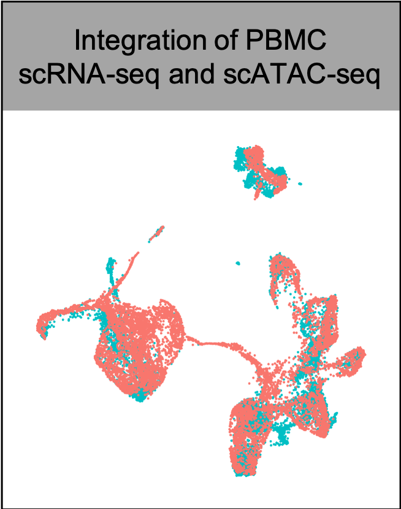
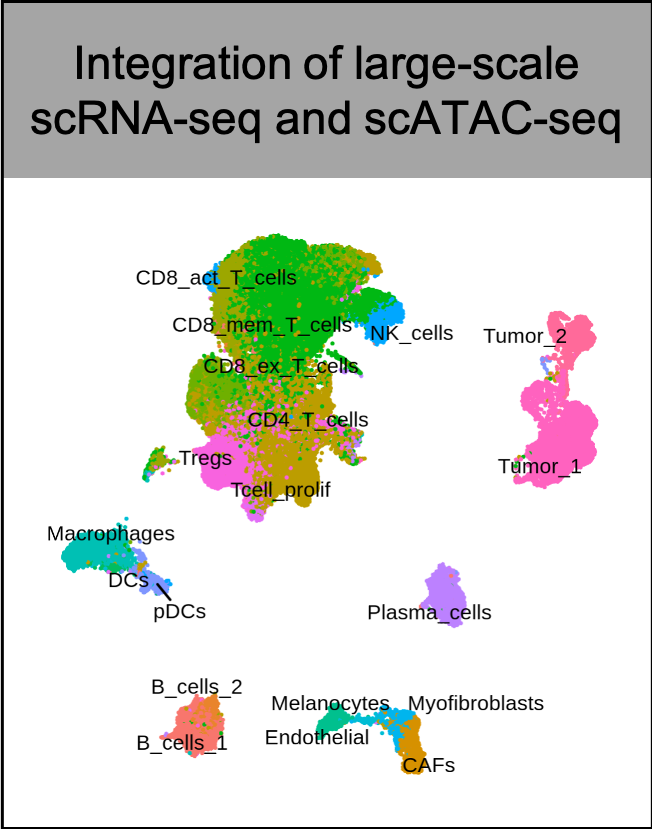

# MAESTRO


[](https://anaconda.org/liulab-dfci/maestro)
[](https://hub.docker.com/repository/docker/winterdongqing/maestro)

**MAESTRO**(**M**odel-based **A**nalys**E**s of **S**ingle-cell **T**ranscriptome and **R**egul**O**me) is a comprehensive single-cell RNA-seq and ATAC-seq analysis suit built using [snakemake](https://bitbucket.org/snakemake/snakemake/wiki/Home). MAESTRO combines several dozen tools and packages to create an integrative pipeline, which enables scRNA-seq and scATAC-seq analysis from raw sequencing data (fastq files) all the way through alignment, quality control, cell filtering, normalization, unsupervised clustering, differential expression and peak calling, celltype annotation and transcription regulation analysis. Currently, MAESTRO support [Smart-seq2](https://www.ncbi.nlm.nih.gov/pubmed/24385147), [10x-genomics](https://www.10xgenomics.com/solutions/single-cell/), [Drop-seq](https://www.cell.com/abstract/S0092-8674(15)00549-8), [SPLiT-seq](https://science.sciencemag.org/content/360/6385/176) for scRNA-seq protocols; [microfudics-based](https://www.ncbi.nlm.nih.gov/pubmed/26083756), [10x-genomics](https://www.10xgenomics.com/solutions/single-cell-atac/) and [sci-ATAC-seq](https://science.sciencemag.org/content/348/6237/910) for scATAC-seq protocols.       
        
## ChangeLog

### v1.0.0
* Release MAESTRO.
### v1.0.1
* Provide [docker image](https://hub.docker.com/repository/docker/winterdongqing/maestro) for easy installation. Note, the docker does not include cellranger/cellranger ATAC, as well as the corresponding genome index. Please install cellranger/cellranger ATAC following the installation instructions.
### v1.0.2
* Fix some bugs and set LISA as the default method to predict transcription factors for scRNA-seq. Note, the docker includes the lisa conda environment, but does not include required pre-computed  genome datasets. Please download hg38 or mm10 datasets and update the configuration following the installation instructions.
### v1.1.0
* Change the default alignment method of MAESTRO from cellranger to [starsolo](https://github.com/alexdobin/STAR/blob/master/docs/STARsolo.md) and [minimap2](https://github.com/lh3/minimap2) for accerating the mapping time.
* Improve the memory efficiency of scATAC gene score calculation.
* Incoparate the installation of giggle into MAESTRO, add web API for LISA function, all the core MAESTRO function can be installed through the conda environment now!
* Provide more documents for the QC parameters and add flexibility for other parameters in the workflow.

## System requirements
* Linux/Unix
* Python (>= 3.0) for MAESTRO snakemake workflow
* R (>= 3.5.1) for MAESTRO R package

## Installation

** Installing the full solution of MAESTRO workflow** 

MAESTRO uses the [Miniconda3](http://conda.pydata.org/miniconda.html) package management system to harmonize all of the software packages. Users can install full solution of MAESTRO using the conda environment.

Use the following commands to install Minicoda3：
``` bash
$ wget https://repo.continuum.io/miniconda/Miniconda3-latest-Linux-x86_64.sh
$ bash Miniconda3-latest-Linux-x86_64.sh
```
And then users can create an isolated environment for MAESTRO and install through the following commands:
``` bash
$ conda config --add channels defaults
$ conda config --add channels bioconda
$ conda config --add channels conda-forge
$ conda create -n MAESTRO maestro -c liulab-dfci
```

**Installing the MAESTRO R package** 

If users already have the processed datasets, like cell by gene or cell by peak matrix generate by Cell Ranger. Users can install the MAESTRO R package alone to perform the analysis from processed datasets.
``` bash
$ R
> library(devtools)
> install_github("liulab-dfci/MAESTRO")
```

**Requried annotations for MAESTRO workflow**

* MAESTRO depends on [starsolo](https://github.com/alexdobin/STAR/blob/master/docs/STARsolo.md) and [minimap2](https://github.com/lh3/minimap2) for mapping scRNA-seq and scATAC-seq dataset. Users need to generate the reference files for the alignment software and specify the path of the annotations to MAESTRO through command line options.

* MAESTRO utilizes LISA to evaluate the enrichment of transcription factors based on the marker genes from scRNA-seq clusters. MAESTRO provided two options for LISA function, the web version do not need installation of LISA and download the annotations. If users select the local version, which is faster than the web version, users need to install [LISA](https://github.com/qinqian/lisa) locally, build the annotation files according to the LISA document, and provide the path of LISA to MAESTRO when using the RNAAnnotateTranscriptionFactor function.

* MAESTRO utilizes giggle to identify enrichment of transcription factor peaks in scATAC-seq cluster-specific peaks. By default [giggle](https://github.com/ryanlayer/giggle) is installed in MAESTRO environment. The giggle index for Cistrome database can be download [here](http://cistrome.org/~chenfei/MAESTRO/giggle.tar.gz). Users need to download the file and provide the location of the giggle annation to MAESTRO when using the ATACAnnotateTranscriptionFactor function.

## Usage
```
usage: MAESTRO [-h] [-v]
               {scrna-init,scatac-init,integrate-init,mtx-to-h5,count-to-h5,merge-h5,scrna-qc,scatac-qc,scatac-peakcount,scatac-genescore}
```

There are ten functions available in MAESTRO serving as sub-commands.

Subcommand | Description
-----------|----------
`scrna-init` | Initialize the MAESTRO scRNA-seq workflow.
`scatac-init` | Initialize the MAESTRO scATAC-seq workflow.
`integrate-init` | Initialize the MAESTRO integration workflow.
`mtx-to-h5` | Convert 10X mtx format matrix to HDF5 format.
`count-to-h5` | Convert plain text count table to HDF5 format.
`merge-h5` | Merge multiple HDF5 files, e.g. different replicates.
`scrna-qc` | Perform quality control for scRNA-seq gene-cell count matrix.
`scatac-qc` | Perform quality control for scATAC-seq peak-cell count matrix.
`scatac-peakcount` | Generate peak-cell binary count matrix.
`scatac-genescore` | Calculate gene score based on the binarized scATAC peak count.

Example for running MAESTRO can be found at the follwing galleries. Please use `MAESTRO
COMMAND -h` to see the detail description for each option of each module.

## Galleries & Tutorials (click on the image for details)

[](./example/RNA_infrastructure_10x/RNA_infrastructure_10x.md)
[](./example/ATAC_infrastructure_10x/ATAC_infrastructure_10x.md)  
[](./example/Integration/Integration.md)
[](./example/Integration_large/Integration_large.md)

## Citation

