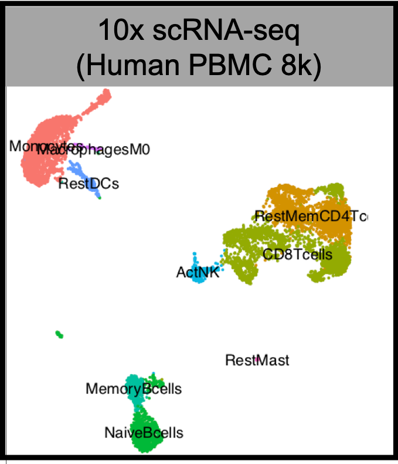
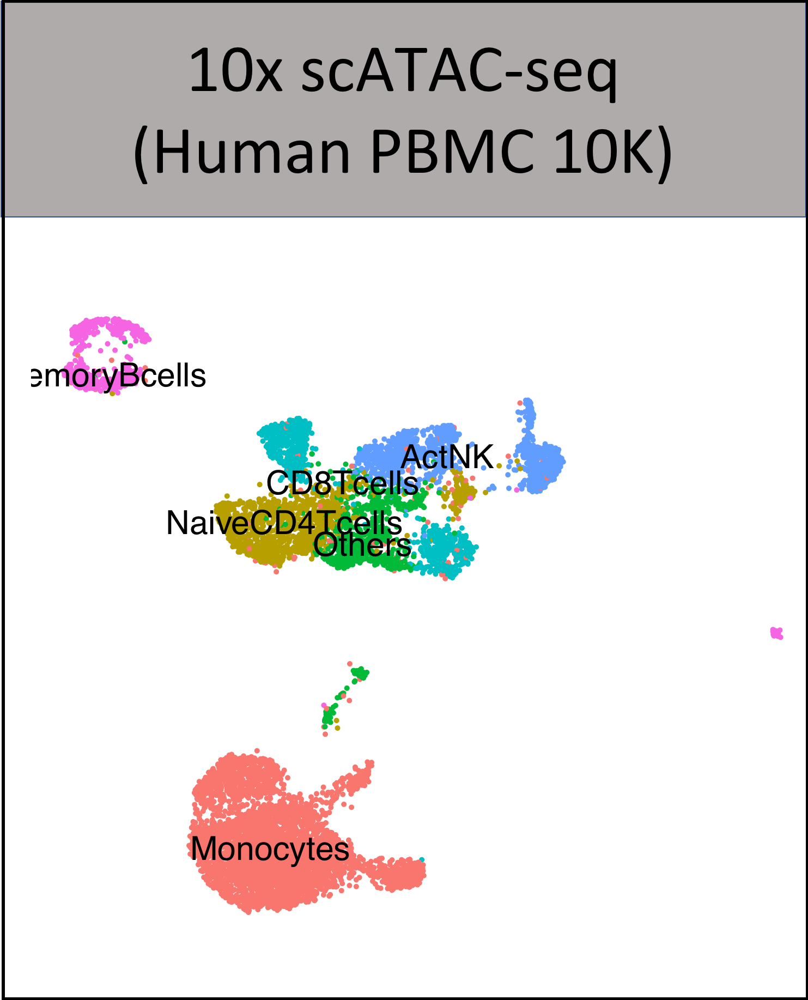
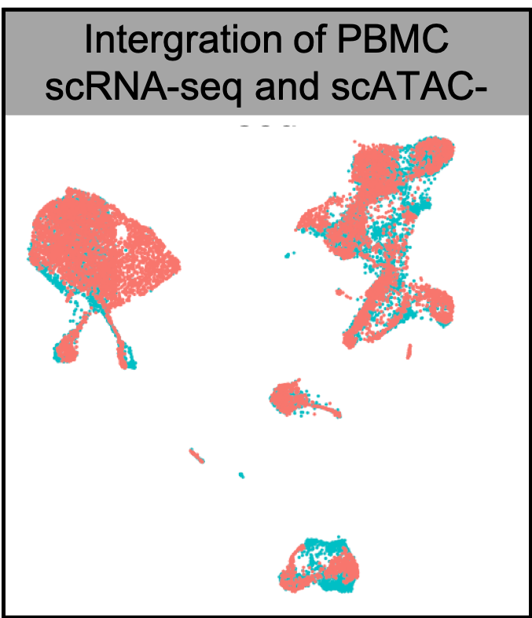
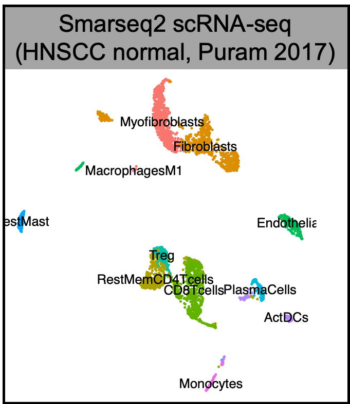
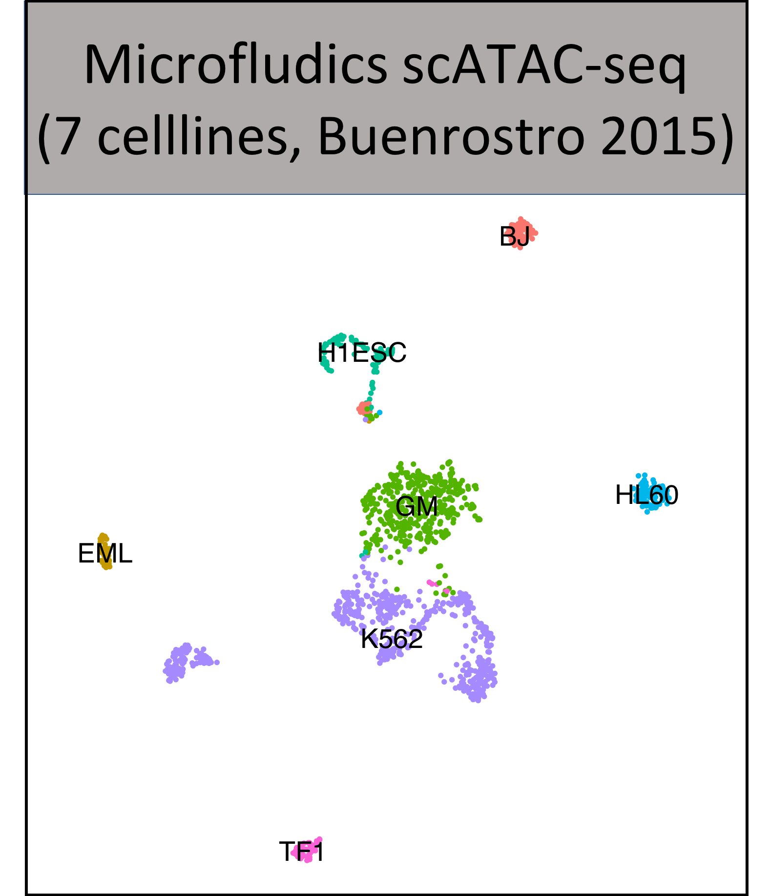

# MAESTRO (Development)

**MAESTRO**(**M**odel-based **A**nalys**E**s of **S**ingle-cell **T**ranscriptome and **R**egul**O**me) is a comprehensive single-cell RNA-seq and ATAC-seq analysis suit built using [snakemake](https://bitbucket.org/snakemake/snakemake/wiki/Home). MAESTRO combines several dozen tools and packages to create an integrative pipeline, which enables scRNA-seq and scATAC-seq analysis from raw sequencing data (fastq files) all the way through alignment, quality control, cell filtering, normalization, unsupervised clustering, differential expression and peak calling, celltype annotation and transcription regulation analysis. Currently, MAESTRO support [Smart-seq2](https://www.ncbi.nlm.nih.gov/pubmed/24385147), [10x-genomics](https://www.10xgenomics.com/solutions/single-cell/), [Drop-seq](https://www.cell.com/abstract/S0092-8674(15)00549-8), [SPLiT-seq](https://science.sciencemag.org/content/360/6385/176) for scRNA-seq protocols; [microfudics-based](https://www.ncbi.nlm.nih.gov/pubmed/26083756), [10x-genomics](https://www.10xgenomics.com/solutions/single-cell-atac/) and [sci-ATAC-seq](https://science.sciencemag.org/content/348/6237/910) for scATAC-seq protocols.       
        
## System requirements
* Linux/Unix
* Python (>= 3.0) (MAESTRO snakemake workflow)
* R (>= 3.5.1) (MAESTRO R package)

## Installation

**Installing the MAESTRO by conda**     

We will use the [Miniconda3](http://conda.pydata.org/miniconda.html) package management system to manage all of the software packages that MAESTRO is dependent on. 

Use following commands to the install Minicoda3：
``` bash
$ wget https://repo.continuum.io/miniconda/Miniconda3-latest-Linux-x86_64.sh
$ bash Miniconda3-latest-Linux-x86_64.sh
```
And now you are ready to install MAESTRO or create an isolated environment through conda:
``` bash
$ conda create -n MAESTRO maestro -c dongqingsun
```

**Installing the MAESTRO R package** 

We next need to install the MAESTRO R package. The R package support analyzing the scRNA-seq and scATAC-seq from processed datasets.
``` bash
$ R
> library(devtools)
> install_github("chenfeiwang/MAESTRO")
```

**Installing Cell Ranger**

MAESTRO depent on the Cell Ranger and Cell Ranger ATAC for the mapping of the data genertaed by 10X genomics. Please install [Cell Ranger](https://support.10xgenomics.com/single-cell-gene-expression/software/pipelines/latest/installation) and [Cell Ranger ATAC](https://support.10xgenomics.com/single-cell-atac/software/pipelines/latest/installation) before using MAESTRO.

**Installing giggle**

MAESTRO utilize giggle to identify enrichment of transcription factor peaks in scATAC-seq cluster specific peaks. To run this function, you need to first install [giggle](https://github.com/ryanlayer/giggle), download the giggle index from [Cistrome website](http://cistrome.org/~chenfei/MAESTRO/giggle.tar.gz), and provide the file location of the index to MAESTRO.       

**Installing RABIT**       

MAESTRO utilize rabit to predict the potential transcription factors based on the marker genes from scRNA-seq clusters. To run this function, you need to first install [rabit](http://rabit.dfci.harvard.edu/), download the rabit index from [Cistrome website](http://cistrome.org/~chenfei/MAESTRO/rabit.tar.gz), and provide the file location of the index to MAESTRO.

## Galleries & Tutorials (click on the image for details)

[](./example/RNA_infrastructure_10x/RNA_infrastructure_10x.md)
[](./example/ATAC_infrastructure_10x/ATAC_infrastructure_10x.md)
[](./example/Integration/Integration.md)
[](./example/RNA_infrastructure_smartseq/RNA_infrastructure_smartseq.md)
[](./example/ATAC_infrastructure_microfludics/ATAC_infrastructure_microfludics.md)


## Citation

