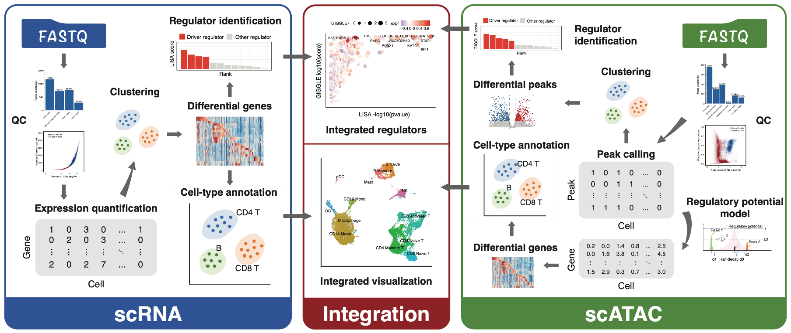

# MAESTRO


[](https://anaconda.org/liulab-dfci/maestro)
[](https://hub.docker.com/repository/docker/winterdongqing/maestro)
[](https://travis-ci.com/liulab-dfci/MAESTRO)


**MAESTRO**(**M**odel-based **A**nalys**E**s of **S**ingle-cell **T**ranscriptome and **R**egul**O**me) is a comprehensive single-cell RNA-seq and ATAC-seq analysis suit built using [snakemake](https://bitbucket.org/snakemake/snakemake/wiki/Home). MAESTRO combines several dozen tools and packages to create an integrative pipeline, which enables scRNA-seq and scATAC-seq analysis from raw sequencing data (fastq files) all the way through alignment, quality control, cell filtering, normalization, unsupervised clustering, differential expression and peak calling, celltype annotation and transcription regulation analysis. Currently, MAESTRO support [Smart-seq2](https://www.ncbi.nlm.nih.gov/pubmed/24385147), [10x-genomics](https://www.10xgenomics.com/solutions/single-cell/), [Drop-seq](https://www.cell.com/abstract/S0092-8674(15)00549-8), [SPLiT-seq](https://science.sciencemag.org/content/360/6385/176) for scRNA-seq protocols; [microfudics-based](https://www.ncbi.nlm.nih.gov/pubmed/26083756), [10x-genomics](https://www.10xgenomics.com/solutions/single-cell-atac/) and [sci-ATAC-seq](https://science.sciencemag.org/content/348/6237/910) for scATAC-seq protocols.

<p align="center">

</p>

## Documentation

We are hosting MAESTRO documentation, instruction and tutorials at [MAESTRO Website](https://baigal628.github.io/MAESTRO_documentation/).

## Change Log

### v1.0.0
* Release MAESTRO.
### v1.0.1
* Provide [docker image](https://hub.docker.com/repository/docker/winterdongqing/maestro) for easy installation. Note, the docker does not include cellranger/cellranger ATAC, as well as the corresponding genome index. Please install cellranger/cellranger ATAC following the installation instructions.
### v1.0.2
* Fix some bugs and set LISA as the default method to predict transcription factors for scRNA-seq. Note, the docker includes the LISA conda environment, but does not include required pre-computed genome datasets. Please download hg38 or mm10 datasets and update the configuration following the installation instructions.
### v1.1.0
* Change the default alignment method of MAESTRO from cellranger to [starsolo](https://github.com/alexdobin/STAR/blob/master/docs/STARsolo.md) and [minimap2](https://github.com/lh3/minimap2) for accelerating the mapping time.
* Improve the memory efficiency of scATAC gene score calculation.
* Incorporate the installation of giggle into MAESTRO, and add web API for LISA function. All the core MAESTRO function can be installed through the conda environment now!
* Provide more documents for the QC parameters and add flexibility for other parameters in the workflow.
### v1.2.0
* Modify the regulatory potential model by removing the interfering peaks from adjacent genes and adjusting the weight of exon peaks. The "enhanced RP model" is set as the default gene activity scoring model with original "simple RP model" as a option.
* Modify the integration function of MAESTRO. The new function can output more intermediate figures and log files for diagnosing the possible failure in integrating rare populations.
* Add the function for annotating cell-types for scATAC-seq clusters based on public bulk chromatin accessibility data from Cistrome database (**Note:** Please update the giggle index to the latest.
* Provide the function of generating genome browser tracks at cluster level for scATAC-seq dataset visualization.
* Support peak calling at the cluster level now!
### v1.2.1
* For scATAC, MAESTRO can support fastq, bam, fragments.tsv.gz as the input of the scATAC-seq workflow.
* For scATAC, MAESTRO provides an option for users to skip the cell-type annotation step in the pipeline, and an option to choose the strategy for cell-type annotation (`RP-based` and `peak-based`).
* Provide small test data for test pipeline (sampling from 10x fastq files).
* Add parameter validation before initializing the pipeline and provide more gracious error messages.
* Update R in MAESTRO conda package from 3.6.3 to 4.0.2, and Seurat from 3.1.2 to 3.1.5.
### v1.2.1.9999
* Bug fixes (placeholder for v1.2.2 formal release)
### v1.2.2
* Update LISA to LISA2 which extends the original, runs faster, reduces dependencies, and adds useful CLI functions for pipeline integration. Please download the LISA2 data from human and mouse.
* Update conda dependencies to only requesting lowest versions.
* Fix the bugs in conda package installation channel.
* Update markers in the mouse.brain.ALLEN cell signature file.
* Fix the bugs to support the 10X .h5 file as the input format of MAESTRO scatac-genescore.
* Rename 'Adjusted RP model' to 'Enhanced RP model'.
* Fix the bugs in Snakefile to meet the latest version of snakemake.
* Update STAR reference indexes files for STAR -version 2.7.6a. Provide pre-built indexes for human and mouse.
### v1.3.0
* scATAC-seq multi-sample pipeline enabled. Deduplication can be set at cell or bulk level.
* Peak count matrix can be generated either on binary or raw count.
* LISA2 data will only be configured once in a given environment.
* Update web links for downloading reference data.
### v1.3.1
* Fix the bug in raw peak count matrix generation.
### v1.3.2
* Move from TravisCI to GitHub Actions for building package.
* LISA2 upgrades to v2.2.2. New LISA data are required for human and mouse. Please download to your computer and provide the path when initiating.
* Add LISA path as a variable in TF annotating function.
* Reduce the time and memory usage in the peak counting step.
* Fix the bug in the simple RP model for gene score calculation.
* Fix the bug in scATAC-Seq Snakefile.
### v1.4.0
* Upgrade dependencies to Seurat 4.0.0 and Signac 1.1.1.
* Set QC; genes mapped to mitochondrial as a variable in the scRNA-seq analysis.
* Add output path as variables in the MAESTRO R package.
### v1.5.0
* Support processing multi-samples for both scRNA-seq and scATAC-seq.
* Integrate [chromap](https://github.com/haowenz/chromap) as the default aligner for scATAC-seq.
* Support multi-sample scATAC-seq when starting from bam file with CB tag or 10X like fragment file.
* Fix the ratio of genes mapped to mitochondrial to percentage.
* Move MAESTRO documentation to [workfowr](https://github.com/jdblischak/workflowr).


## System requirements
* Linux/Unix
* Python (>= 3.7) for MAESTRO snakemake workflow
* R (>= 4.0.2) for MAESTRO R package

## Installation

### Install MAESTRO

There are two ways to install MAESTRO -- to install the full workflow through [Anaconda cloud](https://www.anaconda.com/); or to install only the R codes for exploring the processed data.

#### Installing the full solution of MAESTRO workflow through conda

MAESTRO uses the [Miniconda3](http://conda.pydata.org/miniconda.html) package management system to harmonize all of the software packages. Users can install the full solution of MAESTRO using the conda environment.

Use the following commands to install Minicoda3：
``` bash
$ wget https://repo.continuum.io/miniconda/Miniconda3-latest-Linux-x86_64.sh
$ bash Miniconda3-latest-Linux-x86_64.sh
```
And then users can create an isolated environment for MAESTRO and install through the following commands:
``` bash
$ conda config --add channels defaults
$ conda config --add channels liulab-dfci
$ conda config --add channels bioconda
$ conda config --add channels conda-forge
# To make the installation faster, we recommend using mamba
$ conda install mamba -c conda-forge
$ mamba create -n MAESTRO maestro=1.5.0 -c liulab-dfci
# Activate the environment
$ conda activate MAESTRO
```

#### Installing the MAESTRO R package from source code

If users already have the processed datasets, like cell by gene or cell by peak matrix generate by Cell Ranger. Users can install the MAESTRO R package alone to perform the analysis from processed datasets.
``` bash
$ R
> library(devtools)
> install_github("liulab-dfci/MAESTRO")
```

## Citation
Wang C, Sun D, Huang X, Wan C, Li Z, Han Y, Qin Q, Fan J, Qiu X, Xie Y, Meyer CA, Brown M, Tang M, Long H, Liu T, Liu XS. Integrative analyses of single-cell transcriptome and regulome using MAESTRO. Genome Biol. 2020 Aug 7;21(1):198. doi: 10.1186/s13059-020-02116-x. PMID: 32767996; PMCID: PMC7412809.
