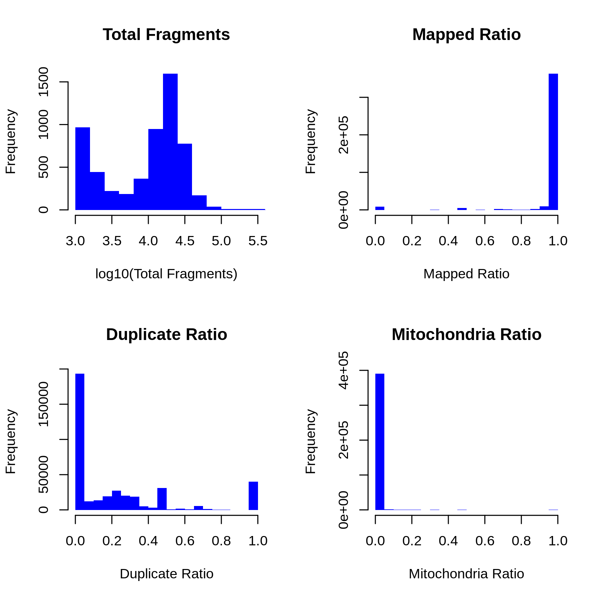
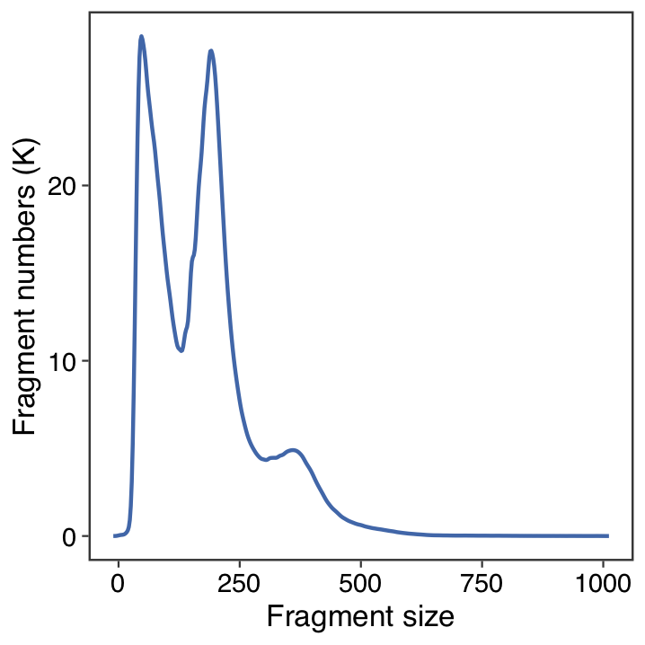
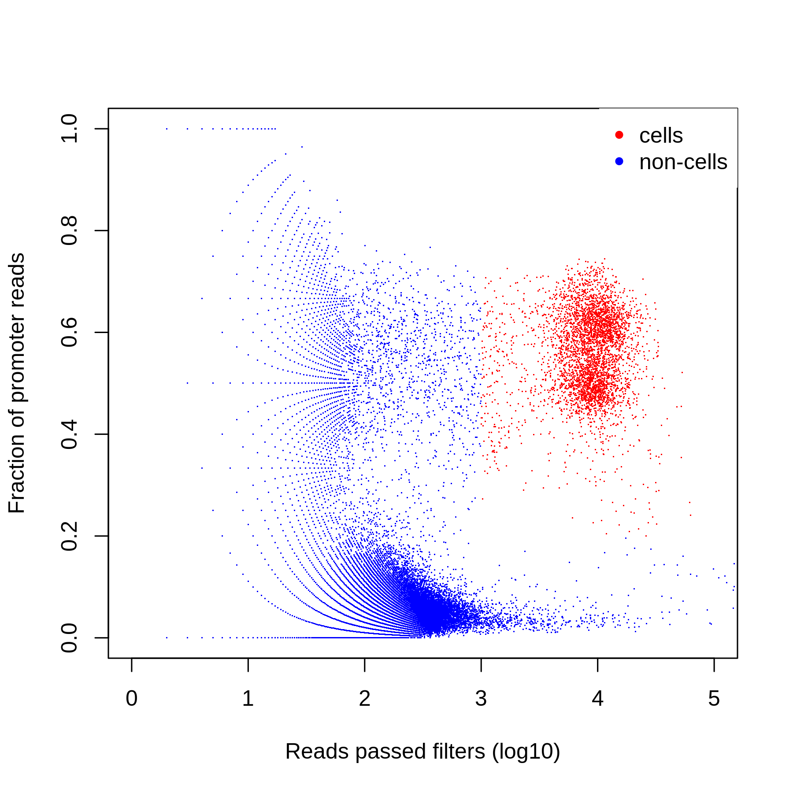
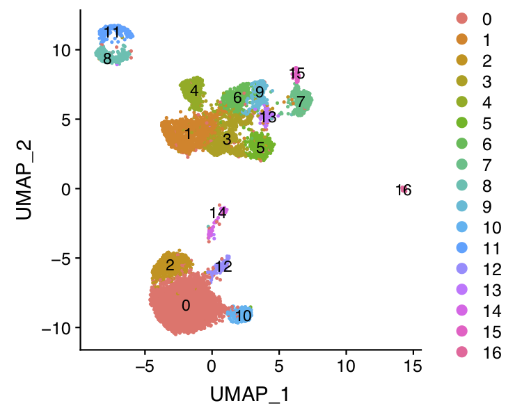
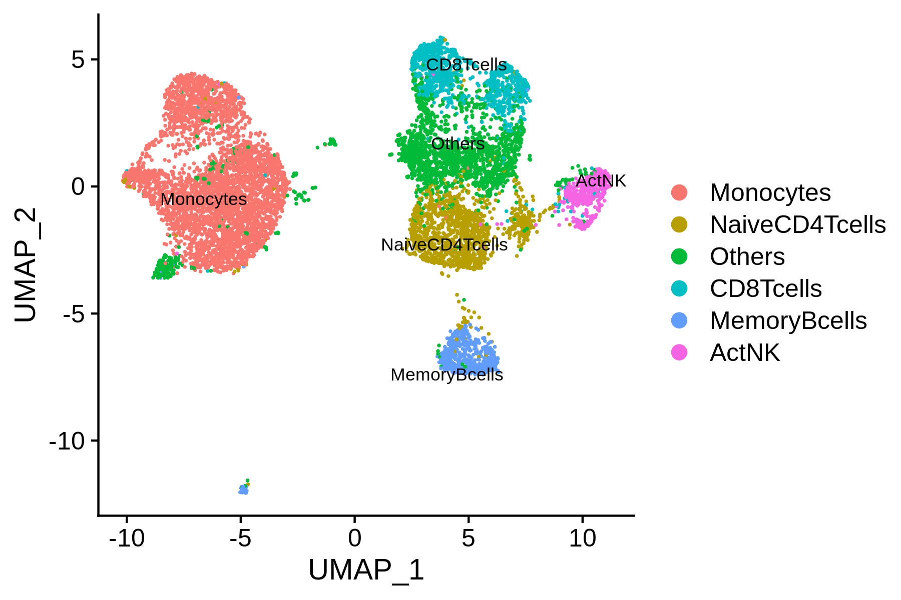
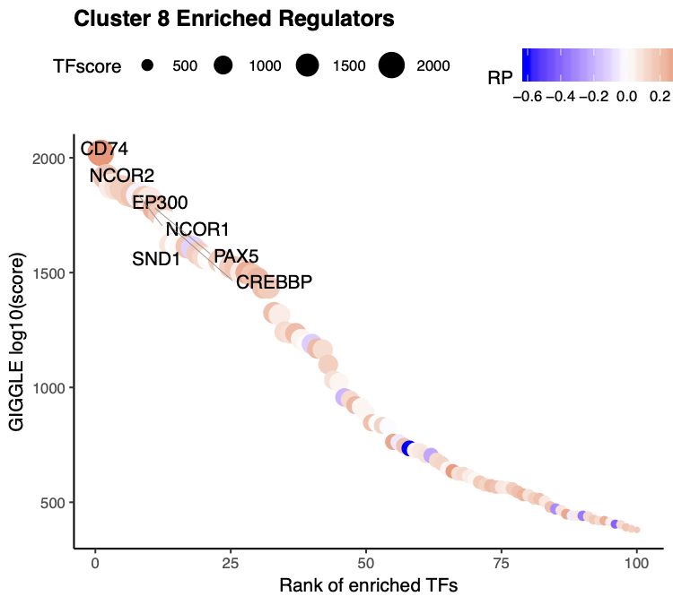
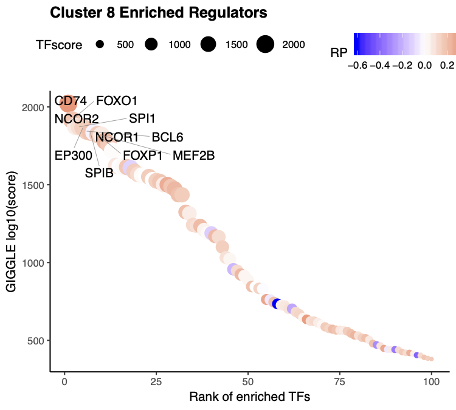
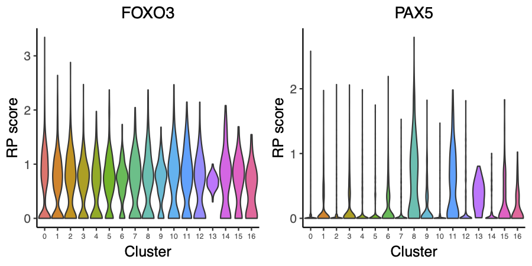
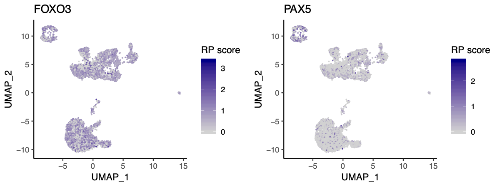
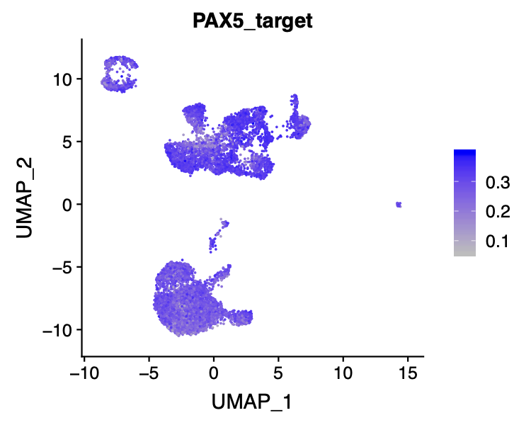

## 10x PBMC 10k scATAC-seq

In this example, we will be analyzing a scATAC-seq dataset of 10K human peripheral blood mononuclear cells (PBMCs) freely available from 10X Genomics. The raw dataset can be downloaded from the 10X Genomics website. We will demonstrate how to run through the whole MAESTRO pipeline from the raw sequencing fastq files to the final results. 

**Step 0. Download the data and prepare your working directory**     
Before running MAESTRO, users need to activate the MAESTRO environment and prepare the working directory.
```bash
source activate MAESTRO
MAESTRO init --help
MAESTRO init -d 10X_PBMC_10K -m scATAC
```

The raw data can be downloaded from 10X Genomics:
```bash
$ cd 10X_PBMC_10K
$ wget http://s3-us-west-2.amazonaws.com/10x.files/samples/cell-atac/1.1.0/atac_v1_pbmc_10k/atac_v1_pbmc_10k_fastqs.tar
$ tar xvf atac_v1_pbmc_10k_fastqs
```               

**Step 1. Configure the MAESTRO workflow**                           
Open the `config.yaml` file in the working directory, add the sample information and software annotations. Currently, for scATAC-seq analysis, MAESTRO support microfluidics-based, 10X Genomics, and sci-ATAC-seq based protocols, here is an example config file for 10X Genomics scATAC-seq. 

```bash
$ vi config.yaml
# Directory where fastq files are stored
fastqdir: /home/cw254/projects/MAESTRO/snakemake/ATAC/10X/atac_v1_pbmc_10k_fastqs
# Sample name of fastq file
fastqprefix: atac_v1_pbmc_10k
# Species to use [GRCh38, GRCm38] (GRCh38 for human and GRCm38 for mouse)
species: GRCh38
# Platform of single cell ATAC-seq [10X Genomics, sci-ATAC-seq, microfluidic]
platform: 10X Genomics
# The prefix of output files
outprefix: 10X_PBMC_10K
# Please specify the barcode library if the platform is sci-ATAC-seq, or the pipeline will automatically output the barcodes with enough reads count (>1000).
barcodelib: 
# The core number
cores: 8
# Flag to provide custom peaks [TRUE, FALSE]
custompeaks: FALSE
# IF custompeaks = TRUE, provide the file location of custom peaks
custompeaksloc: 
# Whether or not to call peaks from short fragment (less than 50bp)
shortpeaks: FALSE
# Gene score decay distance, could be optional from 1kb (promoter-based regulation) and 10kb(enhancer-based regulation), default is 10kb
genedistance: 10000
# Path of the giggle annotation file.
giggleannotation: /home/cw254/annotation/giggle 

# Reference genome 
genome:
  # Genome index directory for BWA
  fasta: /home/cw254/annotation/refdata-cellranger-atac-GRCh38-1.1.0/fasta/genome.fa
  # genome annotation file from 10X Genomics required for Cell Ranger ATAC
  cellranger: /home/cw254/annotation/refdata-cellranger-atac-GRCh38-1.1.0
```

**Step 2. Run MAESTRO**     
Once configured, users can use snakemake to run the workflow. 
```bash
snakemake -np
nohup snakemake --cores 8 --use-conda > 10X_PBMC_8K.out &
```

**Step 3. Understanding the final output files**     
Here, we assume users have ran MAESTRO successfully. An output directory is specified in the run call, and will contain several useful outputs as described below.
```bash
$ ls 10X_PBMC_10K/Result
$ Analysis CellRangerATAC Log QC Summary
```

Output files: 1) The CellRangerATAC directory contains all the mapping and analysis files from the CellRangerATAC pipeline. 2) The QC directory contains quality control analysis of scATAC-seq data, including the barcodes filtering table. 3) The Analysis directory contains the MACS peak calling result, peak count table, clustering result, annotated result, driver transcription factor identification result, for which we will introduce in the step-by-step analysis. 4) The Log directory contains the log files generated in the pipeline analysis. 5) The Summary directory contains the 10X_PBMC_10K_report.html, which summarized all the results in an HTML based document. The summary HTML for the 10X_PBMC_10K example can be found [here](http://cistrome.org/~chenfei/MAESTRO/10X_PBMC_10k_MAESTRO_scATAC_report.html).

Mappability plot for scATAC-seq QC analysis:     
 

Fragment size distribution for scATAC-seq QC analysis:      
 

Cell filtering plot for scATAC-seq QC analysis, cells with less than 1000 unique fragments and 20% fraction of promoter reads are treated as non-cells and filtered out from the downstream analysis:      
 

**Step 4. Custom analysis starting from the processed dataset**    
Although MAESTRO will generate all the analysis result through the snakemake based workflow, in most cases, users might want to analysis the result from the processed dataset(count matrix of a cell by peak table), tune the parameters, focused on specific clusters or sub-clusters, and learn transcription regulation in those clusters. Considering this, we build a stand-alone MAESTRO R package for downstream analysis. We will demonstrate how to run through the MAESTRO analysis using the R package step by step.

First users need to read the peak count matrix as well as the gene regulatory potential matrix generated by MAESTRO into the R enviroment. To support the processing of large dataset, in MAESTRO we use [HDF5 format](https://support.10xgenomics.com/single-cell-atac/software/pipelines/latest/advanced/h5_matrices) for all the expression, atac-seq peak count and RP tables. 
```R
> library(MAESTRO)
> library(Seurat)
> pbmc.peak <- Read10X_h5('Result/Analysis/10X_PBMC_10K_peak_count.h5')
> pbmc.gene <- Read10X_h5('Result/Analysis/10X_PBMC_10K_gene_score.h5')
```

We also support the processed dataset from 10x Cell Ranger pipelines, users can load the gene matrix into R through Seurat package. Then generate the gene regulatory score matrix by the following command.
```R
> pbmc.peaks <- Read10X_h5("Result/Cellranger/10X_PBMC_10K/outs/filtered_peak_bc_matrix.h5")
> pbmc.gene <- ATACCalculateGenescore(pbmc.peaks)
```

**Step 5. Clustering and differential peak calling**      
We next create a Seurat object using the peak count matrix and perform the clustering analysis as well as differential peak calling for different clusters. 1) We first run dimension reduction on the input matrix. As we and others reported [Cusanovich et al, Science 2015](https://science.sciencemag.org/content/348/6237/910/tab-pdf), the Latent Semantic Index (LSI) has been widely used in learning the structure of scATAC-seq data. We use LSI as the default dimension reduction method, which has the best performance according to our benchmark. Users can also use "PCA" as an optional dimension reduction method. 2) We apply UMAP to reduce the dimensions further and identify the clusters using a graph-based clustering approach implemented in [Seurat](https://www.cell.com/cell/pdf/S0092-8674(19)30559-8.pdf). 3) We used a [wilcox-test](https://www.tandfonline.com/doi/abs/10.1080/01621459.1972.10481279) based method to identify the differential peaks for each cluster. The original peak count matrix is scaled and weighed by the total peaks present in each cell to overcome the potential ties in Wilcox-test. It will take 10-20mins to calculate the differential peaks for all the clusters.

```R
> pbmc.ATAC.res <- ATACRunSeurat(inputMat = pbmc.peaks, 
>                                project = "10X_PBMC_10K", 
>                                method = "LSI",
>                                min.c = 50,
>                                min.p = 500,
>                                dims.use = 1:30,
>                                cluster.res = 0.6,
>                                peaks.test.use = "wilcox",
>                                peaks.cutoff = 1e-05
>                                )
> head(pbmc.ATAC.res$peaks)
                                 p_val avg_logFC pct.1 pct.2    p_val_adj cluster
chr6-44058458-44059516    0.000000e+00 0.4752823 0.572 0.135 0.000000e+00       0
chr14-50038437-50039234   0.000000e+00 0.4224288 0.496 0.125 0.000000e+00       0
chr9-129777051-129777688 4.355527e-286 0.3982421 0.478 0.129 6.985916e-281       0
chr20-50274836-50275400  1.797037e-283 0.3954815 0.457 0.118 2.882304e-278       0
chr8-141137795-141138489 1.017501e-255 0.3727491 0.411 0.102 1.631991e-250       0
chr2-112839364-112840014 3.109149e-251 0.3694872 0.409 0.103 4.986827e-246       0
                                             peak
chr6-44058458-44059516     chr6-44058458-44059516
chr14-50038437-50039234   chr14-50038437-50039234
chr9-129777051-129777688 chr9-129777051-129777688
chr20-50274836-50275400   chr20-50274836-50275400
chr8-141137795-141138489 chr8-141137795-141138489
chr2-112839364-112840014 chr2-112839364-112840014
```

 

**Step 6. Annotate cell types**     
We next try to annotate different clusters based on their marker genes. For scATAC, we first need to pass the gene regulatory potential matrix to the clustering result, then perform differential gene analysis for each cluster on the gene RPscore matrix, and identify the marker genes. We use public immune signatures like [CIBERSORT](https://www.nature.com/articles/nmeth.3337) to annotate the clusters. Users can also use their signatures to annotate the clusters.

```R
> data(human.immune.CIBERSORT)
> pbmc.ATAC.res$ATAC <- ATACAnnotateCelltype(ATAC = pbmc.ATAC.res$ATAC, 
>                                            RPmatrix = pbmc.gene, 
>                                            signatures = human.immune.CIBERSORT, 
>                                            min.score = 0.1, 
>                                            genes.test.use = "wilcox",
>                                            genes.cutoff = 1E-5)
```

 

**Step 7. Identify driver transcription factors**     
Identify enriched transcription regulators is crucial to understanding gene regulation in the heterogeneous single-cell populations. MAESTRO utilizes giggle to identify enrichment of transcription factor peaks in scATAC-seq cluster-specific peaks. To run this function, users need first to install [giggle](https://github.com/ryanlayer/giggle), download the giggle index from [Cistrome website](http://cistrome.org/~chenfei/MAESTRO/giggle.tar.gz), and provide the file location of the index to MAESTRO. 
After identifying enriched transcription regulators, MAESTRO also provides the potential target gene list of the top 10 transcription factors for each cluster, which are based on the ChIP-seq peaks from [CistromeDB](http://cistrome.org/db/#/). The target genes will be generated in the "10X_PBMC_10K.TF.GIGGLE" directory.

```R
> pbmc.ATAC.tfs <- ATACAnnotateTranscriptionFactor(ATAC = pbmc.ATAC.res$ATAC, 
>                                                  peaks = pbmc.ATAC.res$peaks, 
>                                                  project = "10X_PBMC_10K_TF", 
>                                                  giggle.path = "/homes/cwang/annotations/giggle")
Identify enriched TFs for cluster  0 ...
Identify enriched TFs for cluster  1 ...
Identify enriched TFs for cluster  2 ...
Identify enriched TFs for cluster  3 ...
Identify enriched TFs for cluster  4 ...
Identify enriched TFs for cluster  5 ...
Identify enriched TFs for cluster  6 ...
Identify enriched TFs for cluster  7 ...
Identify enriched TFs for cluster  8 ...
Identify enriched TFs for cluster  9 ...
Identify enriched TFs for cluster  10 ...
Identify enriched TFs for cluster  11 ...
Identify enriched TFs for cluster  12 ...
Identify enriched TFs for cluster  13 ...
Identify enriched TFs for cluster  14 ...
Identify enriched TFs for cluster  15 ...
Identify enriched TFs for cluster  16 ...
Identification of enriched TFs is done.
Identify target genes for the top  10  TFs for cluster  0 ...
Identify target genes for the top  10  TFs for cluster  1 ...
Identify target genes for the top  10  TFs for cluster  2 ...
Identify target genes for the top  10  TFs for cluster  3 ...
Identify target genes for the top  10  TFs for cluster  4 ...
Identify target genes for the top  10  TFs for cluster  5 ...
Identify target genes for the top  10  TFs for cluster  6 ...
Identify target genes for the top  10  TFs for cluster  7 ...
Identify target genes for the top  10  TFs for cluster  8 ...
Identify target genes for the top  10  TFs for cluster  9 ...
Identify target genes for the top  10  TFs for cluster  10 ...
Identify target genes for the top  10  TFs for cluster  11 ...
Identify target genes for the top  10  TFs for cluster  12 ...
Identify target genes for the top  10  TFs for cluster  13 ...
Identify target genes for the top  10  TFs for cluster  14 ...
Identify target genes for the top  10  TFs for cluster  15 ...
Identify target genes for the top  10  TFs for cluster  16 ...
> head(pbmc.ATAC.tfs)
$`0`
 [1] "NR2F6 | PPARD | PPARA | PPARG | RXRG | HNF4A | HNF4G"
 [2] "IRF1 | IRF3 | SPI1 | BCL11A | STAT2 | IRF2 | STAT1 | IRF8 | SPIB | PRDM1 | IRF4"
 [3] "PML"
 [4] "DBP | ATF4 | DDIT3 | CEBPA | NFIL3 | CEBPB | CEBPD | CEBPG | CEBPE | BATF | HLF"
 [5] "GLI1 | GLI3 | GLI2"
 [6] "BRD4"
 [7] "RARA | ESRRA | NR4A1 | NR4A2 | NR4A3 | RXRA | NR1I3 | THRA | RXRB | RARG | VDR | NR1H3 | PPARA | PPARG | THRB | ESR2 | NR2C1 | NR2F1 | ESR1 | NR5A2 | NR1I2 | NR2F2 | ESRRB | NR1H4 | RARB | NR5A1"
 [8] "SKI"
 [9] "E4F1 | GMEB2 | ARNT | HIF1A | AHR | EPAS1"
[10] "ELF2 | ELF1 | ETV2 | ETS2 | FLI1 | ELK1 | ETV5 | NFAT5 | GABPA | ETV6 | ELK4 | ETS1 | ETV7 | ELK3 | ETV4 | ERG | ETV1 | EHF | FEV | ELF3 | ELF5"
```

Beside indentify TFs for all the clusters, we also support the differential peaks from a single comparison.
```R
> de.peakset <- FindMarkersMAESTRO(pbmc.ATAC.res$ATAC, ident.1 = c(0,2,10,12))
   |++++++++++++++++++++++++++++++++++++++++++++++++++| 100% elapsed = 60s
> pbmc.ATAC.monocyte.tfs <- ATACAnnotateTranscriptionFactor(ATAC = pbmc.ATAC.res$ATAC, 
>                                                           peaks = de.peakset,
>                                                           cluster = c(0,2,10,12),
>                                                           project = "10X_PBMC_MAESTRO_Monocyte_TF", 
>                                                           giggle.path = "/homes/cwang/annotations/giggle")
```

**Step 8. Visualize driver transcription factors for each cluster**     
According to the annotation of the clusters, we know that cluster 8 is B-cells. Next, we want to visualize the enriched regulators in B-cells from Step 7. To further filter the regulators, we will also visualize the expression level of the predicted transcription factors; here, we used the gene regulatory potential score as the predicted gene expression level. 

The output TFs from MAESTRO have already been pre-filtered using TF regulatory potential score. 
```R
> tfs = sapply(pbmc.ATAC.tfs[[9]], function(x) {return(unlist(strsplit(x, split = " | ", fixed = TRUE))[1])})
> VisualizeTFenrichment(TFs = tfs, 
>                       cluster.1 = 8, 
>                       type = "ATAC", 
>                       SeuratObj = pbmc.ATAC.res$ATAC, 
>                       GIGGLE.table = "10X_PBMC_10K_TF_giggle.txt",
>                       visual.totalnumber = 100, 
>                       name = "10X_PBMC_10K_TF_Bcell_filtered")  
```

 

If users want to visualize the top factors without filtering using regulatory potential. Please leave the TFs to blank, then the top 10 regulators will be visualized.
```R
> VisualizeTFenrichment(cluster.1 = 8, 
>                       type = "ATAC", 
>                       SeuratObj = pbmc.ATAC.res$ATAC, 
>                       GIGGLE.table = "10X_PBMC_10K_TF_giggle.txt",
>                       visual.topnumber = 10,
>                       visual.totalnumber = 100, 
>                       name = "10X_PBMC_10K_TF_Bcell_top")  
```

 

And we also provide the function for visualize TF/genes regulatory potential using Vlnplot and Umap.
```R
> VisualizeVlnplot(genes = c("PAX5","FOXO3"), 
>                  type = "ATAC", 
>                  SeuratObj = pbmc.ATAC.res$ATAC, 
>                  ncol = 2, 
>                  width = 6, 
>                  height = 3, 
>                  name = "10X_PBMC_10K_TF_Bcell_vlnplot")
```
   

```R
> VisualizeUmap(genes = c("PAX5","FOXO3"),
>               type = "ATAC", 
>               SeuratObj = pbmc.ATAC.res$ATAC, 
>               ncol = 2, 
>               width = 8, 
>               height = 3, 
>               name = "10X_PBMC_10K_TF_Bcell_umap")
```
 

Based on the regulatory potential of TFs, we can see that PAX5 is highly expressed in the B-cells from PBMC, while FOXO3 is generally distributed. We will next visualize the regulatory potential of PAX5 target genes.

```R
> PAX5_target <- as.character(read.table('10X_PBMC_10K_TF.GIGGLE/8.PAX5.34475.target.genes.top500.txt')[1:200,1])
> PAX5_target <- intersect(PAX5_target, rownames(pbmc.ATAC.res$ATAC))
> pbmc.ATAC.res$ATAC@meta.data$PAX5_target <- colMeans(x = as.matrix(GetAssayData(pbmc.ATAC.res$ATAC))[PAX5_target, ], na.rm = TRUE)
> p <- FeaturePlot(pbmc.ATAC.res$ATAC,  features = "PAX5_target", cols = c("grey", "blue"))
> ggsave(file.path("10X_PBMC_10K_Bcell_PAX5.pdf"), p, width = 5, height = 4)
 ```
  

**Step 9. Save the project for future analysis**     
Finally, users can save the R project, including the raw data, normalized data, clustering result, and meta information for future analysis.

```R
saveRDS(pbmc.ATAC.res, "pbmc.ATAC.res.rds")
```

The differential peaks, TFs, and target genes have already been saved in the current directory by MAESTRO.

```bash
$ ls 10X_PBMC_10K.DiffPeak.tsv 10X_PBMC_10K_TF.GIGGLE 
```

