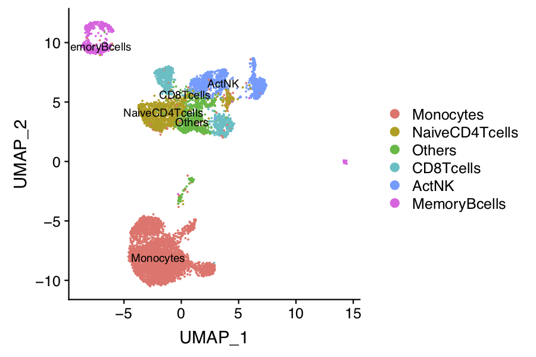
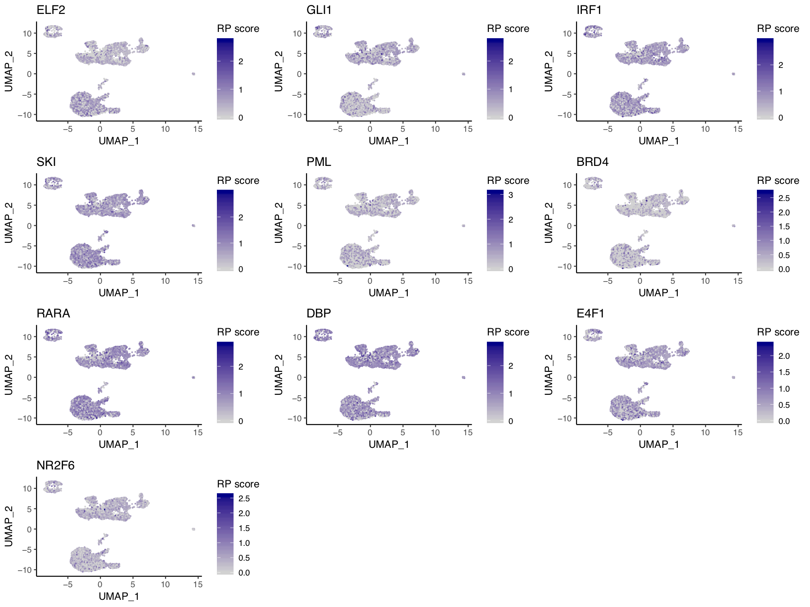
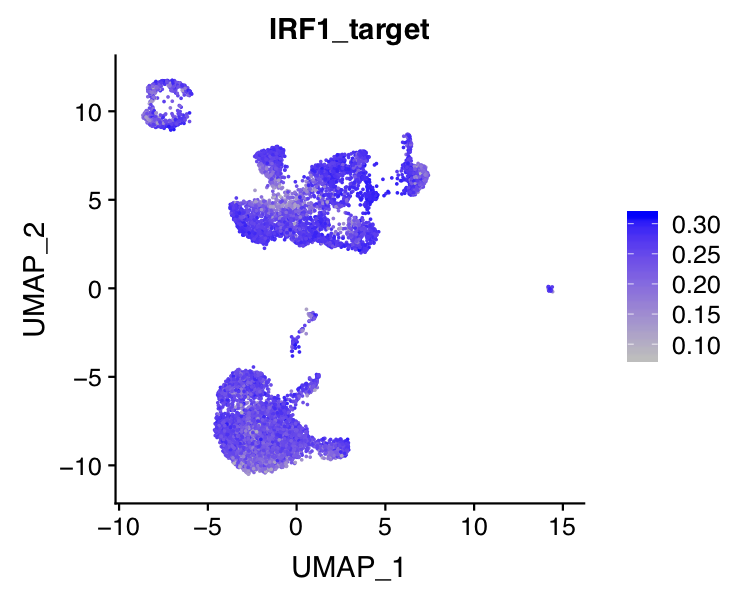

## 10x PBMC 10k scATAC-seq

In this example, we will be analyzing a scATAC-seq dataset of 10K human peripheral blood mononuclear cells (PBMCs) freely available from 10X-genomics. The raw dataset can be downloaded from 10x-genomic website. We will show you how to run through the whole MAESTRO pipeline from the raw sequencing fastq files to the final results. 

**Step 0. Download the data and prepare your working directory**     
Prepare your working directory.
```bash
```      

The raw data can be downloaded from 10X genomics:
```bash
$ cd 10x.pbmc10k.ATAC
$ mkdir data
$ cd data
$ wget http://s3-us-west-2.amazonaws.com/10x.files/samples/cell-atac/1.1.0/atac_v1_pbmc_10k/atac_v1_pbmc_10k_fastqs.tar
$ tar xvf atac_v1_pbmc_10k_fastqs
```               

**Step 1. Configure the MAESTRO workflow**                           
Open the `config.yaml` file and edit it to your needs. Especially, define your single-cell platform for use. 

```bash
$ cd /root/MAESTRO/Snakemake
$ vi config.yaml
```

Here is an example for `config.yaml` file.
```bash
``` 
Once configured, the workflow can be executed with Snakemake.                

**Step 2. Run MAESTRO**

To start, we must activate the MAESTRO CONDA ENVIRONMENT.If successful, you will see "(MAESTRO)" prepended to your command prompt.

Next we will perform a DRY-RUN to make sure that we setup the MAESTRO PROJECT directory correctly. In your PROJECT folder run the following command:
```bash
nohup snakemake --cores 8 --use-conda > 10x.pbmc.1k.out &
```
**Step 3. Understanding the final output files**

Here, we assume you've run MAESTRO successfully. An output directory is specified in the run call, and will contain several useful outputs as described below.            

**Step 4. Custom analysis starting from the processed dataset**
Although MAESTRO will generate all the analysis result through the snakemake based workflow, in most cases, you might want to analysis the result from the processed dataset(count matrix of a cell by peak table), tune the parameters, focused on specific clusters or sub-clusters, and learn transcription regulation in those clusters. Considering this, we build a stand alone MAESTRO R package for downstream analysis. We will show you how to run though the MAESTRO analysis using the R package step by step.

First you need to read the peak count matrix as well as the gene regulatory potential matrix generated by MAESTRO into the R enviroment.
```R
> library(MAESTRO)
> pbmc.peak <- read.table('10X_PBMC_10K_merged_count.txt')
> pbmc.gene <- read.table('10X_PBMC_10K_gene_score.txt')
```

We also support the processed dataset from 10x Cell Ranger pipelines, you can load the gene matrix into R through Seurat package.
```R
> library(Seurat)
> pbmc.peaks <- Read10X_h5("./outs/atac_v1_pbmc_10k_filtered_peak_bc_matrix.h5")
```

**Step 5. Clustering and differential peak calling**      
We next create an Seurat object using the peak count matrix, and perform the clustering analysis as well as differential peak calling for different clusters. 1) We first run dimension reduction on the input matrix. As we and others reported [Cusanovich et al, Science 2015](https://science.sciencemag.org/content/348/6237/910/tab-pdf), the Latent Semantic Index (LSI) have been widely used in learning the structure of scATAC-seq data. We use LSI as the default dimension reduction method, which has the best performance according to our benchmark. You can also use "PCA" as an optional dimension reduction method. 2) We apply UMAP to further reduce the dimensions and identify the clusters using graph-based clustering approach implemented in [Seurat](https://www.cell.com/cell/pdf/S0092-8674(19)30559-8.pdf). 3) We used a [wilcox-test](https://www.tandfonline.com/doi/abs/10.1080/01621459.1972.10481279) based method to identify the differential peaks for each clusters. The original peak count matrix is scaled and weighed by the total peaks present in each cell to overcome the potential ties in wilcox-test. It will take 10-20mins to calculate the differential peaks for all the clusters.

```R
> pbmc.ATAC.res <- ATACRunSeurat(inputMat = as.matrix(pbmc.peak), 
>                                project = "10X_PBMC_10K", 
>                                method = "LSI",
>                                min.c = 50,
>                                min.p = 500,
>                                dims.use = 1:30,
>                                cluster.res = 0.6,
>                                peaks.test.use = "wilcox",
>                                peaks.cutoff = 1e-05
>                                )
> head(pbmc.ATAC.res$peaks)
                                 p_val avg_logFC pct.1 pct.2    p_val_adj cluster
chr6-44058458-44059516    0.000000e+00 0.4752823 0.572 0.135 0.000000e+00       0
chr14-50038437-50039234   0.000000e+00 0.4224288 0.496 0.125 0.000000e+00       0
chr9-129777051-129777688 4.355527e-286 0.3982421 0.478 0.129 6.985916e-281       0
chr20-50274836-50275400  1.797037e-283 0.3954815 0.457 0.118 2.882304e-278       0
chr8-141137795-141138489 1.017501e-255 0.3727491 0.411 0.102 1.631991e-250       0
chr2-112839364-112840014 3.109149e-251 0.3694872 0.409 0.103 4.986827e-246       0
                                             gene
chr6-44058458-44059516     chr6-44058458-44059516
chr14-50038437-50039234   chr14-50038437-50039234
chr9-129777051-129777688 chr9-129777051-129777688
chr20-50274836-50275400   chr20-50274836-50275400
chr8-141137795-141138489 chr8-141137795-141138489
chr2-112839364-112840014 chr2-112839364-112840014
```

 

**Step 6. Annotate celltypes**     
We next try to annotate different clusters based on their marker genes. For scATAC, we first need to pass the gene regulatory potential matrix to the clustering result, then perform differential gene analysis for each cluster on the gene RPscore matrix, and identify the marker genes. We use public immune signatures like [CIBERSORT](https://www.nature.com/articles/nmeth.3337) to annotate the clusters. You can also use your own signatures to annotate the clusters.

```R
> data(human.immune.CIBERSORT)
> pbmc.ATAC.res$ATAC <- ATACAnnotateCelltype(ATAC = pbmc.ATAC.res$ATAC, 
>                                            RPmatrix = pbmc.gene, 
>                                            signatures = human.immune.CIBERSORT, 
>                                            min.score = 0.1, 
>                                            genes.test.use = "wilcox",
>                                            genes.cutoff = 1E-5)
```

 

**Step 7. Identify driver transcription factors**     
Identify enriched transcription regulators is crucial to understanding gene regulation in the heterogeneous single-cell populations. MAESTRO utilize giggle to identify enrichment of transcription factor peaks in scATAC-seq cluster specific peaks. To run this function, you need to first install [giggle](https://github.com/ryanlayer/giggle), download the giggle index from [Cistrome website](http://cistrome.org/~chenfei/MAESTRO/giggle.tar.gz), and provide the file location of the index to MAESTRO. 
After identify enriched transcription regulators, MAESTRO also provide the potential target gene list of the top 10 transcription factors for each cluster, which are based on the ChIP-seq peaks from [CistromeDB](http://cistrome.org/db/#/). The target genes will be generated in the "10X_PBMC_10K.TF.GIGGLE" directory.

```R
> pbmc.ATAC.tfs <- ATACAnnotateTranscriptionFactor(ATAC = pbmc.ATAC.res$ATAC, 
>                                                      peaks = pbmc.ATAC.res$peaks, 
>                                                      project = "10X_PBMC_10K.TF", 
>                                                      giggle.path = "/homes/cwang/annotations/giggle")
Identify enriched TFs for cluster  0 ...
Identify enriched TFs for cluster  1 ...
Identify enriched TFs for cluster  2 ...
Identify enriched TFs for cluster  3 ...
Identify enriched TFs for cluster  4 ...
Identify enriched TFs for cluster  5 ...
Identify enriched TFs for cluster  6 ...
Identify enriched TFs for cluster  7 ...
Identify enriched TFs for cluster  8 ...
Identify enriched TFs for cluster  9 ...
Identify enriched TFs for cluster  10 ...
Identify enriched TFs for cluster  11 ...
Identify enriched TFs for cluster  12 ...
Identify enriched TFs for cluster  13 ...
Identify enriched TFs for cluster  14 ...
Identify enriched TFs for cluster  15 ...
Identify enriched TFs for cluster  16 ...
Identification of enriched TFs is done.
Identify target genes for the top  10  TFs for cluster  0 ...
Identify target genes for the top  10  TFs for cluster  1 ...
Identify target genes for the top  10  TFs for cluster  2 ...
Identify target genes for the top  10  TFs for cluster  3 ...
Identify target genes for the top  10  TFs for cluster  4 ...
Identify target genes for the top  10  TFs for cluster  5 ...
Identify target genes for the top  10  TFs for cluster  6 ...
Identify target genes for the top  10  TFs for cluster  7 ...
Identify target genes for the top  10  TFs for cluster  8 ...
Identify target genes for the top  10  TFs for cluster  9 ...
Identify target genes for the top  10  TFs for cluster  10 ...
Identify target genes for the top  10  TFs for cluster  11 ...
Identify target genes for the top  10  TFs for cluster  12 ...
Identify target genes for the top  10  TFs for cluster  13 ...
Identify target genes for the top  10  TFs for cluster  14 ...
Identify target genes for the top  10  TFs for cluster  15 ...
Identify target genes for the top  10  TFs for cluster  16 ...
> head(pbmc.ATAC.tfs)
$`0`
 [1] "NR2F6 | PPARD | PPARA | PPARG | RXRG | HNF4A | HNF4G"
 [2] "IRF1 | IRF3 | SPI1 | BCL11A | STAT2 | IRF2 | STAT1 | IRF8 | SPIB | PRDM1 | IRF4"
 [3] "PML"
 [4] "DBP | ATF4 | DDIT3 | CEBPA | NFIL3 | CEBPB | CEBPD | CEBPG | CEBPE | BATF | HLF"
 [5] "GLI1 | GLI3 | GLI2"
 [6] "BRD4"
 [7] "RARA | ESRRA | NR4A1 | NR4A2 | NR4A3 | RXRA | NR1I3 | THRA | RXRB | RARG | VDR | NR1H3 | PPARA | PPARG | THRB | ESR2 | NR2C1 | NR2F1 | ESR1 | NR5A2 | NR1I2 | NR2F2 | ESRRB | NR1H4 | RARB | NR5A1"
 [8] "SKI"
 [9] "E4F1 | GMEB2 | ARNT | HIF1A | AHR | EPAS1"
[10] "ELF2 | ELF1 | ETV2 | ETS2 | FLI1 | ELK1 | ETV5 | NFAT5 | GABPA | ETV6 | ELK4 | ETS1 | ETV7 | ELK3 | ETV4 | ERG | ETV1 | EHF | FEV | ELF3 | ELF5"
```

**Step 8. Visualize driver transcription factors for each cluster**     
According to the annotation of the clusters, we know that cluster 0 is Monocyte. Next we want to visualize the expression level of the enriched transcription factors, here we used the gene regulatory potential score (RPscoe) as the predicted gene expression level, and we only want to focused on the TFs that are expressed in the Monocyte cluster as its potential driver transcriptional regulators.

```R
> VisualizeVlnplot(genes = pbmc.ATAC.tfs, 
>                  cluster = "0", 
>                  type = "ATAC", 
>                  SeuratObj = pbmc.ATAC.res$ATAC, 
>                  ncol = 5, 
>                  width = 10, 
>                  height = 4, 
>                  name = "10X_PBMC_10K_TF_Monocyte")
```
   

```R
> VisualizeUmap(genes = pbmc.ATAC.tfs, 
>              cluster = "0", 
>              type = "ATAC", 
>              SeuratObj = pbmc.ATAC.res$ATAC, 
>              ncol = 3, 
>              width = 9, 
>              height = 7.5, 
>              name = "10X_PBMC_10K_TF_Monocyte")
```
 

Based on the predicted expression level of TFs, we can see that IRF1 is highly expressed in the monocytes from PBMC. We will next visualize the predicted expression of IRF1 target genes.

```R
> IRF1_target <- as.character(read.table('10X_PBMC_10K.TF.GIGGLE/0.IRF1.41302.target.genes.top500.txt')[,1])
> IRF1_target <- intersect(IRF1_target, rownames(pbmc.ATAC.res$ATAC))
> head(IRF1_target)
[1] "A1BG"         "A4GNT"        "ABHD13"       "ABHD14A"      "ABHD14A-ACY1"
[6] "ACVRL1"
> pbmc.ATAC.res$ATAC@meta.data$IRF1_target <- colMeans(x = as.matrix(GetAssayData(pbmc.ATAC.res$ATAC))[IRF1_target, ], na.rm = TRUE)
> p <- FeaturePlot(pbmc.ATAC.res$ATAC,  features = "IRF1_target", cols = c("grey", "blue"))
> ggsave(file.path("10X_PBMC_10K_TF_Monocyte_IRF1.pdf"), p, width = 5, height = 4)
```
  

**Step 9. Save the project for future analysis**     
Finally, you can save the R project including the raw data, normalized data, clustering result and meta informations for future analysis.

```R
saveRDS(pbmc.ATAC.res, "pbmc.ATAC.res.rds")
```

The differential peaks, TFs and target genes have already been saved in the current directory by MAESTRO.

```bash
$ ls 10X_PBMC_10K.DiffPeak.tsv 10X_PBMC_10K.TF.GIGGLE 
```

