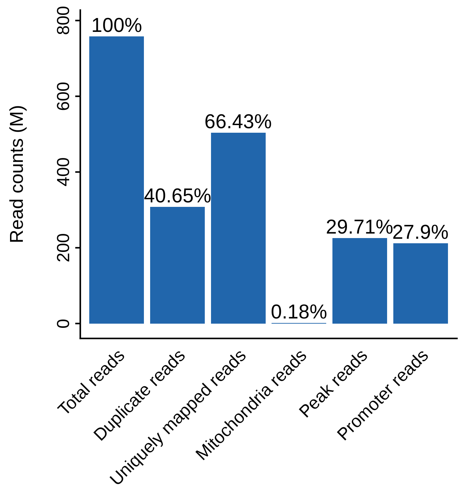
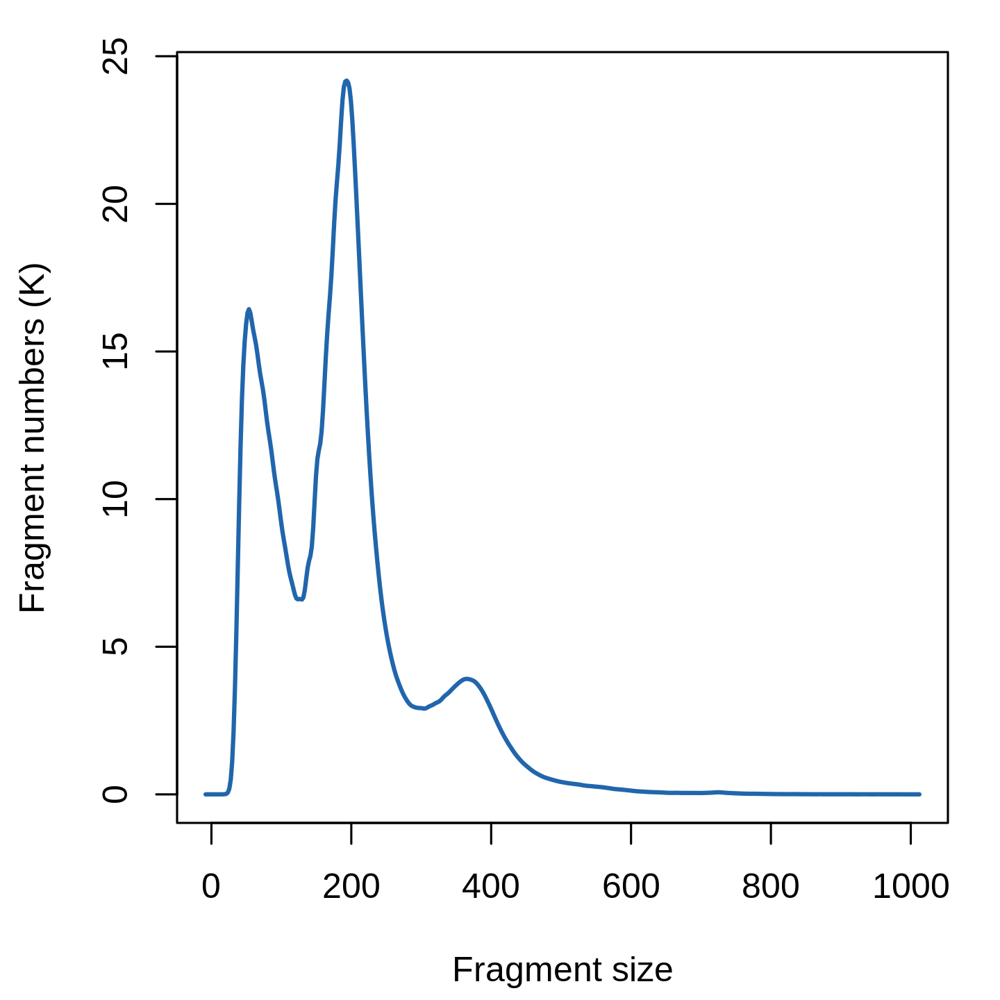
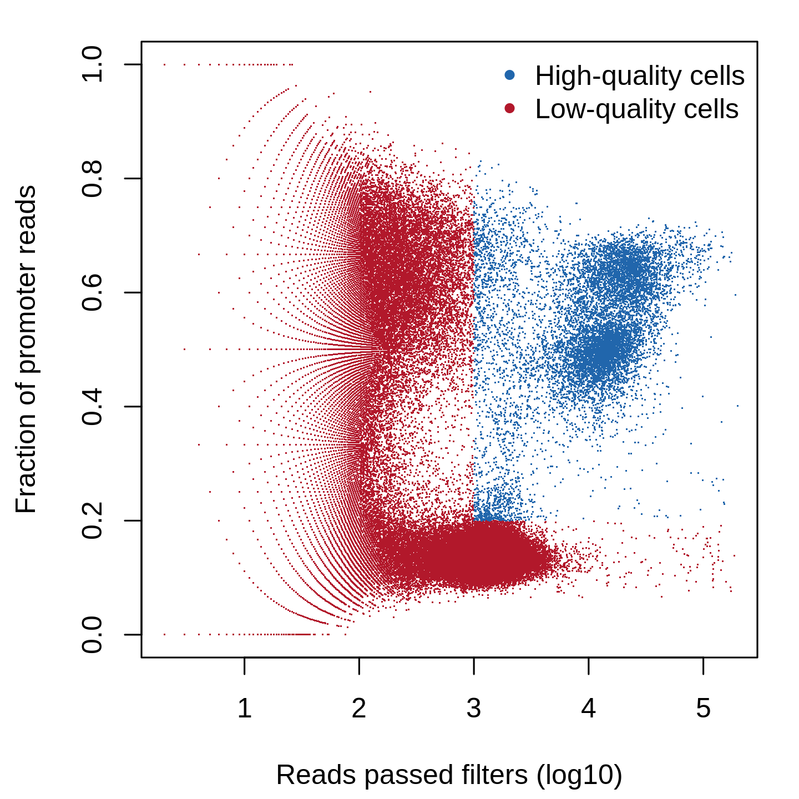
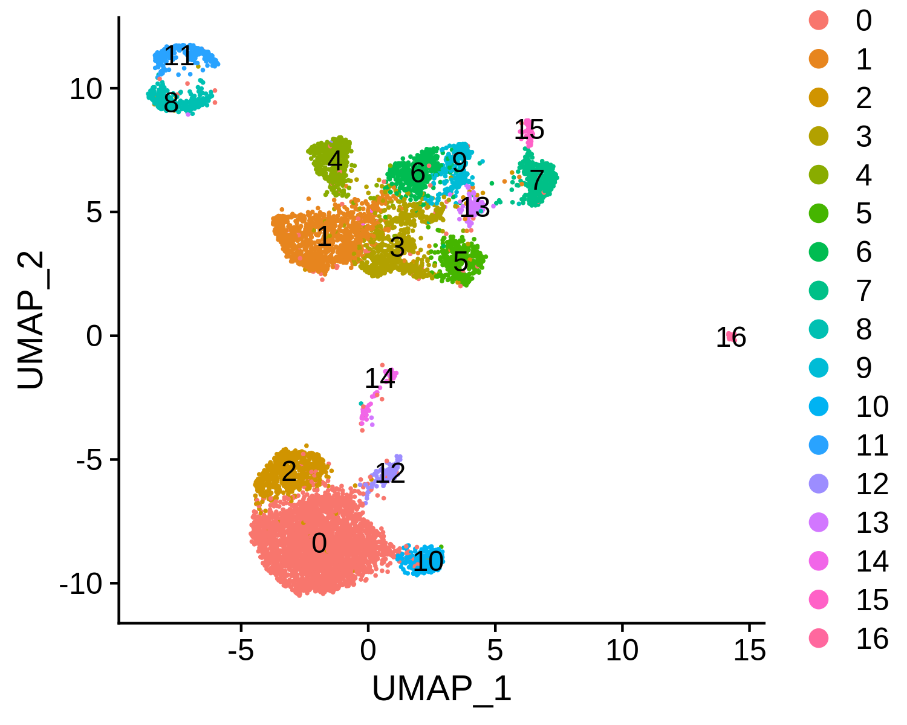
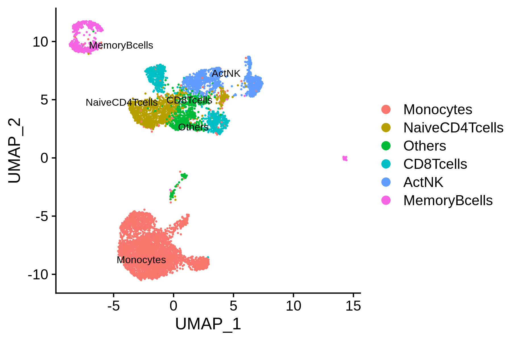
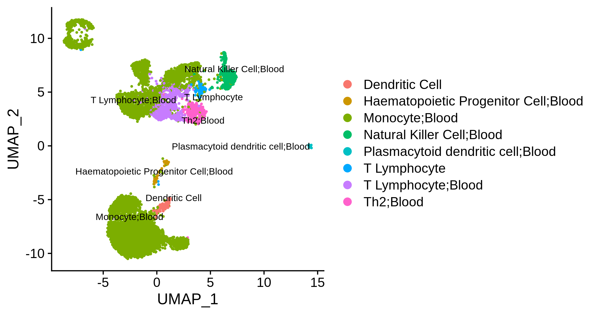
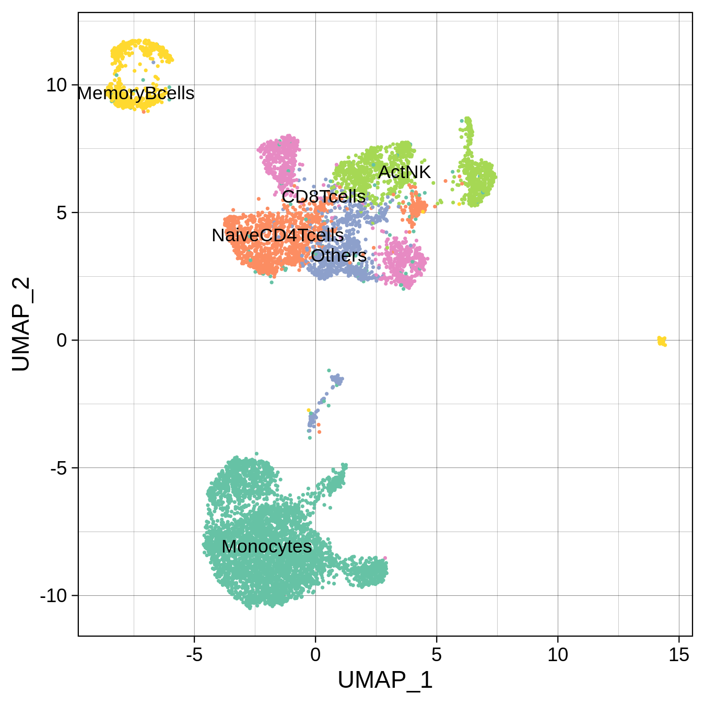
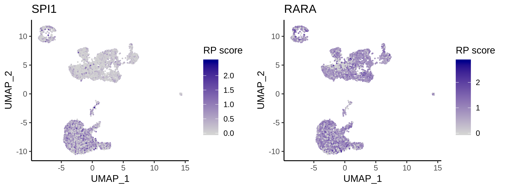
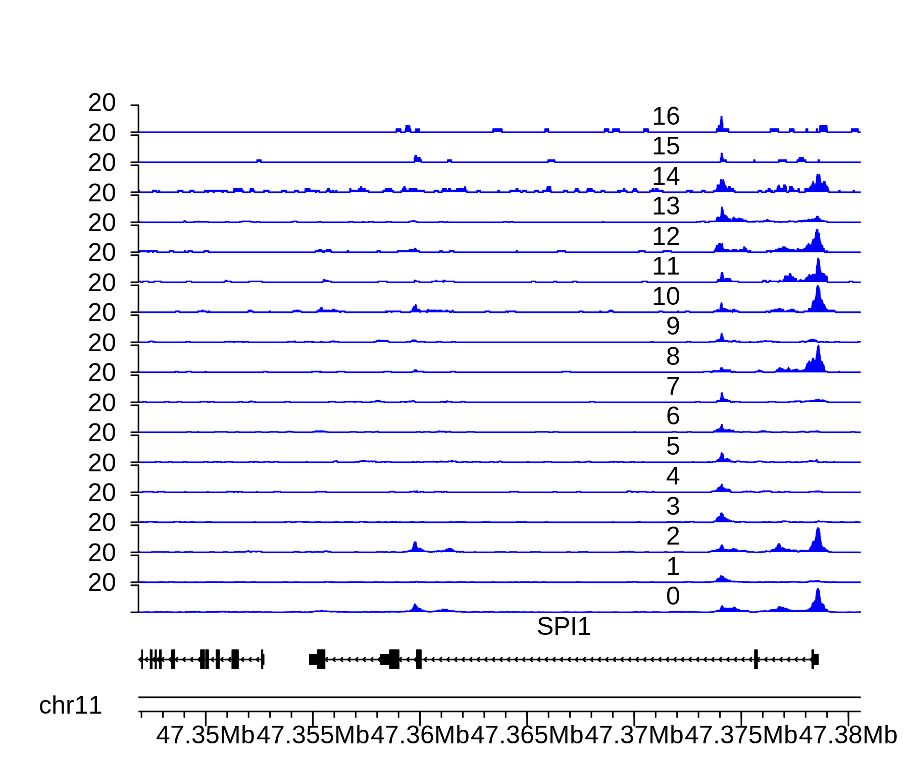

# 10x PBMC 10k scATAC-seq

In this example, we will be analyzing a scATAC-seq dataset of 10K human peripheral blood mononuclear cells (PBMCs) freely available from 10X Genomics. The raw dataset can be downloaded from the 10X Genomics website. We will show you how to [run through the whole MAESTRO pipeline](#run-maestro-pipeline) from the raw sequencing fastq files to the final results. We also provide guidance on how to [perform custom analysis](#perform-custom-analysis-from-the-pipeline-output) starting from the pipeline output such as the peak count matrix.

## Run MAESTRO pipeline

### Step 0. Download the data and prepare the environment
Please download the raw data from 10X Genomics website.
```bash
$ wget http://s3-us-west-2.amazonaws.com/10x.files/samples/cell-atac/1.1.0/atac_v1_pbmc_10k/atac_v1_pbmc_10k_fastqs.tar
$ tar xvf atac_v1_pbmc_10k_fastqs.tar
```

Before running MAESTRO, users need to activate the MAESTRO environment.
```bash
$ conda activate MAESTRO
```

### Step 1. Configure the MAESTRO workflow
Initialize the MAESTRO scATAC-seq workflow using `MAESTRO scATAC-init` command. This will install a Snakefile and a config file in this directory. Here we take the 10X PBMC data as an example. Considering MAESTRO provides built-in immune cell markers, it's recommended to choose the `RP-based` cell-type annotation strategy. If the data is not immune-related, users can choose to provide their own marker gene list, or choose to annotate cell types through the `peak-based` method (see the following argument description for more details), or they can directly skip the annotation step by not setting `--annotation`.
```bash
$ MAESTRO scatac-init --platform 10x-genomics --format fastq --species GRCh38 \
--fastq-dir Data/atac_v1_pbmc_10k_fastqs --fastq-prefix atac_v1_pbmc_10k \
--cores 8 --directory 10X_PBMC_10k_MAESTRO_V110 --outprefix 10X_PBMC_10k \
--peak-cutoff 100 --count-cutoff 1000 --frip-cutoff 0.2 --cell-cutoff 50 \
--giggleannotation annotations/MAESTRO/giggle.all \
--fasta annotations/MAESTRO/Refdata_scATAC_MAESTRO_GRCh38_1.1.0/GRCh38_genome.fa \
--whitelist Data/barcodes/737K-cratac-v1.txt \
--rpmodel Enhanced \
--annotation --method RP-based --signature human.immune.CIBERSORT
```

MAESTRO also allow users to start with bam files with 'CB' tag. Here the bam file `atac_pbmc_10k_v1_possorted_bam.bam` can be downloaded from [10X Genomics](https://support.10xgenomics.com/single-cell-atac/datasets/1.1.0/atac_pbmc_10k_v1). 
```bash
$ MAESTRO scatac-init --platform 10x-genomics --format bam --species GRCh38 \
--bam Data/atac_pbmc_10k_v1_possorted_bam.bam \
--cores 8 --directory 10X_PBMC_10k_MAESTRO_V110 --outprefix 10X_PBMC_10k \
--peak-cutoff 100 --count-cutoff 1000 --frip-cutoff 0.2 --cell-cutoff 50 \
--rpmodel Enhanced \
--giggleannotation annotations/MAESTRO/giggle.all \
--annotation --method both --signature human.immune.CIBERSORT --clusterpeak
```

Fragment file generated by Cellranger ATAC is also supported as the input of the workflow. Here the fragment file `atac_pbmc_10k_v1_fragments.tsv.gz` can be downloaded from [10X Genomics](https://support.10xgenomics.com/single-cell-atac/datasets/1.1.0/atac_pbmc_10k_v1).
```bash
MAESTRO scatac-init --platform 10x-genomics --format fragments --species GRCh38 \
--frag Data/atac_pbmc_10k_v1_fragments.tsv.gz \
--cores 8 --directory 10X_PBMC_10k_MAESTRO_V110 --outprefix 10X_PBMC_10k \
--peak-cutoff 100 --count-cutoff 1000 --frip-cutoff 0.2 --cell-cutoff 50 \
--rpmodel Enhanced \
--giggleannotation annotations/MAESTRO/giggle.all \
--annotation --method both --signature human.immune.CIBERSORT --clusterpeak
```

To get a full description of command-line options, please use the command `MAESTRO scatac-init -h`.
```bash
usage: usage: MAESTRO scatac-init [-h]
                           [--platform {10x-genomics,sci-ATAC-seq,microfluidic}]
                           [--format {fastq,bam,fragments}]
                           [--fastq-dir FASTQ_DIR]
                           [--fastq-prefix FASTQ_PREFIX] [--bam BAM]
                           [--frag FRAG] [--species {GRCh38,GRCm38}]
                           [--cores CORES] [--directory DIRECTORY]
                           [--outprefix OUTPREFIX] [--peak-cutoff PEAK_CUTOFF]
                           [--count-cutoff COUNT_CUTOFF]
                           [--frip-cutoff FRIP_CUTOFF]
                           [--cell-cutoff CELL_CUTOFF] --giggleannotation
                           GIGGLEANNOTATION [--fasta FASTA]
                           [--whitelist WHITELIST] [--custompeak]
                           [--custompeak-file CUSTOMPEAK_FILE] [--shortpeak]
                           [--clusterpeak] [--rpmodel {Simple,Enhanced}]
                           [--genedistance GENEDISTANCE] [--annotation]
                           [--method {RP-based,peak-based,both}]
                           [--signature SIGNATURE]
```

Here we list all the arguments and their description.

**Input files arguments:**

Arguments  |  Description
---------  |  -----------
`--platform` | {10x-genomics,sci-ATAC-seq,microfluidic} Platform of single cell ATAC-seq. DEFAULT: 10x-genomics.
`--format` | {fastq,bam,fragments} The format of input files. Users can start with sequencing fastq files, bam files with CB tag or fragments.tsv.gz file generated by CellRanger ATAC. If the platform is 10x-genomics, users can start with sequencing fastq files, bam files with CB tag or fragments.tsv.gz file generated by CellRanger ATAC. If the platform is sci-ATAC-seq, users can start with sequencing fastq files, bam files with CB tag. If the platform is microfluidic, users can only start with sequencing fastq files. If the format is 'fastq', --fastq-dir and --fastq-prefix need to be set. If the format is 'bam', --bam needs to be set. If the format is 'fragments', --frag needs to be set. DEFAULT: fastq.
`--fastq-dir` | Directory where fastq files are stored.
`--fastq-prefix` | Sample name of fastq file (required for the platform of '10x-genomics' or 'sci-ATAC-seq'). When the platform is '10x-genomics', if there is a file named pbmc_1k_v2_S1_L001_I1_001.fastq.gz, the prefix is 'pbmc_1k_v2'. If the platform is 'sci-ATAC-seq', there are two ways to provide fastq files. The first is to provide pair-end sequencing results that contain two fastq files -- prefix_1.fastq and prefix_2.fastq. If in this way, the barcode for each read needs to be included in the reads ID (the first line of each read) in the format of '@ReadName:CellBarcode:OtherInformation'. For example, @rd.1:TCTCCCGCCGAGGCTGACTGCATAAGGCGAAT:SHEN-MISEQ02:1:1101:15311:1341. The other way is to provide 10x-like fastq files which should contain three fastq files -- prefix_R1.fastq, prefix_R2.fastq and prefix_R3.fastq. In this way, read1, barcode and read2 are associated with R1, R2, R3, respectively.
`--bam BAM` | The bam file with cell barcode (CB) tag (required when the format is set as 'bam').
`--frag FRAG` | The fragment file generated by CellRanger ATAC (required when the format is set as 'fragments'). For example, fragments.tsv.gz.
`--species` | {GRCh38,GRCm38} Specify the genome assembly (GRCh38 for human and GRCm38 for mouse). DEFAULT: GRCh38.

**Running and output arguments:**

Arguments  |  Description
---------  |  -----------
`--cores` | The number of cores to use. DEFAULT: 8.
`--directory` | Path to the directory where the workflow shall be initialized and results shall be stored. DEFAULT: MAESTRO.
`--outprefix` | Prefix of output files. DEFAULT: MAESTRO.

**Quality control arguments:**

Arguments  |  Description
---------  |  -----------
`--peak-cutoff` |  Minimum number of peaks included in each cell. DEFAULT: 100.
`--count-cutoff` | Cutoff for the number of count in each cell. DEFAULT: 1000.
`--frip-cutoff` | Cutoff for fraction of reads in promoter in each cell. DEFAULT: 0.2.
`--cell-cutoff` | Minimum number of cells covered by each peak. DEFAULT: 10.

**Reference genome arguments:**

Arguments  |  Description
---------  |  -----------
`--giggleannotation` | Path of the giggle annotation file required for regulator identification. Please download the annotation file from [here](http://cistrome.org/~chenfei/MAESTRO/giggle.all.tar.gz) and decompress it.
`--fasta` | Genome fasta file for minimap2. Users can just download the fasta file for [human](http://cistrome.org/~chenfei/MAESTRO/Refdata_scATAC_MAESTRO_GRCh38_1.1.0.tar.gz) and [mouse](http://cistrome.org/~chenfei/MAESTRO/Refdata_scATAC_MAESTRO_GRCm38_1.1.0.tar.gz) from CistromDB and decompress them. For example, `--fasta Refdata_scATAC_MAESTR O_GRCh38_1.1.0/GRCh38_genome.fa`.

**Barcode library arguments, only for the platform of 'sci-ATAC-seq':**

Arguments  |  Description
---------  |  -----------
`--whitelist` | If the platform is 'sci-ATAC-seq' or '10x-genomics', please specify the barcode library (whitelist) so that the pipeline can correct cell barcodes with 1 base mismatched. Otherwise, the pipeline will automatically output the barcodes with enough read count (>1000). The 10X Chromium whitelist file can be found inside the CellRanger-ATAC distribution. For example, in CellRanger-ATAC 1.1.0, the whitelist is 'cellranger-atac-1.1.0/cellranger-atac-cs/1.1.0/lib/python/barcodes/737K-cratac-v1.txt'.

**Customized peak arguments:**

Arguments  |  Description
---------  |  -----------
`--custompeak` | Whether or not to provide custom peaks. If set, users need to provide the file location of peak file through `--custompeak-file` and then MAESTRO will merge the custom peak file and the peak file called from all fragments using MACS2. By default (not set), the pipeline will use the peaks called using MACS2.
`--custompeak-file` | If `--custompeak` is set, please provide the file location of custom peak file. The peak file is BED formatted with tab-separated. The first column is the chromosome, the second is chromStart, and the third is chromEnd.
`--shortpeak` | Whether or not to call peaks from short fragments (shorter than 150bp). If set, MAESTRO will merge the peaks called from all fragments and those called from short fragments, and then use the merged peak file for further analysis. If not (by default), the pipeline will only use peaks called from all fragments.
`--clusterpeak` | Whether or not to call peaks by cluster. If set, MAESTRO will split the bam file according to the clustering result, and then call peaks for each cluster. By default (not set), MAESTRO will skip this step.

**Gene score arguments:**

Arguments  |  Description
---------  |  -----------
`--rpmodel` | {Simple,Enhanced} The RP model to use to calaculate gene score. For each gene, simple model sums over the impact of all regulatory elements within the up/dowm-stream of TSS. On the basis of simple model, enhanced model gives the regulatory elements within the exon region a higher weight, and also excludes the regulatory elements overlapped with another gene (the promoter and exon of a nearby gene). See the MAESTRO paper for more details. DEFAULT: Enhanced.
`--genedistance` | Gene score decay distance, could be optional from 1kb (promoter-based regulation) to 10kb (enhancer-based regulation). DEFAULT: 10000.

**Cell-type annotation arguments:**

Arguments  |  Description
---------  |  -----------
`--annotation` | Whether or not to perform ccell-type annotation. By default (not set), MAESTRO will skip the step of cell-type annotation. If set, please specify the method of cell-type annotation through `--method`.
`--method` | {RP-based,peak-based,both} Method to annotate cell types. MAESTRO provides two strategies to annotate cell types for scATAC-seq data. Users can choose from 'RP-based' and 'peak-based', or choose to run both of them. One is based on gene regulatory potential predicted by RP model. Another is based on the bulk chromatin accessibility data from Cistrome database. If 'RP-based' is set, MAESTRO performs the cell-type annotation using the gene regulatory potential to represent gene expression, and the logFC of gene regulatory potential between one cluster and all the other cells is used to calculate the gene signature scores. If 'peak-based' is set, MAESTRO utilizes GIGGLE to evaluate the enrichment of bulk chromatin accessibility peaks on cluster-specific peaks from scATAC-seq data, and then transfers the Cistrome cluster identity from the most enriched bulk chromatin accessibility data as the cell-type annotation for the scATAC-seq cluster. See the MAESTRO paper for more details. DEFAULT: RP-based.
`--signature` |Cell signature file used to annotate cell types (required when method is set as 'RP-based'). MAESTRO provides several sets of built-in cell signatures. Users can choose from ['human.immune.CIBERSORT', 'mouce.brain.ALLEN', 'mouse.all.facs.TabulaMuris', 'mouse.all.droplet.TabulaMuris']. Custom cell signatures are also supported. In this situation, users need to provide the file location of cell signatures, and the signature file is tab-seperated without header. The first column is cell type, and the second column is signature gene. DEFAULT: human.immune.CIBERSORT.


### Step 2. Run MAESTRO
Before running the workflow, please check the `config.yaml` and see if it is configured correctly. Once configured, users can use snakemake to run the workflow. 
```bash
$ cd 10X_PBMC_10k_MAESTRO_V110
$ snakemake -np
$ nohup snakemake --cores 10 > 10X_PBMC_10k.out &
```

### Step 3. Understand the final output files   
The whole pipeline in this example takes about 6 hours with 10 cores. Here, we assume users have run MAESTRO from fastq files successfully. An output directory is specified in the run call, and will contain several useful outputs as described below.
```bash
$ ls Result
10X_PBMC_10k_scATAC_report.html  Analysis  Benchmark  Log  minimap2  QC
```

#### Output files
* **minimap2:**
The `minimap2` directory contains all the mapping results generated by `minimap2`. `fragments_corrected_count.tsv` is a BED-like tabular file, in which each line represents a unique ATAC-seq fragment captured by the assay. The 5 columns in the file are chrom, chromStart, chromEnd, barcode, and duplicateCount, respectively. All the barcodes have been corrected according to the whitelist users provide. `fragments_corrected_count.tsv` is used for counting peaks in the downstream analysis.
* **QC:**
The `QC` directory contains quality control analysis results of scATAC-seq data, including the barcode filtering table `outprefix_scATAC_validcells.txt`, filtered count matrix `outprefix_filtered_peak_count.h5` and other QC results. The filtered count matrix is generated according to `singlecell.txt` and the parameters like `--count-cutoff` and `--frip-cutoff` that users provide. `singlecell.txt` is a tabular file, which provides QC information associated with the fragments per barcode. The file contains three columns, representing barcode, number of fragments and number of fragments overlapping promoter regions. 
* **Analysis:**
The `Analysis` directory contains MACS2 peak calling result, peak count table and gene score table, as well as clustering result, cell type annotation result and driver transcription factor identification result, which we will introduce in the step-by-step analysis.
* **Benchmark:**
The `Benchmark` directory stores benchmark files for all rules in Snakefile, each of which contains a tab-separated table of run times and memory usage in MiB.
* **Log:**
The Log directory contains the log files generated in the pipeline analysis.
* **outprefix_scATAC_report.html:**
The `outprefix_scATAC_report.html` file summarizes all the results in an HTML based document. The summary HTML for the 10X_PBMC_10k example can be found [here](http://cistrome.org/~chenfei/MAESTRO/10X_PBMC_10k_scATAC_report.html).

MAESTRO performs quality control at both bulk and single-cell level. Here we list QC plots generated by MAESTRO.

**Mappability plot for scATAC-seq QC analysis (bulk level)**

MAESTRO evaluates read mappability, duplicate reads percentage, the fraction of reads mapped to mitochondrial genes, peak regions or promoter regions.  
* The **percentage of duplicate reads** shows whether the library is over-amplified due to limited starting material. PCR duplicates will be removed for downstream analysis. So, we expect as few duplicates read as possible. For human or mouse, if the percentage of duplicate reads is more than 50%, there may be something wrong during the library preparation.
* As for **uniquely mapped reads**, if the percentage is less than 50%, it might be due to inadequate sequencing depth or excessive PCR amplification.   
* **Reads derived from mitochondrial DNA** represent noise in ATAC-seq data, and should be discarded in the downstream analysis.
* The **fraction of reads in peak or promoter regions** is a widely used metric to evaluate the signal-to-noise ratio of ATAC-seq data quality. High values are an indicator of a good signal-to-noise ratio. At the bulk level, if the values are less than 2%, it seems that ATAC-seq assay does not capture strong signals. 

 

**Fragment size distribution for scATAC-seq QC analysis (bulk level)**

The fragment size distribution should show a periodicity of approximately 200bp due to nucleosome protection of the chromatin to transposase cutting.

 

**Cell filtering plot for scATAC-seq QC analysis (single-cell level)**

While the fraction of reads in peaks is a good way to check overall sample quality at the bulk level, peak calls from the aggregated scATAC-seq data are dominated by the major populations. Therefore, instead of using the fraction of reads in aggregated peaks to filter cell barcodes, which might eliminate the rare cell populations, we use the fraction of reads in promoter regions to filter the cell barcodes. Cells with fewer than 1000 unique fragments and 20% fraction of promoter reads are treated as low-quality cells and filtered out from the downstream analysis. If the sequencing depth is not enough or the number of cells is small, please lower the `--count-cutoff` and `--frip-cutoff`.

 

## Perform custom analysis from the pipeline output
Although MAESTRO will generate all the analysis results through the snakemake-based workflow, in most cases, users might focus on specific clusters or sub-clusters or want to tune some of the parameters to improve the results. Then users can utilize the stand-alone MAESTRO R package, which has been installed in the MAESTRO conda environment, to perform custom analysis from the processed dataset (peak by cell binary matrix). We will show you how to run through the downstream analysis using the R package step by step.

### Step 0. Read data
First users need to read the peak count matrix as well as the gene regulatory potential matrix generated by MAESTRO into the R enviroment. To support the processing of large datasets, in MAESTRO we use [HDF5 format](https://support.10xgenomics.com/single-cell-atac/software/pipelines/latest/advanced/h5_matrices) for all the expression, atac-seq peak count and RP tables. 
```R
> library(MAESTRO)
> library(Seurat)
> pbmc.peak <- Read10X_h5('Result/QC/10X_PBMC_10k_filtered_peak_count.h5')
> pbmc.gene <- Read10X_h5('Result/Analysis/10X_PBMC_10k_gene_score.h5')
```

We also support the processed dataset from 10x Cell Ranger pipelines, users can load the peak matrix into R through Seurat package. Then users can generate the gene regulatory score matrix by the following command. See [tutorial](../Gene_activity_modelling/Gene_activity_modelling.md) of gene activity modelling for more details.
```R
> pbmc.peak <- Read10X_h5("10X_PBMC_10k/outs/filtered_peak_bc_matrix.h5")
> pbmc.gene <- ATACCalculateGenescore(pbmc.peaks, organism = "GRCh38")
```

**Note:** If MAESTRO R package is not managed through miniconda, users may encounter the following error.

```R
Error: Python shared library not found, Python bindings not loaded.
Use reticulate::install_miniconda() if you'd like to install a Miniconda Python environment.
```

It means reticulate R package cannot find the python shared library. If Anaconda has been installed, users just need to specify an alternate version of python, for example:

```R
> library(reticulate)
> use_python("/opt/anaconda3/bin/python", required = TRUE)
> pbmc.gene <- ATACCalculateGenescore(pbmc.peak)
```

If users don't install Miniconda or Anaconda, we recommend to use `reticulate::install_miniconda()` to install a Miniconda Python environment and specify the version through `use_python`.

### Step 1. Perform clustering analysis and differential peak calling    
We next create a Seurat object using the peak count matrix and perform the clustering analysis as well as differential peak calling for different clusters. `ATACRunSeurat()` function in MAESTRO integrates multiple functions of Seurat and perform the routine analysis as follows.

**Analysis**
* **Dimension reduction:**
MAESTRO first performs dimension reduction on the input matrix. As we and others reported [(Cusanovich et al, Science 2015)](https://science.sciencemag.org/content/348/6237/910/tab-pdf), the Latent Semantic Index (LSI) has been widely used in learning the structure of scATAC-seq data. We use LSI as the default dimension reduction method, which has the best performance according to our benchmark. Users can tune the parameters of `RunLSI` via `runlsi.args`. For example, users can set `runlsi.args = list(n = 30)` to define the number of singular values to compute LSI. We also provide PCA as an optional method.  
* **Clustering:**
MAESTRO employs the graph-based clustering method in Seurat for scATAC-seq clustering analysis. Please see [Seurat](https://www.cell.com/cell/pdf/S0092-8674(19)30559-8.pdf) for the details. Briefly, MAESTRO will build a K-nearest neighbor (KNN) graph using the reduced dimensions from the previous step, and then refine the edge weights between two cells based on the Jaccard similarity of their neighborhoods, which are completed by the `FindNeighbors` function in Seurat. To cluster the cells, MAESTRO uses the `FindClusters` function in Seurat, which applies the Louvain algorithm to cluster cells together iteratively. The default clustering resolution for scATAC-seq is set to 0.6, and users can also tune the parameter for different conditions. Besides, extra parameters for `FindNeighbors` and `FindClusters` can be passed via `findneighbors.args` and `findclusters.args`. For example, users can set `findneighbors.args = list(k.param = 25)` to define k = 25 for the k-nearest neighbor algorithm.
* **UMAP visualization:**
UMAP is used to visualize all the single cells. MAESTRO adopts [UMAP](https://arxiv.org/abs/1802.03426) to achieve a low dimension embedding, in which similar cells are placed together. To get a better result for visualization, users can tune the parameters of `RunUMAP` by adding the arguments in `ATACRunSeurat` function, like `ATACRunSeurat(inputMat = pbmc.gene, ..., n.neighbors = 20, min.dist = 0.2)`. 
* **Differential peak calling:**
MAESTRO adopts a [wilcox-test](https://www.tandfonline.com/doi/abs/10.1080/01621459.1972.10481279) based method to identify the differential peaks for each cluster. The original peak count matrix is scaled and weighed by the total peaks present in each cell to overcome the potential ties in Wilcox-test. It will take 10-20mins to calculate the differential peaks for all the clusters. We provide `FindAllMarkersMAESTRO` function in MAESTRO, which is adapted from `FindAllMarkers` of Seurat, to reduce the computational time and memory. Peaks with logFC greater than 0.2, minimum presence faction in cells of 0.1, and p-value less than 1E-5 are identified as differential peaks for each cluster.

```R
> pbmc.ATAC.res <- ATACRunSeurat(inputMat = pbmc.peak,
                                 project = "10X_PBMC_10k",
                                 min.c = 50,
                                 min.p = 500,
                                 method = "LSI",
                                 dims.use = 1:30,
                                 cluster.res = 0.6,
                                 only.pos = TRUE,
                                 peaks.test.use = "presto",
                                 peaks.cutoff = 1e-05,
                                 peaks.pct = 0.1,
                                 peaks.logfc = 0.2)
> head(pbmc.ATAC.res$peaks)
          p_val avg_logFC pct.1 pct.2     p_val_adj cluster
1  0.000000e+00 0.4752823 0.572 0.135  0.000000e+00       0
2  0.000000e+00 0.4224288 0.496 0.125  0.000000e+00       0
3 4.355527e-286 0.3982421 0.478 0.129 6.985916e-281       0
4 1.797037e-283 0.3954815 0.457 0.118 2.882304e-278       0
5 1.017501e-255 0.3727491 0.411 0.102 1.631991e-250       0
6 3.109149e-251 0.3694872 0.409 0.103 4.986827e-246       0
                      peak
1   chr6-44058458-44059516
2  chr14-50038437-50039234
3 chr9-129777051-129777688
4  chr20-50274836-50275400
5 chr8-141137795-141138489
6 chr2-112839364-112840014
```

`ATACRunSeurat()` returns a list of a Seurat object `ATAC` and dataframe `peaks`. Please see [Seurat Github wiki](https://github.com/satijalab/seurat/wiki) for more details of the Seurat object structure. Users can use the `str()` command to get an intuitive understanding of the object.
```R
> str(pbmc.ATAC.res$ATAC)
```
 

### Step 2. Annotate cell types 
We next try to annotate different clusters based on their marker genes. For scATAC, MAESTRO provides two methods to annotate cell types. One is based on inferred gene activity. MAESTRO uses the gene regulatory potential (RP model, see the paper for more details) to quantify gene expression. So, we first need to use `ATACAttachGenescore()` to pass the gene regulatory potential matrix to the clustering result, and then perform differential gene analysis for each cluster on the gene RPscore matrix and identify the marker genes. We use public immune signatures like [CIBERSORT](https://www.nature.com/articles/nmeth.3337) to annotate the clusters. Users can also use their own signatures to annotate the clusters. Cell type information is stored in `Object@meta.data$assign.ident`.

```R
> pbmc.ATAC.res$ATAC <- ATACAttachGenescore(ATAC = pbmc.ATAC.res$ATAC, RPmatrix = pbmc.gene)
> data(human.immune.CIBERSORT)
> pbmc.ATAC.res$ATAC <- ATACAnnotateCelltype(ATAC = pbmc.ATAC.res$ATAC,
                                             signatures = human.immune.CIBERSORT, 
                                             min.score = 0.1, 
                                             genes.test.use = "presto",
                                             genes.cutoff = 1E-5)
> head(pbmc.ATAC.res$ATAC@meta.data)
                   orig.ident nCount_ATAC nFeature_ATAC ATAC_snn_res.0.6
AAACGAAAGAGCGAAA 10X_PBMC_10k        6073          6073                0
AAACGAAAGAGTTTGA 10X_PBMC_10k        7091          7091                2
AAACGAAAGCGAGCTA 10X_PBMC_10k       10187         10187                7
AAACGAAAGGCTTCGC 10X_PBMC_10k       40191         40191               13
AAACGAAAGTGCTGAG 10X_PBMC_10k        5343          5343                0
AAACGAAGTCAGGCTC 10X_PBMC_10k        2853          2853                1
                 seurat_clusters nCount_ACTIVITY nFeature_ACTIVITY
AAACGAAAGAGCGAAA               0        8832.537             19326
AAACGAAAGAGTTTGA               2       10169.177             20662
AAACGAAAGCGAGCTA               7       17031.471             24756
AAACGAAAGGCTTCGC              13       57484.577             34209
AAACGAAAGTGCTGAG               0        8132.421             18455
AAACGAAGTCAGGCTC               1        5323.381             13041
                   assign.ident
AAACGAAAGAGCGAAA      Monocytes
AAACGAAAGAGTTTGA      Monocytes
AAACGAAAGCGAGCTA          ActNK
AAACGAAAGGCTTCGC NaiveCD4Tcells
AAACGAAAGTGCTGAG      Monocytes
AAACGAAGTCAGGCTC NaiveCD4Tcells
```

 

Another method `ATACAnnotateChromatinAccessibility` to annotate scATAC-seq data is based on chromatin accessibility directly. MAESTRO incorporates public bulk chromatin accessibility data (DNase-seq and ATAC-seq) from Cistrome database. All the datesets are clustered into 80 clusters and the cluster identities are determined by the cell-type or tissue type information of datasets within each cluster. For scATAC-seq clusters, MAESTRO utilizes giggle to evaluate the enrichment of bulk chromatin accessibility peaks on cluster-specific peaks from scATAC-seq data. Then the Cistrome cluster identity from the most enriched bulk chromatin accessibility data is used to represent the cell-type annotation for the scATAC-seq cluster. Giggle has been installed in the MAESTRO conda environment. If users only installed the stand-alone R pcakage, please install [giggle](https://github.com/ryanlayer/giggle) first. Users need to download the giggle index from [Cistrome website](http://cistrome.org/~chenfei/MAESTRO/giggle.all.tar.gz), and provide the file location of the index to `ATACAnnotateChromatinAccessibility`. Cell type annotation based on bulk chromatin accessibility data is stored in `Object@meta.data$biological_resource`.

```R
result$ATAC <- ATACAnnotateChromatinAccessibility(ATAC = pbmc.ATAC.res$ATAC, 
                                                  peaks = pbmc.ATAC.res$peaks, 
                                                  project = "10X_PBMC_10k", 
                                                  giggle.path = "~/annotations/MAESTRO/giggle.all",
                                                  organism = "GRCh38")
p <- DimPlot(result$ATAC, label = TRUE, reduction = "umap", group.by = "biological_resource", repel=T, pt.size = 0.5, label.size = 2.5)
ggsave(file.path(paste0(result$ATAC@project.name, "_CistromeTop_annotated.png")), p, width=7.5, height=4)
```

 

All the reduction results are stored in `Object@reductions`. For example, users can use `Object@reductions$umap@cell.embeddings` to extract the cell embedding result of UMAP for custom plotting. Or users can directly use `DimPlot()` from Seurat and other functions like `theme()` from ggplot2 to generate a prettier plot.

```R
> library(ggplot2)
> library(RColorBrewer)
> p <- DimPlot(object = pbmc.ATAC.res$ATAC, label = TRUE, pt.size = 0.15, 
               group.by = "assign.ident", label.size = 3, 
               cols = brewer.pal(8,"Set2")) + 
       theme_linedraw() + NoLegend()
> ggsave(file.path(paste0(pbmc.ATAC.res$ATAC@project.name, "_annotated_nolegend.png")), p, width=4.5, height=4.5)
```



### Step 3. Identify driver transcription regulators  
To identify enriched transcription regulators is crucial to understanding gene regulation in the heterogeneous single-cell populations. MAESTRO utilizes giggle to identify enrichment of transcription factor peaks in scATAC-seq cluster-specific peaks.

After identifying enriched transcription regulators, MAESTRO also provides the potential target gene list of the top 10 transcription factors for each cluster, which are based on the ChIP-seq profiles from [CistromeDB](http://cistrome.org/db/#/). The target genes will be generated in the `project.GIGGLE` directory.

```R
> pbmc.ATAC.tfs <- ATACAnnotateTranscriptionFactor(ATAC = pbmc.ATAC.res$ATAC, 
                                                   peaks = pbmc.ATAC.res$peaks, 
                                                   project = "10X_PBMC_10k", 
                                                   giggle.path = "~/annotations/MAESTRO/giggle.all")
> pbmc.ATAC.tfs[["0"]]
 [1] "RARA | ESRRA | NR4A1 | NR4A2 | NR4A3 | RXRA | NR1I3 | THRA | RXRB | RARG | VDR | NR2F6 | NR1H3 | PPARD | PPARA | PPARG | THRB | ESR2 | NR2C1 | NR2F1 | ESR1 | NR5A2 | NR1I2 | RXRG | NR2F2 | HNF4A | HNF4G | ESRRB | NR1H4 | RARB | NR5A1"
 [2] "IRF1 | IRF3 | SPI1 | STAT3 | BCL11A | BCL6 | STAT2 | IRF2 | STAT1 | IRF8 | STAT5A | SPIB | STAT5B | PRDM1 | IRF4 | STAT4"
 [3] "PML"
 [4] "DBP | ATF4 | DDIT3 | CEBPA | NFIL3 | CEBPB | CEBPD | CEBPG | CEBPE | BATF3 | BATF | HLF"
 [5] "GLI1 | GLI3 | GLI2"
 [6] "BRD4"
 [7] "SKI"
 [8] "E4F1 | GMEB2 | ARNT | HIF1A | AHR | EPAS1"
 [9] "ELF2 | ELF1 | ETV2 | ETS2 | FLI1 | ELK1 | ETV5 | NFAT5 | GABPA | ETV6 | ELK4 | ETS1 | ETV7 | ELK3 | ETV4 | ERG | ETV1 | EHF | FEV | ELF3 | ELF5"
[10] "FOS | JUNB | FOSB | JUND | FOSL2 | JUN | FOSL1 | NFE2L2 | NFE2 | BACH1 | ZNF554 | BACH2"
```

Besides indentifying TFs for all the clusters, we also support the differential peaks from a single comparison.
```R
> DefaultAssay(pbmc.ATAC.res$ATAC) = "ATAC"
> de.peakset <- FindMarkersMAESTRO(pbmc.ATAC.res$ATAC, ident.1 = c(0,2,10,12))
> pbmc.ATAC.monocyte.tfs <- ATACAnnotateTranscriptionFactor(ATAC = pbmc.ATAC.res$ATAC, 
                                                            peaks = de.peakset,
                                                            cluster = c(0,2,10,12),
                                                            project = "10X_PBMC_10k_Monocyte", 
                                                            giggle.path = "~/annotations/MAESTRO/giggle.all")
```

### Step 4. Visualize driver transcription factors for each cluster
According to the annotation of the clusters, we know that cluster 0 is Monocytes. Next, we want to visualize the enriched regulators in Monocytes from Step 4. 

The output TFs from MAESTRO have already been pre-filtered using TF regulatory potential score. 
```R
> tfs <- sapply(pbmc.ATAC.tfs[["1"]], function(x) {return(unlist(strsplit(x, split = " | ", fixed = TRUE))[1])})
> p <- VisualizeTFenrichment(TFs = tfs, 
                             cluster.1 = 0, 
                             type = "ATAC", 
                             SeuratObj = pbmc.ATAC.res$ATAC, 
                             GIGGLE.table = "10X_PBMC_10k_giggle.txt",
                             visual.totalnumber = 100, 
                             name = "10X_PBMC_10k_Monocyte_filtered") 
```

 

If users want to visualize the top factors without filtering using regulatory potential. Please leave the TFs to blank, then the top 10 regulators will be visualized.
```R
> p <- VisualizeTFenrichment(cluster.1 = 0, 
                             type = "ATAC", 
                             SeuratObj = pbmc.ATAC.res$ATAC, 
                             GIGGLE.table = "10X_PBMC_10k_giggle.txt",
                             visual.topnumber = 10,
                             visual.totalnumber = 100, 
                             name = "10X_PBMC_10k_Monocyte_top")   
```

 

To further filter the regulators, users may want to visualize the expression level of the predicted transcription factors. Here, we use the gene regulatory potential score as the predicted gene expression level. We provide the function for visualize TF/genes regulatory potential using Vlnplot and Umap.
```R
> p <- VisualizeVlnplot(genes = c("SPI1","RARA"), 
                        type = "ATAC", 
                        SeuratObj = pbmc.ATAC.res$ATAC, 
                        ncol = 2, 
                        width = 9, 
                        height = 4, 
                        name = "10X_PBMC_10k_Monocyte")
```
   

```R
> p <- VisualizeUmap(genes = c("SPI1","RARA"),
                     type = "ATAC", 
                     SeuratObj = pbmc.ATAC.res$ATAC, 
                     ncol = 2, 
                     width = 8, 
                     height = 3, 
                     name = "10X_PBMC_10k_Monocyte")
```
 

Based on the regulatory potential of TFs, we can see that SPI1 is highly expressed in the Monocytes from PBMC, while RARA is generally distributed among all cell-types. 

MAESTRO can also provide a genome browser function `ATACViewTrack` for visualizing the scATAC-seq signal for different clusters. The fragment file `fragments_corrected_count.tsv.gz` and its index `fragments_corrected_count.tsv.gz.tbi` are needed for this function. If users start from the output of 10x Cell Ranger pipeline, `fragments.tsv.gz` and `fragments.tsv.gz.tbi` are the substitutes.

```R
library(TxDb.Hsapiens.UCSC.hg38.knownGene)
library(org.Hs.eg.db)
txdb = TxDb.Hsapiens.UCSC.hg38.knownGene
genome = "hg38"
fragment = "../minimap2/fragments_corrected_count.tsv.gz"

meta_info = data.frame(cell = rownames(pbmc.ATAC.res[["ATAC"]]@meta.data),
                       cluster = pbmc.ATAC.res[["ATAC"]]@meta.data$seurat_clusters,
                       depth = pbmc.ATAC.res[["ATAC"]]@meta.data$nCount_ATAC)

ATACViewTrack(gene_name = "SPI1", downstream = 8000, 
              yaxis_cex = 1,
              fragment = fragment,
              grouping = meta_info,
              tick_label_cex = 1, tick.dist = 5000,
              track_cols = "blue", 
              label_cex = 1,
              minor.tick.dist = 1000, label.margin = -0.6,
              txdb = txdb,
              genome = genome)
```

 

### Step 5. Save the project for future analysis
Finally, users can save the R project, including the raw data, normalized data, clustering result, and meta information for future analysis.

```R
> saveRDS(pbmc.ATAC.res, "10X_PBMC_10k_res.rds")
```

The differential peaks, predicted TFs, and target genes and all the figures have already been saved in the current directory by MAESTRO.

```R
> list.files()
 [1] "10X_PBMC_10k_annotated_nolegend.png"
 [2] "10X_PBMC_10k_annotated.png"
 [3] "10X_PBMC_10k_CistromeTop_annotated.png"
 [4] "10X_PBMC_10k_Monocyte_filtered.pdf"
 [5] "10X_PBMC_10k_Monocyte_top.pdf"
 [6] "10X_PBMC_10k_Monocyte_umapplot.png"
 [7] "10X_PBMC_10k_Monocyte_vlnplot.png"
 [8] "10X_PBMC_10k_cluster.png"
 [9] "10X_PBMC_10k_DiffPeaks.tsv"
[10] "10X_PBMC_10k_giggle.txt"
[11] "10X_PBMC_10k_Monocyte_giggle.txt"
[12] "10X_PBMC_10k_Monocyte.GIGGLE"
[13] "10X_PBMC_10k_Monocyte.PredictedTFTop10.txt"
[14] "10X_PBMC_10k_res.rds"
[15] "10X_PBMC_10k_RPDiffGenes.tsv"
[16] "10X_PBMC_10k_SPI1_genetrack.png"
[17] "10X_PBMC_10k.GIGGLE"
[18] "10X_PBMC_10k.PredictedTFScore.txt"
[19] "10X_PBMC_10k.PredictedTFTop10.txt"
```

