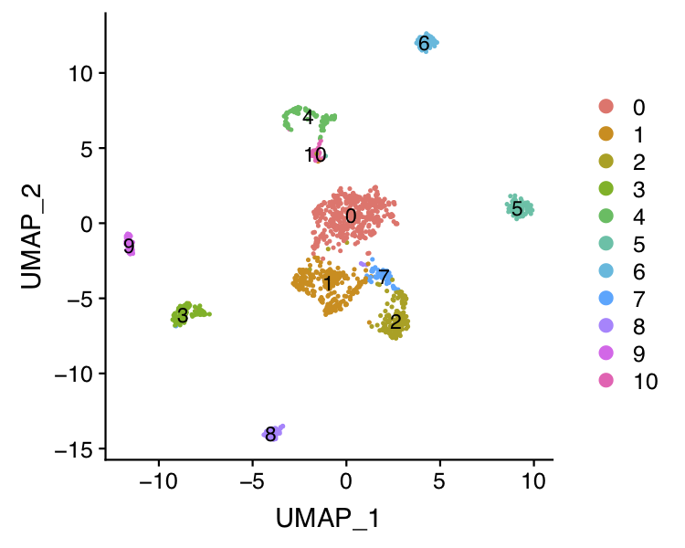
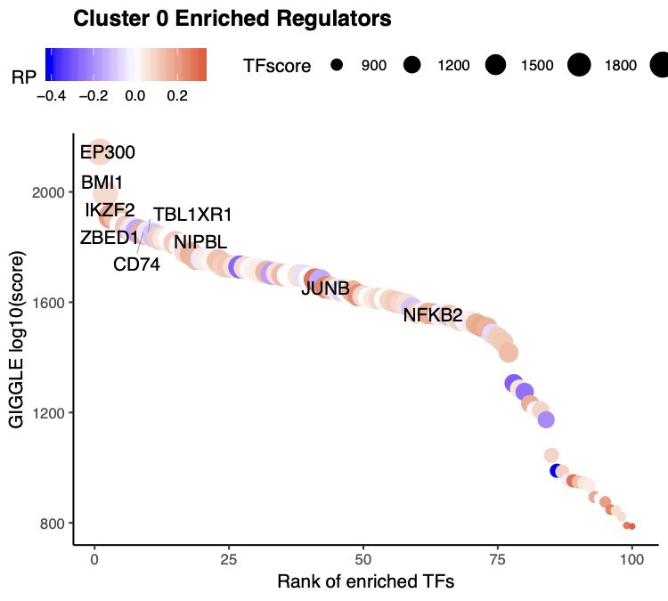
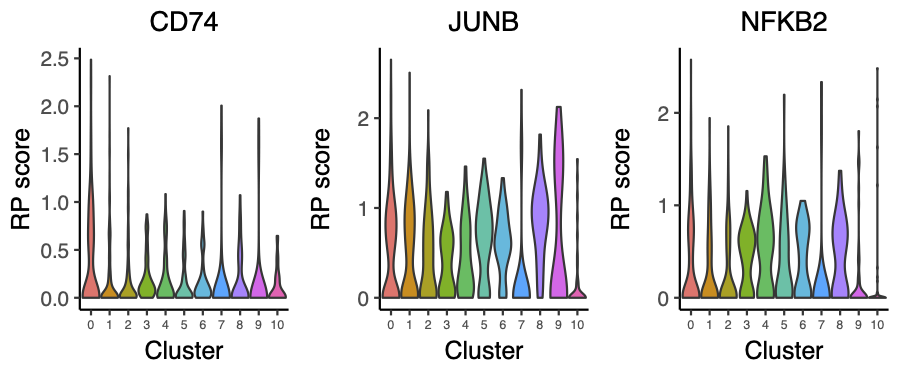
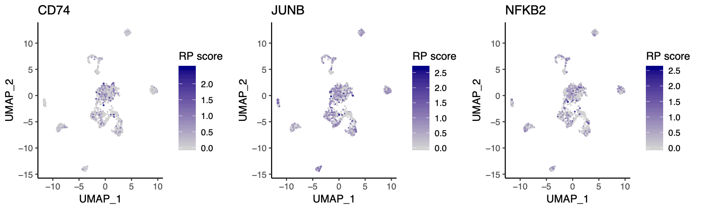

## Microfluidics scATAC-seq of 7 cell lines

In this example, we will be analyzing datasets of 7 cell lines using the microfluidics-based scATACs-seq.  The raw data can be downloaded from the GEO [GSE65360](https://www.ncbi.nlm.nih.gov/geo/query/acc.cgi?acc=GSE65360). Here we will start from the processed data, which include the peak count matrix and gene score matrix generated by the MAESTRO pipeline.

**Step 0. Download the data**     
We will start from the processed dataset and demonstrate the step-by-step analysis using the MAESTRO R package. First, users can download the data from the Cistrome website.

```bash
$ wget http://cistrome.org/~chenfei/MAESTRO/GSE65360_cellline_peak_count.h5.gz
$ gunzip GSE65360_cellline_peak_count.h5.gz
```

**Step 1. Read the data into R environment**     
To use the MAESTRO R function, following the instructions in MAESTRO [README](https://github.com/chenfeiwang/MAESTRO/blob/master/README.md) page and install the R package. Then read the peak count matrix into R. Then generate the gene regulatory score matrix by the following command.

```R
> library(MAESTRO)
> library(Seurat)
> cellline.peak <- Read10X_h5('GSE65360_cellline_peak_count.h5')
> cellline.gene <- ATACCalculateGenescore(cellline.peak)
```

**Step 2. Clustering and differential peak calling**      
We next create a Seurat object using the peak count matrix and perform the clustering analysis as well as differential peak calling for different clusters. 1) We first run dimension reduction on the input matrix. As we and others reported [Cusanovich et al, Science 2015](https://science.sciencemag.org/content/348/6237/910/tab-pdf), the Latent Semantic Index (LSI) has been widely used in learning the structure of scATAC-seq data. We use LSI as the default dimension reduction method, which has the best performance according to our benchmark. You can also use "PCA" as an optional dimension reduction method. 2) We apply UMAP to reduce the dimensions further and identify the clusters using a graph-based clustering approach implemented in [Seurat](https://www.cell.com/cell/pdf/S0092-8674(19)30559-8.pdf). 3) We used a [wilcox-test](https://www.tandfonline.com/doi/abs/10.1080/01621459.1972.10481279) based method to identify the differential peaks for each cluster. The original peak count matrix is scaled and weighed by the total peaks present in each cell to overcome the potential ties in Wilcox-test. It will take 10-20mins to calculate the differential peaks for all the clusters.

```R
> cellline.ATAC.res <- ATACRunSeurat(inputMat = cellline.peak, 
>                                    project = "cellline_scATAC", 
>                                    method = "LSI",
>                                    min.c = 50,
>                                    min.p = 500,
>                                    dims.use = 1:30,
>                                    cluster.res = 0.6,
>                                    peaks.test.use = "wilcox",
>                                    peaks.cutoff = 1e-05
>                                    )
> head(cellline.ATAC.res$peaks)
                               p_val avg_logFC pct.1 pct.2    p_val_adj cluster
chr9-63818078-63818620  6.989416e-97 0.5781455 0.505 0.028 2.841337e-92       0
chr9-41234550-41235005  2.353518e-94 0.5742166 0.513 0.034 9.567521e-90       0
chr9-64870486-64870945  3.558833e-89 0.5434076 0.455 0.020 1.446737e-84       0
chr15-22173694-22174497 7.613366e-81 0.5059745 0.409 0.016 3.094985e-76       0
chr8-72000304-72000895  1.883152e-79 0.4831220 0.369 0.004 7.655389e-75       0
chr21-42078065-42078756 2.309298e-78 0.4861408 0.379 0.009 9.387760e-74       0
                                           gene
chr9-63818078-63818620   chr9-63818078-63818620
chr9-41234550-41235005   chr9-41234550-41235005
chr9-64870486-64870945   chr9-64870486-64870945
chr15-22173694-22174497 chr15-22173694-22174497
chr8-72000304-72000895   chr8-72000304-72000895
chr21-42078065-42078756 chr21-42078065-42078756
```

 

**Step 3. Annotate cell types**     
The cell identity for the microfluidics-based scATACs-seq is known before clustering. To visualize the cell type annotation of the clusters, we need to pass the original identity to the clustering result.

```R
> cellline.ATAC.orig <- gsub(".well","",sapply(strsplit(rownames(cellline.ATAC.res$ATAC@meta.data),"\\."),function(x) x[2]))
> cellline.ATAC.res$ATAC <- ATACAnnotateCelltype(ATAC = cellline.ATAC.res$ATAC, 
>                                                RPmatrix = cellline.gene, 
>                                                signatures = NULL, 
>                                                min.score = 0.1, 
>                                                genes.test.use = "wilcox",
>                                                genes.cutoff = 1E-5, 
>                                                orig.ident = cellline.ATAC.orig)
```

 

**Step 4. Identify driver transcription factors**     
Identify enriched transcription regulators is crucial to understanding gene regulation in the heterogeneous single-cell populations. MAESTRO utilizes giggle to identify enrichment of transcription factor peaks in scATAC-seq cluster-specific peaks. To run this function, you need first to install [giggle](https://github.com/ryanlayer/giggle), download the giggle index from [Cistrome website](http://cistrome.org/~chenfei/MAESTRO/giggle.tar.gz), and provide the file location of the index to MAESTRO. 
After identifying enriched transcription regulators, MAESTRO also provides the potential target gene list of the top 10 transcription factors for each cluster, which are based on the ChIP-seq peaks from [CistromeDB](http://cistrome.org/db/#/). The target genes will be generated in the "cellline_scATAC_TF.GIGGLE" directory.

```R
> cellline.ATAC.tfs <- ATACAnnotateTranscriptionFactor(ATAC = cellline.ATAC.res$ATAC, 
>                                                      peaks = cellline.ATAC.res$peaks, 
>                                                      project = "cellline_scATAC_TF", 
>                                                      giggle.path = "/homes/cwang/annotations/giggle")
Identify enriched TFs for cluster  0 ...
Identify enriched TFs for cluster  1 ...
Identify enriched TFs for cluster  2 ...
Identify enriched TFs for cluster  3 ...
Identify enriched TFs for cluster  4 ...
Identify enriched TFs for cluster  5 ...
Identify enriched TFs for cluster  6 ...
Identify enriched TFs for cluster  8 ...
Identify enriched TFs for cluster  9 ...
Identify enriched TFs for cluster  10 ...
Identification of enriched TFs is done.
Identify target genes for the top  10  TFs for cluster  0 ...
Identify target genes for the top  10  TFs for cluster  1 ...
Identify target genes for the top  10  TFs for cluster  2 ...
Identify target genes for the top  10  TFs for cluster  3 ...
Identify target genes for the top  10  TFs for cluster  4 ...
Identify target genes for the top  10  TFs for cluster  5 ...
Identify target genes for the top  10  TFs for cluster  6 ...
Identify target genes for the top  10  TFs for cluster  8 ...
Identify target genes for the top  10  TFs for cluster  9 ...
Identify target genes for the top  10  TFs for cluster  10 ...
> head(cellline.ATAC.tfs)
$`0`
 [1] "EP300"
 [2] "BMI1"
 [3] "JUNB | BACH1 | FOSB | FOSL2 | JUND | FOSL1 | ZNF554 | FOS | JUN | NFE2L2 | BACH2 | NFE2"
 [4] "RELB | NFKB2 | REL | RELA | NFKB1 | HIVEP1"
 [5] "IRF8 | IRF4 | SPIB | PRDM1 | STAT1 | IRF1 | IRF3 | IRF2 | STAT2 | BCL11A | SPI1"
 [6] "IKZF2"
 [7] "ZBED1"
 [8] "CD74"
 [9] "TBL1XR1"
[10] "NIPBL"
```

Beside indentify TFs for all the clusters, we also support the differential peaks from a single comparison.
```R
> de.peakset <- FindMarkersMAESTRO(cellline.ATAC.res$ATAC, ident.1 = c(1,2,7))
   |++++++++++++++++++++++++++++++++++++++++++++++++++| 100% elapsed = 45s
> pbmc.ATAC.tfs <- ATACAnnotateTranscriptionFactor(ATAC = cellline.ATAC.res$ATAC, 
>                                                  peaks = de.peakset,
>                                                  cluster = c(1,2,7),
>                                                  project = "cellline_scATAC_K562_TF", 
>                                                  giggle.path = "/homes/cwang/annotations/giggle")
```

**Step 5. Visualize driver transcription factors for each cluster**     
According to the annotation of the clusters, we know that cluster 0 is GM12878 cells. Next we want to visualize the enriched regulators in GM12878 from Step 4. To further filter the regulators, we will also visualize the expression level of the predicted transcription factors, here we used the gene regulatory potential score as the predicted gene expression level. The output TFs from MAESTRO have already been pre-filtered using TF regulatory potential score. 
```R
> tfs = sapply(pbmc.ATAC.tfs[[9]], function(x) {return(unlist(strsplit(x, split = " | ", fixed = TRUE))[1])})
> VisualizeTFenrichment(TFs = tfs, 
>                       cluster.1 = 0, 
>                       type = "ATAC", 
>                       SeuratObj = pbmc.ATAC.res$ATAC, 
>                       GIGGLE.table = "cellline_scATAC_TF_giggle.txt",
>                       visual.totalnumber = 100, 
>                       name = "cellline_scATAC_TF_GM12878")  
```

   

And we also provide the function for visualize TF/genes regulatory potential using Vlnplot and Umap.
```R
> VisualizeVlnplot(genes = c("JUNB","NFKB2","CD74"), 
>                  type = "ATAC", 
>                  SeuratObj = pbmc.ATAC.res$ATAC, 
>                  ncol = 2, 
>                  width = 6, 
>                  height = 3, 
>                  name = "cellline_scATAC_TF_GM12878_vlnplot")
```
    
   


```R
> VisualizeUmap(genes = c("JUNB","NFKB2","CD74"),
>               type = "ATAC", 
>               SeuratObj = pbmc.ATAC.res$ATAC, 
>               ncol = 2, 
>               width = 8, 
>               height = 3, 
>               name = "cellline_scATAC_TF_GM12878_umap")
```

 

Based on the regulatory potential of TFs, we can see that JUNB is highly expressed in the GM12878 cell line. We will next visualize the regulatory potential of JUNB target genes.

```R
> JUNB_target <- as.character(read.table('cellline_scATAC_TF.GIGGLE/0.JUNB.64780.target.genes.top500.txt')[,1])
> JUNB_target <- intersect(JUNB_target, rownames(cellline.ATAC.res$ATAC))
> cellline.ATAC.res$ATAC@meta.data$JUNB_target <- colMeans(x = as.matrix(GetAssayData(cellline.ATAC.res$ATAC))[JUNB_target, ], na.rm = TRUE)
> p <- FeaturePlot(cellline.ATAC.res$ATAC,  features = "JUNB_target", cols = c("grey", "blue"))
> ggsave(file.path("cellline_scATAC_TF_GM12878_JUNB.pdf"), p, width = 5, height = 4)
```
  

**Step 6. Save the project for future analysis**     
Finally, uses can save the R project, including the raw data, normalized data, clustering result, and meta information for future analysis.

```R
saveRDS(cellline.ATAC.res, "cellline.ATAC.res.rds")
```

The differential peaks, TFs, and target genes have already been saved in the current directory by MAESTRO.

```bash
$ ls cellline_scATAC.DiffPeaks.tsv cellline_scATAC_TF.GIGGLE 
```


