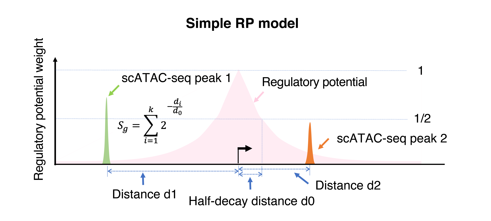

# Gene activity modeling from scATAC-seq

Modeling gene activities from scATAC-seq is the key step for understanding the cell-type identity of each cluster. MAESTRO uses 2 regulatory potential (RP) models to model gene activities. The presence of scATAC-seq peaks surrounding each gene reflects the potential transcriptional regulator bindings and their impact on the gene expression. Our regulatory potential (RP) model assumes that the effect of a scATAC-seq peak on the expression of a given gene is independent and additive, which follows an exponential decay with the distance from the peak to the transcription start site (TSS). We termed this naïve RP model as “simple RP model”. Regulatory potential is calculated independently for each gene i in each cell j to reflect the accumulated regulation of surrounding scATAC-seq peaks on the gene i and predict gene i expression in cell j. 



Besides increased promoter and enhancer accessibilities, active genes also have increased accessibility at the exon regions, which might reflect the binding of the RNA Pol II complex on chromatin during active transcription. In addition, we noticed that RP calculations could deviate from gene activity by the promoter and exon accessibilities of highly expressed genes nearby. Based on these observations, we implemented RP models with different combinations, and tested their performances in integrating scATAC-seq with scRNA-seq (see MAESTRO for more details). We set the “enhanced RP model” with the best association with the gene expression from scRNA-seq as the default to calculate gene activity score in MAESTRO. This RP model still weighs peaks by exponential decay from TSS, but sums all peaks on the given gene exons as if they are on TSS, normalizes the sum by total exon length, and excludes the peaks from promoters and exons of nearby genes.

 

MAESTRO integrates the two RP models into the function `MAESTRO scatac-genescore`. Users can start from 10X CellRanger output. For example,
```bash
MAESTRO scatac-genescore --format h5 --peakcount 10X_PBMC_10k_MAESTRO/outs/filtered_peak_bc_matrix.h5 \
--genedistance 10000 --species GRCh38 --model Enhanced -d 10X_PBMC_10k --outprefix 10X_PBMC_10k_10x
MAESTRO scatac-genescore --format h5 --peakcount /home1/wangchenfei/Project/SingleCell/scATAC/Analysis/MAESTRO_tutorial/10X_PBMC_10k_MAESTRO_V110_0610/Result/QC/10X_PBMC_10k_filtered_peak_count.h5 \
--genedistance 10000 --species GRCh38 --model Enhanced -d 10X_PBMC_10k --outprefix 10X_PBMC_10k
```

To get a full description of command-line options, please use the command `MAESTRO scatac-genescore -h`.

```bash
usage: MAESTRO scatac-genescore [-h] [--format {h5,mtx,plain}]
                                [--peakcount PEAKCOUNT] [--feature FEATURE]
                                [--barcode BARCODE]
                                [--genedistance GENEDISTANCE]
                                [--species {GRCh38,GRCm38}]
                                [--model {Simple,Enhanced}] [-d DIRECTORY]
                                [--outprefix OUTPREFIX]
```

Here we list all the arguments and their description.

**Input arguments:**

Arguments  |  Description
---------  |  -----------
`--format` | {h5,mtx,plain} Format of the count matrix file.
`--peakcount` | Location of peak count matrix file. Peak count matrix with peaks as rows and cells as columns. If the format is 'h5' or 'plain', users need to specify the name of the count matrix file and row names should be like 'chromosome_peakstart_peakend', such as 'chr10_100020591_100020841'. If the format is 'mtx', the 'matrix' should be the name of .mtx formatted matrix file, such as 'matrix.mtx'.
`--feature` | Location of feature file (required for the format of 'mtx'). Features correspond to row indices of count matrix. The feature file should be the peak bed file with 3 columns. For example, peaks.bed.
`--barcode` | Location of barcode file (required for the format of 'mtx'). Cell barcodes correspond to column indices of count matrix. For example, barcodes.tsv.
`--genedistance` | Gene score decay distance, could be optional from 1kb (promoter-based regulation) to 10kb (enhancer-based regulation). DEFAULT: 10000.
`--species` | {GRCh38,GRCm38} Species (GRCh38 for human and GRCm38 for mouse). DEFAULT: GRCh38.
`--model` | {Simple,Enhanced} The RP model to use to calaculate gene score. For each gene, simple model sums over the impact of all regulatory elements within the up/dowm-stream of TSS. On the basis of simple model, enhanced model gives the regulatory elements within the exon region a higher weight, and also excludes the regulatory elements overlapped with another gene (the promoter and exon of a nearby gene). See the MAESTRO paper for more details. DEFAULT: Enhanced.

**Output arguments:**

Arguments  |  Description
---------  |  -----------
`-d` | Path to the directory where the result file shall be stored. DEFAULT: MAESTRO.
`--outprefix` | Prefix of output files. DEFAULT: MAESTRO.

The gene activity modeling function has also been incorporated into the function `ATACCalculateGenescore` in MAESTRO R package. Users can load the peak matrix into R through Seurat package, and then generate the gene regulatory score matrix by the following command. This step may take several minutes.
```R
> pbmc.peak <- Read10X_h5("10X_PBMC_10k/outs/filtered_peak_bc_matrix.h5")
> pbmc.peak[1:5,1:5]
5 x 5 sparse Matrix of class "dgCMatrix"
                   AAACGAAAGAGCGAAA-1 AAACGAAAGAGTTTGA-1 AAACGAAAGCGAGCTA-1
chr1:181285-181658                  .                  .                  .
chr1:629732-630163                  .                  .                  .
chr1:633799-634257                  .                  .                  .
chr1:778153-779430                  .                  .                  2
chr1:817056-817646                  .                  .                  .
                   AAACGAAAGGCTTCGC-1 AAACGAAAGTGCTGAG-1
chr1:181285-181658                  1                  .
chr1:629732-630163                  .                  .
chr1:633799-634257                  .                  .
chr1:778153-779430                  8                  .
chr1:817056-817646                  .                  .
> pbmc.gene <- ATACCalculateGenescore(pbmc.peak, organism = "GRCh38", decaydistance = 10000, model = "Enhanced")
> pbmc.gene[1:5,1:5]
5 x 5 sparse Matrix of class "dgCMatrix"
         AAACGAAAGAGCGAAA-1 AAACGAAAGAGTTTGA-1 AAACGAAAGCGAGCTA-1
A1BG                      .                  .        0.143831343
A1BG-AS1                  .                  .        0.096558696
A1CF                      .                  .        .
A2M                       .                  .        0.009911025
A2ML1                     .                  .        .
         AAACGAAAGGCTTCGC-1 AAACGAAAGTGCTGAG-1
A1BG             9.57918417                  .
A1BG-AS1        16.01500693                  .
A1CF             .                           .
A2M              0.01940073                  .
A2ML1            0.03820837                  .
```

**Note:** If MAESTRO R package is not managed through miniconda, users may encounter the following error.

```R
Error: Python shared library not found, Python bindings not loaded.
Use reticulate::install_miniconda() if you'd like to install a Miniconda Python environment.
```

It means reticulate R package cannot find the python shared library. If Anaconda has been installed, users just need to specify an alternate version of python, for example:

```R
> library(reticulate)
> use_python("/opt/anaconda3/bin/python", required = TRUE)
> pbmc.gene <- ATACCalculateGenescore(pbmc.peak)
```

If users don't install Miniconda or Anaconda, we recommend to use `reticulate::install_miniconda()` to install a Miniconda Python environment and specify the version through `use_python`.
