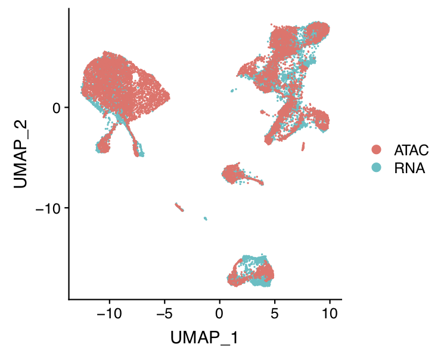
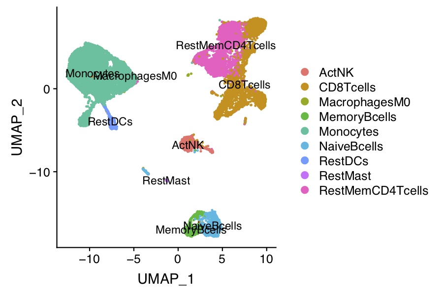
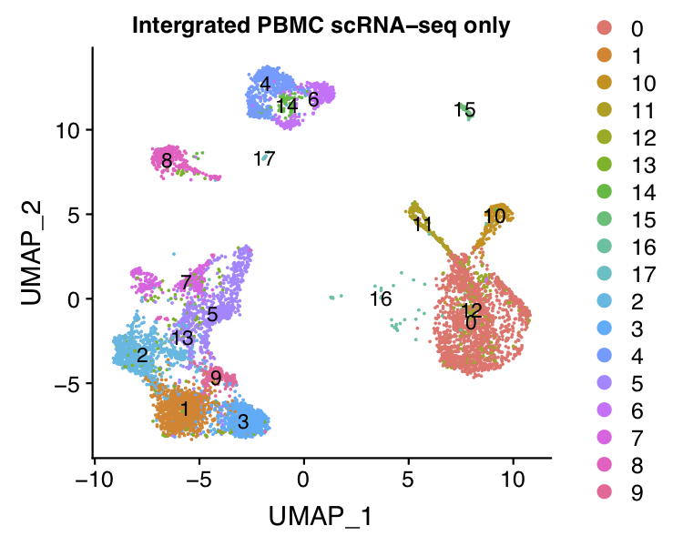
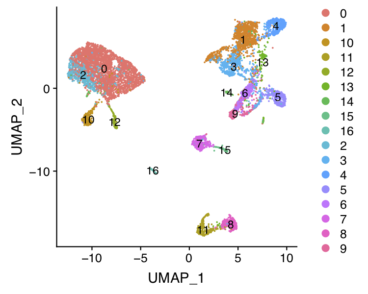

## Integrated analysis of 10x-genomics based scRNA-seq and scATAC-seq from human PBMC samples

In this example, we will introduce the integrated analysis of 10x-genomics scRNA-seq and scATAC-seq from human PBMC samples. 

**Step 1. Read the scRNA-seq and scATAC-seq clustering object**     
Our analysis are based on the clustering result from previous examples. The step-by-step analysis of PBMC scRNA-seq can be found [here](https://github.com/chenfeiwang/MAESTRO/blob/master/example/RNA_infrastructure_10x/RNA_infrastructure_10x.md). The step-by-step analysis of PBMC scATAC-seq can be found [here](https://github.com/chenfeiwang/MAESTRO/blob/master/example/ATAC_infrastructure_10x/ATAC_infrastructure_10x.md).

```R
> pbmc.RNA.res <- readRDS('pbmc.RNA.res.rds')
> pbmc.ATAC.res <- readRDS('pbmc.ATAC.res.rds')
```
**Step 2. Co-embedding of scRNA-seq and scATAC-seq cells**
To visualize all the scRNA-seq and scATAC-seq cells together, we can co-embedded the scRNA-seq and scATAC-seq cells in the same low dimensional space. MAESTRO co-embedding are largely based on canonical correlation analysis (CCA) from [Seurat](https://satijalab.org/seurat/v3.0/atacseq_integration_vignette.html). 1) We first calculated the gene regulatory potential matrix using MAESTRO, which could represent the predicted gene expression level from ATAC-seq reads. 2) Then we identify 'anchors' between scRNA-seq and scATAC-seq datasets. 3) Finally, we transfer the cell type labels from scRNA-seq and also co-embedded the scRNA-seq and scATAC-seq cells using CCA. 

```R
> Incorporate(RNA = pbmc.RNA.res$RNA, ATAC = pbmc.ATAC.res$ATAC, project = "PBMC.coembedded")
> saveRDS(pbmc.coembedded.res, "pbmc.coembedded.Seurat.rds")
```

Cells co-embedding visualization:
 

Cells co-embedding and annotated visualization:
 

Cells scRNA-only visualization:
 

Cells scATAC-only visualization:
 


