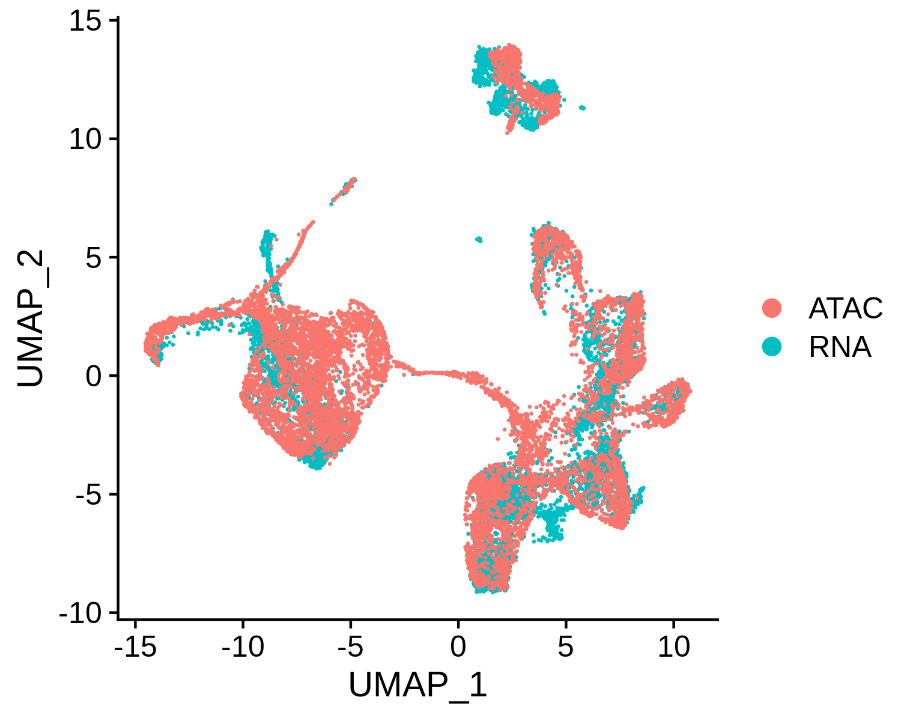
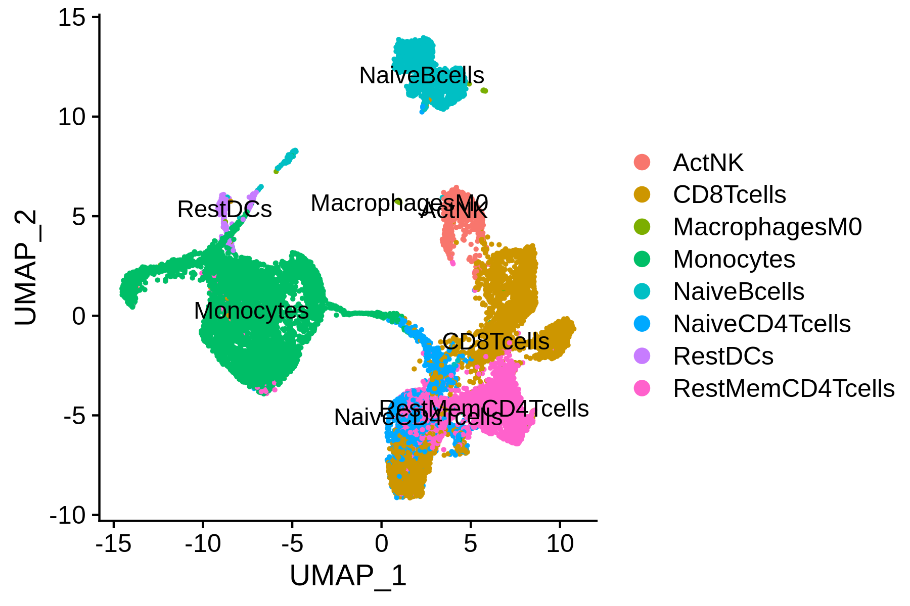
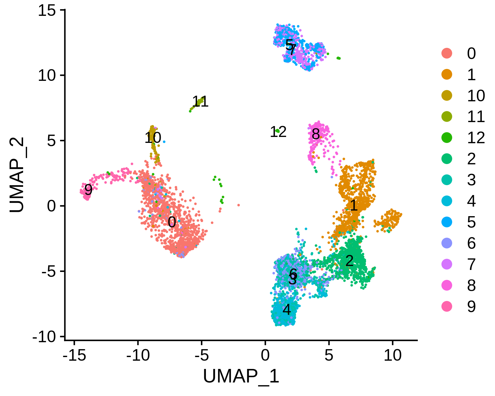
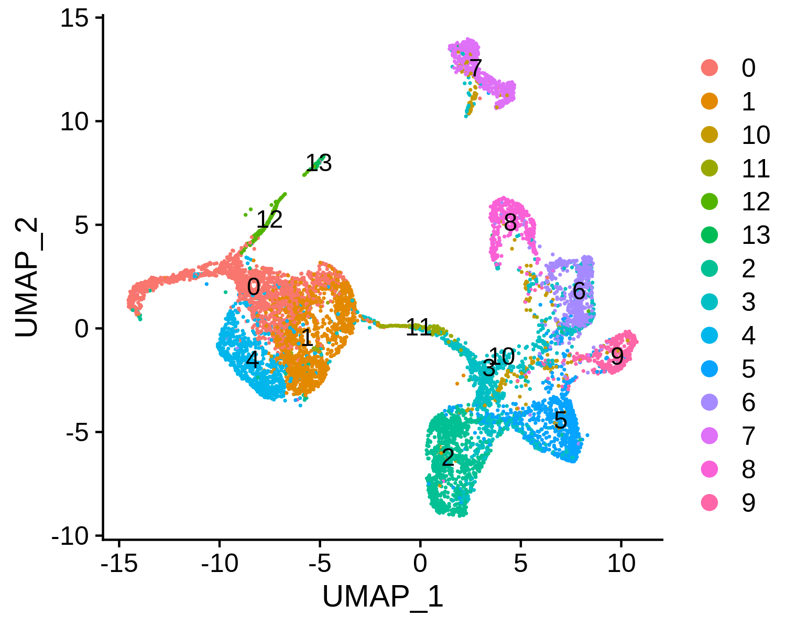
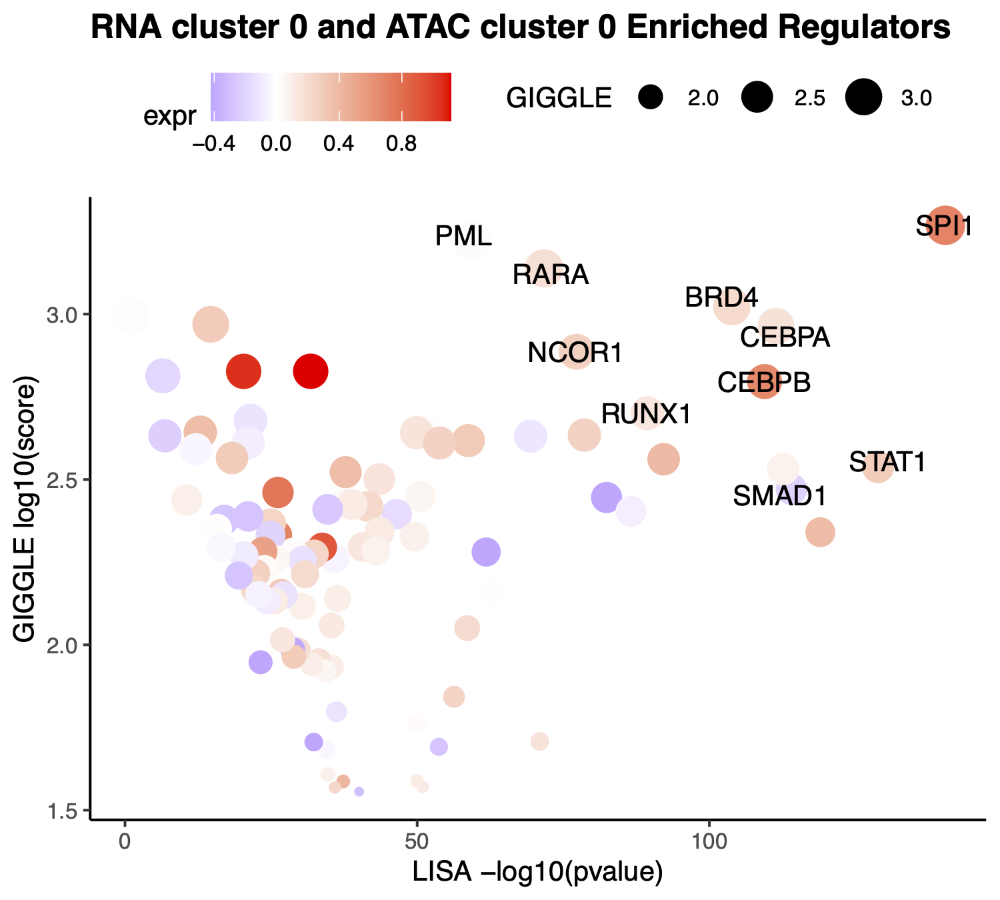

# Integrated analysis of 10X  Genomics based scRNA-seq and scATAC-seq from human PBMC samples

In this example, we will introduce the integrated analysis of 10x-genomics scRNA-seq and scATAC-seq from human PBMC samples. We will show you how to [run through the whole integration pipeline](#run-maestro-pipeline) from the processed Seurat R objects to the final results. We also provide guidance on how to [perform custom analysis](#perform-custom-analysis-step-by-step) step by step.

## Run MAESTRO pipeline

### Step 0. Prepare the environment
Before running MAESTRO, users need to activate the MAESTRO environment.
```bash
$ conda activate MAESTRO
```

### Step 1. Configure the MAESTRO workflow
Initialize the MAESTRO integration workflow using `MAESTRO scATAC-init` command. This will install a Snakefile and a config file in this directory.
```bash
$ MAESTRO integrate-init --rna-object MAESTRO_tutorial/10X_PBMC_8k_MAESTRO_V110/Result/Analysis/10X_PBMC_8k_scRNA_Object.rds \
--atac-object MAESTRO_tutorial/10X_PBMC_10k_MAESTRO_V110/Result/Analysis/10X_PBMC_10k_scATAC_Object.rds \
--directory 10X_PBMC_8kRNA_10kATAC_MAESTRO_V110 --outprefix 10X_PBMC_8kRNA_10kATAC
```

To get a full description of command-line options, please use the command `MAESTRO integrate-init -h`.
```bash
usage: MAESTRO integrate-init [-h] --rna-object RNA_OBJECT --atac-object
                              ATAC_OBJECT [-d DIRECTORY]
                              [--outprefix OUTPREFIX]
```

Here we list all the arguments and their description.

**Input files arguments:**

Arguments  |  Description
---------  |  -----------
`--rna-object` | Path of scRNA Seurat object generated by MAESTRO scRNA pipeline.
`--atac-object` | Path of scATAC Seurat object generated by MAESTRO scATAC pipeline.

**Running and output arguments:**

Arguments  |  Description
---------  |  -----------
`--directory` | Path to the directory where the workflow shall be initialized and results shall be stored. DEFAULT: MAESTRO.
`--outprefix` | Prefix of output files. DEFAULT: MAESTRO.

### Step 2. Run MAESTRO
Before running the workflow, please check the `config.yaml` and see if it is configured correctly. Once configured, users can use snakemake to run the workflow.
```bash
$ cd 10X_PBMC_8kRNA_10kATAC_MAESTRO_V110
$ snakemake -np
$ nohup snakemake > 10X_PBMC_8kRNA_10kATAC.out &
```

### Step 3. Understand the final output files   
The whole pipeline in this example takes about 20 minutes. Here, we assume users have run MAESTRO successfully. An output directory is specified in the run call, and will contain several useful outputs as described below.
```bash
$ ls Result
10X_PBMC_8kRNA_10kATAC_integrate_report.html  Analysis
```

#### Output files
* **Analysis:**
The `Analysis` directory contains integration result, which we will introduce in the step-by-step analysis.
* **outprefix_scATAC_report.html:**
The `outprefix_integrate_report.html` file summarizes all the results in an HTML based document. The summary HTML for the 10X_PBMC_8kRNA_10kATAC example can be found [here](http://cistrome.org/~chenfei/MAESTRO/Result/10X_PBMC_8kRNA_10kATAC_integrate_report.html).


## Perform custom analysis step by step

### Step 0. Read the scRNA-seq and scATAC-seq clustering object
Our analysis is based on the clustering result from previous examples. The step-by-step analysis of PBMC scRNA-seq can be found [here](https://github.com/chenfeiwang/MAESTRO/blob/master/example/RNA_infrastructure_10x/RNA_infrastructure_10x.md). The step-by-step analysis of PBMC scATAC-seq can be found [here](https://github.com/chenfeiwang/MAESTRO/blob/master/example/ATAC_infrastructure_10x/ATAC_infrastructure_10x.md).

```R
> library(MAESTRO)
> pbmc.RNA.res <- readRDS('10X_PBMC_8k_res.rds')
> pbmc.ATAC.res <- readRDS('10X_PBMC_10k_res.rds')
```

### Step 1. Co-embedding of scRNA-seq and scATAC-seq cells 
To visualize all the scRNA-seq and scATAC-seq cells together, we can co-embedded the scRNA-seq and scATAC-seq cells in the same low dimensional space. MAESTRO co-embedding is largely based on canonical correlation analysis (CCA) from [Seurat](https://satijalab.org/seurat/v3.0/atacseq_integration_vignette.html). We have calculated the gene regulatory potential matrix using MAESTRO in the 10X PBMC 10k scATAC example, which could represent the predicted gene expression level from ATAC-seq reads. 

1. To integrate scRNA-seq and scATAC-seq datasets, MAESTRO identify 'anchors' between scRNA-seq gene expression and scATAC-seq gene activity using `FindTransferAnchors` in Seurat. After identifying the transfer anchors, the cell type annotation from scRNA-seq clusters can be transferred to scATAC-seq clusters using `TransferData` function in Seurat.
2. To visualize all the cells in the same low dimensional space, MAESTRO uses the same anchors used in the cell type label transferring analysis, and imputes the scRNA-seq gene expression using scATAC-seq regulatory potential score of highly variable genes from scRNA-seq.
3. The measured scRNA-seq and imputed scRNA-seq data are merged together using CCA and scaled to normalize the variance and mean. Then MAESTRO performs PCA for dimension reduction and uses UMAP to visualize all the cells together. MAESTRO will automatically generate the scATAC and scRNA co-aligned visualization, cell-type annotated visualization using scRNA-seq labels, RNA-only visualization, and ATAC-only visualization.

```R
> pbmc.coembedded.res <- Incorporate(RNA = pbmc.RNA.res$RNA, 
                                     ATAC = pbmc.ATAC.res$ATAC, 
                                     project = "10X_PBMC_integrated",
                                     method = "MAESTRO")
```

Co-embedding visualization:     
 

Co-embedding and annotated visualization:     
 

scRNA-only visualization:       
 

scATAC-only visualization:      
 

### Step 2. Visualize the driver TFs for both scRNA-seq and scATAC-seq samples
MAESTRO provides functions to visualize the enriched TFs for both scRNA-seq and scATAC-seq clusters so that users can compare the diver regulators from the same cell type. From the previous analysis, we know cluster 0 in scRNA-seq and cluster 0 in scATAC-seq are both monocytes, next we will visualize the enrichment of TFs in both datasets.

By default, MAESTRO will label the top 10 regulators using TF enrichment from GIGGLE analysis based on scATAC-seq, and also visualize the TF expression level based on mean expression from scRNA-seq. 
```R
> p <- VisualizeTFenrichment(cluster.1 = 0,
                             cluster.2 = 0,
                             type = "Integrated", 
                             SeuratObj = pbmc.RNA.res$RNA, 
                             LISA.table = "MAESTRO_tutorial/10X_PBMC_8k_MAESTRO_V110/10X_PBMC_8k_lisa.txt",
                             GIGGLE.table = "MAESTRO_tutorial/10X_PBMC_10k_MAESTRO_V110/10X_PBMC_10k_giggle.txt",
                             visual.totalnumber = 100, 
                             name = "10X_PBMC_integrated_Monocyte_top") 
```

 

### Step 3. Save the project for future analysis 
Finally, users can save the integrated R project for future analysis. Users can also explore the differential expressed genes, driver regulators in different clusters, and consistency between scRNA-seq and scATAC-seq in the later analysis.
```R
> saveRDS(pbmc.coembedded.res, "10X_PBMC_integrated.rds")
```
