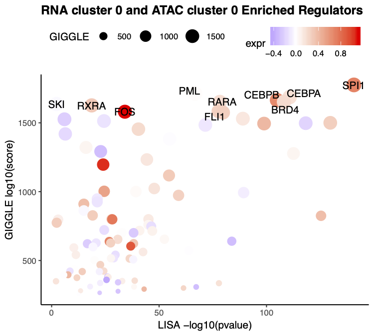

## Integrated analysis of 10X  Genomics based scRNA-seq and scATAC-seq from human PBMC samples

In this example, we will introduce the integrated analysis of 10x-genomics scRNA-seq and scATAC-seq from human PBMC samples. 

**Step 1. Read the scRNA-seq and scATAC-seq clustering object**     
Our analysis is based on the clustering result from previous examples. The step-by-step analysis of PBMC scRNA-seq can be found [here](https://github.com/chenfeiwang/MAESTRO/blob/master/example/RNA_infrastructure_10x/RNA_infrastructure_10x.md). The step-by-step analysis of PBMC scATAC-seq can be found [here](https://github.com/chenfeiwang/MAESTRO/blob/master/example/ATAC_infrastructure_10x/ATAC_infrastructure_10x.md).

```R
> pbmc.RNA.res <- readRDS('pbmc.RNA.res.rds')
> pbmc.ATAC.res <- readRDS('pbmc.ATAC.res.rds')
```
**Step 2. Co-embedding of scRNA-seq and scATAC-seq cells**     
To visualize all the scRNA-seq and scATAC-seq cells together, we can co-embedded the scRNA-seq and scATAC-seq cells in the same low dimensional space. MAESTRO co-embedding are largely based on canonical correlation analysis (CCA) from [Seurat](https://satijalab.org/seurat/v3.0/atacseq_integration_vignette.html). 1) We first calculated the gene regulatory potential matrix using MAESTRO, which could represent the predicted gene expression level from ATAC-seq reads. 2) Then we identify 'anchors' between scRNA-seq and scATAC-seq datasets. 3) Finally, we transfer the cell type labels from scRNA-seq and also co-embedded the scRNA-seq and scATAC-seq cells using CCA. MAESTRO will automatically generate the scATAC and scRNA co-aligned visualizations, cell-type annotated visualizations using scRNA-seq labels, RNA-only visualizations and ATAC-only visualizations.

```R
> pbmc.coembedded.res <- Incorporate(RNA = pbmc.RNA.res$RNA, ATAC = pbmc.ATAC.res$ATAC, project = "PBMC.coembedded")
```

Co-embedding visualization:     
 

Co-embedding and annotated visualization:     
 

scRNA-only visualization:       
 

scATAC-only visualization:      
 

**Step 3. Visualize the driver TF for both scRNA-seq and scATAC-seq samples**      
MAESTRO provides functions to visualize the enriched TFs for both scRNA-seq and scATAC-seq clusters; thus, you can compare the diver regulators from the same cell type. From the previous analysis, we know cluster 0 in scRNA-seq and cluster 0 in scATAC-seq are bothe Monocytes, next we will visualize the enrichment of TFs in both clusters.

By default, MAESTRO will label the top 10 regulators using TF enrichment from GIGGLE analysis based on scATAC-seq, and also visualize the TF expression level base on mean expression from scRNA-seq. 
```R
> VisualizeTFenrichment(cluster.1 = 0,
>                       cluster.2 = 0,
>                       type = "Integrated", 
>                       SeuratObj = pbmc.RNA.res$RNA, 
>                       LISA.table = "/homes/cwang/projects/MAESTRO/pipeline/example.pbmc.RNA/10X_PBMC_8K_TF_lisa.txt",
>                       GIGGLE.table = "/homes/cwang/projects/MAESTRO/analysis/ATAC/cluster/MAESTRO/10X_PBMC_MAESTRO_TF_giggle.txt",
>                       visual.totalnumber = 100, 
>                       name = "10X_PBMC_Integrated_TF_Monocyte_top")  

```

 

**Step 4. Save the project for future analysis**     
Finally, users can save the integrated R project for future analysis. Users can also explore the differential expressed genes, driver regulators in different clusters, and consistency between scRNA-seq and scATAC-seq in the later analysis.
```R
> saveRDS(pbmc.coembedded.res, "pbmc.coembedded.Seurat.rds")
```


