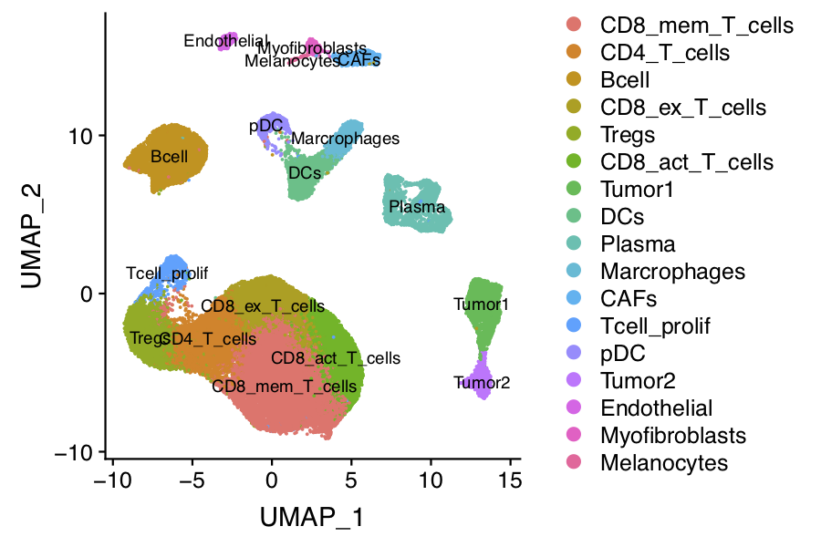
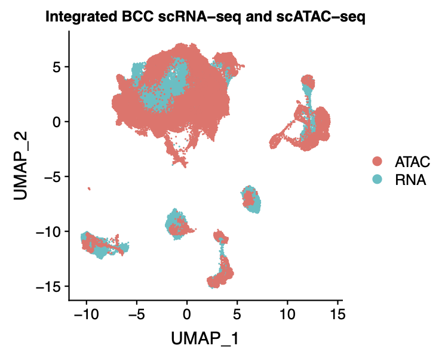
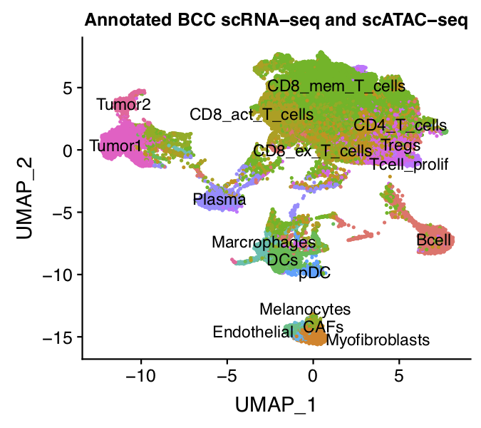
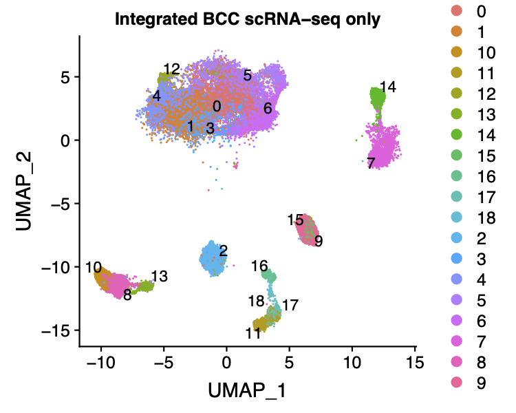
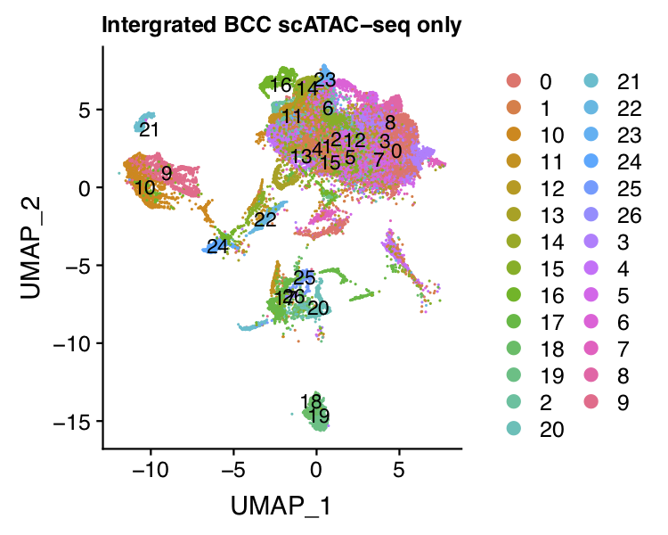

## Integrated analysis of BCC scATAC-seq dataset with 0.5 million peaks

MAESTRO support processing huge dataset by using sparse matrix and HDF5 format to save the expression and peak count matrix, and we also support multiple processing using R to accelerate the clustering and DE analysis. In this example, we will demonstrate how to use MAESTRO to process the BCC scATAC-seq dataset with 0.5 million peaks, which is extremely large. And we will also demonstrate how to use the public scRNA-seq dataset to improve the annotation of scATAC-seq clusters.

**Step 0. Download the bcc scATAC-seq data**     
We will start from the processed dataset and demonstrate the step-by-step analysis using the MAESTRO R package. First, you can download the data from the Cistrome website.

```bash
$ wget http://cistrome.org/~chenfei/MAESTRO/GSE129785_BCC_scATAC_peak_count.h5.gz
$ gunzip GSE129785_BCC_scATAC_peak_count.h5.gz
```
If users have their count matrix of mtx files from 10-x genomics, they can convert it to hdf5 format using the functions provided in MAESTRO under the python environment.

```bash
$ source activate MAESTRO
$ python
>>> from MAESTRO.scATAC_H5Process import *
>>> count_2_h5("GSE129785_BCC_scATAC_peak_count.h5", "GSE129785_BCC_scATAC_peak_count.txt", genome="GRCh38", type="Peaks")
>>> mtx_2_h5("GSE123813_BCC_scRNA_counts.h5", "matrix.mtx", "genes.tsv", "barcodes.tsv", genome="GRCh38", type="Gene Expression")
```
Then users can use the hdf5 files for the downstream analysis.

**Step 1. Read the data into R environment**     
To use the MAESTRO R function, following the instructions in MAESTRO [README](https://github.com/chenfeiwang/MAESTRO/blob/master/README.md) page and install the R package. Then read the peak count matrix into R. We could first filter the peaks with occurrence less than 50 to reduce the computing time and save some memory.

```R
> library(MAESTRO)
> library(Seurat)
> library(Matrix)
> bcc.peak <- Read10X_h5('GSE129785_BCC_scATAC_peak_count.h5')
> dim(bcc.peak)
[1] 580789  37818
> bcc.peak <- bcc.peak[which(rowSums(bcc.peak)>50),]
> dim(bcc.peak)
[1] 531055  37818
> bcc.gene <- ATACCalculateGenescore(bcc.peak)
```
The ATACCalculateGenescore function calls python from R, and utilizes matrix manipulation to calculate gene scores. However, we need to mention that for large dataset, the gene score calculation usually consums large memory. Users should make sure they have enought memory configuration on the computing server of cluster.

**Step 2. Claim the process and memory usage in R**  
There are still ~0.5 million peaks after filtering. To accelerate the computing process, users can use the multiple processing functions in R and claim the process and memory usage using the flowing commands. 

```R
> library(future)
> library(future.apply)
> library(pbapply)
> plan("multiprocess", workers = 8)
> options(future.globals.maxSize = 10*1024^3)
```

**Step 3. Clustering and differential peak calling for BCC scATAC-seq**      
Similar to [previous demonstrations](https://github.com/chenfeiwang/MAESTRO/blob/master/example/ATAC_infrastructure_microfludics/ATAC_infrastructure_microfludics.md), users can clustering the cells from the scATAC-seq dataset and identify the differential peaks.

```R
> bcc.ATAC.res <- ATACRunSeurat(inputMat = bcc.peak, 
>                               project = "GSE129785_BCC_scATAC", 
>                               method = "LSI",
>                               min.c = 50,
>                               min.p = 500,
>                               dims.use = 1:30,
>                               cluster.res = 0.6,
>                               peaks.test.use = "wilcox",
>                               peaks.cutoff = 1e-05
>                               )
> head(bcc.ATAC.res$peaks)
                          p_val avg_logFC pct.1 pct.2 p_val_adj cluster
chr17-53391967-53392467       0 0.4007707 0.348 0.037         0       0
chr7-36248575-36249075        0 0.3942203 0.374 0.052         0       0
chr13-111617570-111618070     0 0.3614455 0.366 0.091         0       0
chr10-127730232-127730732     0 0.3239614 0.370 0.100         0       0
chr19-50832327-50832827       0 0.3138642 0.454 0.204         0       0
chr2-160735531-160736031      0 0.3131790 0.296 0.049         0       0
                                               peak
chr17-53391967-53392467     chr17-53391967-53392467
chr7-36248575-36249075       chr7-36248575-36249075
chr13-111617570-111618070 chr13-111617570-111618070
chr10-127730232-127730732 chr10-127730232-127730732
chr19-50832327-50832827     chr19-50832327-50832827
chr2-160735531-160736031   chr2-160735531-160736031
```

 

**Step 4. Annotate cell types**     
We next try to annotate different clusters based on their marker genes. For scATAC, we first need to pass the gene regulatory potential matrix to the clustering result, then perform differential gene analysis for each cluster on the gene RPscore matrix, and identify the marker genes. We use public immune signatures like [CIBERSORT](https://www.nature.com/articles/nmeth.3337) to annotate the clusters. Users can also use their signatures to annotate the clusters.

```R
> data(human.immune.CIBERSORT)
> bcc.ATAC.res$ATAC <- ATACAnnotateCelltype(ATAC = bcc.ATAC.res$ATAC, 
>                                           RPmatrix = bcc.gene, 
>                                           signatures = human.immune.CIBERSORT, 
>                                           min.score = 0.1, 
>                                           genes.test.use = "wilcox",
>                                           genes.cutoff = 1E-5)
```

 

**Step 5. Download the scRNA-seq dataset**     
However, as we can see from the annotations. Some of the clusters are annotated as "Others", indicating the differential accessibility of marker genes can not robustly annotate these clusters. Usually, scRNA-seq has better discriminations on markers between different clusters, we next performed integrated analysis of the BCC scATAC-seq dataset with public BCC scRNA-seq dataset, and try to use the scRNA-seq cluster labels to annotate the scATAC-seq clusters.

First, users can download the scRNA-seq dataset from Cistrome website.
```bash
$ wget http://cistrome.org/~chenfei/MAESTRO/GSE123813_BCC_scRNA_counts.h5.gz
$ wget http://cistrome.org/~chenfei/MAESTRO/GSE123813_BCC_scRNA_metadata.txt.gz
$ gunzip GSE123813_BCC_scRNA_counts.h5.gz
$ gunzip GSE123813_BCC_scRNA_metadata.txt.gz
```

**Step 6. Clustering and annotating for BCC scRNA-seq**     
Then users can read the bcc scRNA-seq dataset into R, clustering like the [previous demonstrations](https://github.com/chenfeiwang/MAESTRO/blob/master/example/RNA_infrastructure_smartseq/RNA_infrastructure_smartseq.md), and annotate the scRNA-seq clusters using original labels.

```R
> bcc <- Read10X_h5('GSE123813_BCC_scRNA_counts.h5')
> bcc.expr <- RNACountToTPM(bcc, idType = "Symbol")
> bcc.expr <- log2(bcc.expr/10+1)
> bcc.RNA.res <- RNARunSeurat(inputMat = bcc.expr, 
                              project = "GSE123813_BCC_scRNA", 
                              min.c = 10,
                              min.g = 500,
                              dims.use = 1:15,
                              variable.genes = 2000, 
                              organism = "GRCh38",
                              cluster.res = 0.6,
                              genes.test.use = "wilcox",
                              genes.cutoff = 1e-05)
> bcc.RNA.anno <- read.delim("GSE123813_BCC_scRNA_metadata.txt")
> bcc.RNA.res$RNA@meta.data = cbind(bcc.RNA.res$RNA@meta.data, bcc.RNA.anno[match(colnames(bcc.RNA.res$RNA), bcc.RNA.anno[,1]),c(2,3,5)])
> bcc.RNA.res$RNA@meta.data$assign.ident = bcc.RNA.res$RNA@meta.data$cluster
> p = DimPlot(object = bcc.RNA.res$RNA, label = TRUE, pt.size = 0.2, group.by = "assign.ident", label.size = 3)
> ggsave(paste0(bcc.RNA.res$RNA@project.name, "_annotated.pdf"), p, width=5, height=4)
```
 

**Step 7. Integrated analysis of BCC scATAC-seq with scRNA-seq**     
Next, we can integrate the BCC scATAC-seq clusters with scRNA-seq clusters, co-embedded the scRNA-seq and scATAC-seq cells in the same low dimensional space, and transfer the cell type labels from scRNA-seq to scATAC-seq. MAESTRO will automatically generate the scATAC and scRNA co-aligned visualizations, cell-type annotated visualizations using scRNA-seq labels, RNA-only visualizations, and ATAC-only visualizations.

```R
> bcc.coembedded.res <- Incorporate(RNA = bcc.RNA.res$RNA, ATAC = bcc.ATAC.res$ATAC, project = "BCC.coembedded")
```
Co-embedding visualization:     
 

Co-embedding and annotated visualization:     
 

scRNA-only visualization:       
 

scATAC-only visualization:      
 

**Step 8. Save the project for future analysis**     
Finally, users can save the integrated R project for future analysis. Users can also explore the differential expressed genes, driver regulators in different clusters, and consistency between scRNA-seq and scATAC-seq in the later analysis.

```R
> saveRDS(bcc.coembedded.res, "BCC.scRA.coembedded.rds")
```
