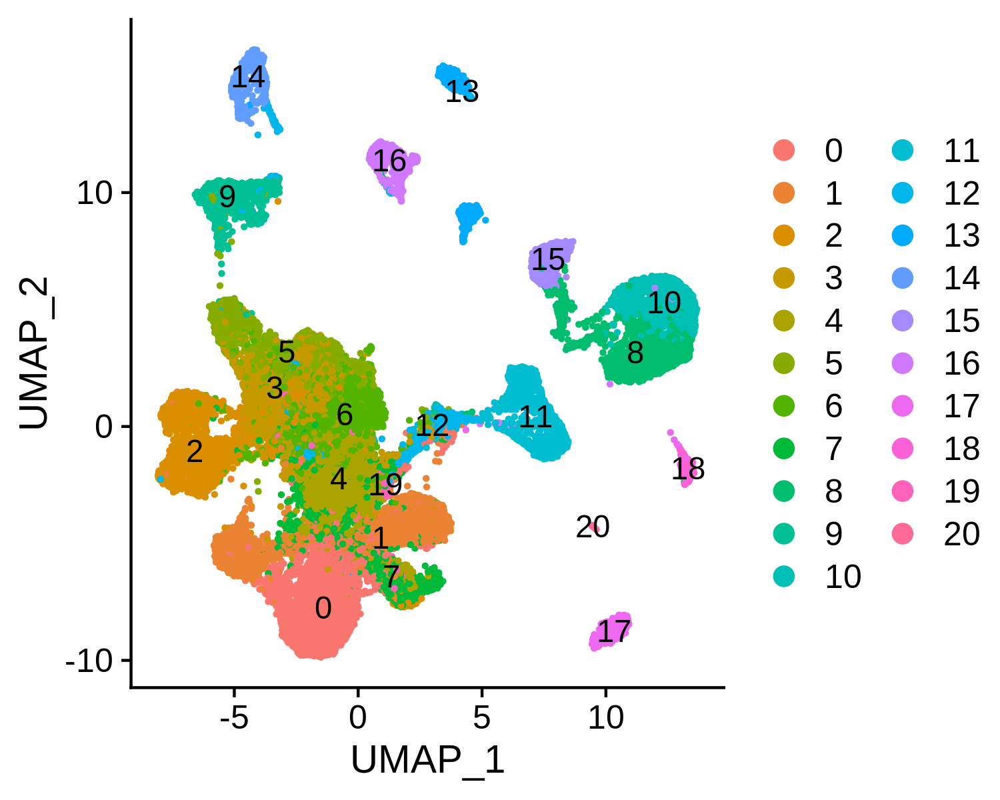
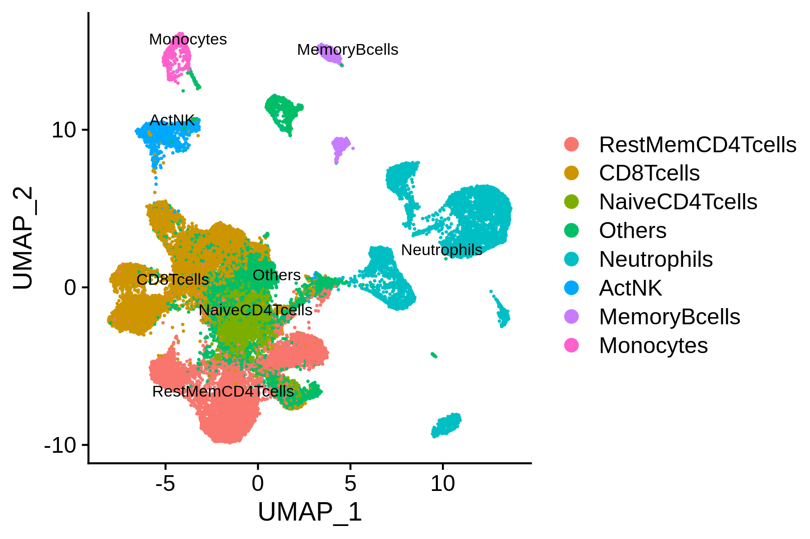
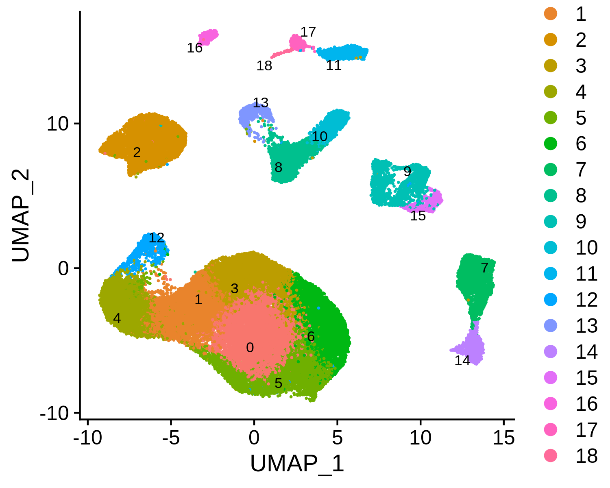
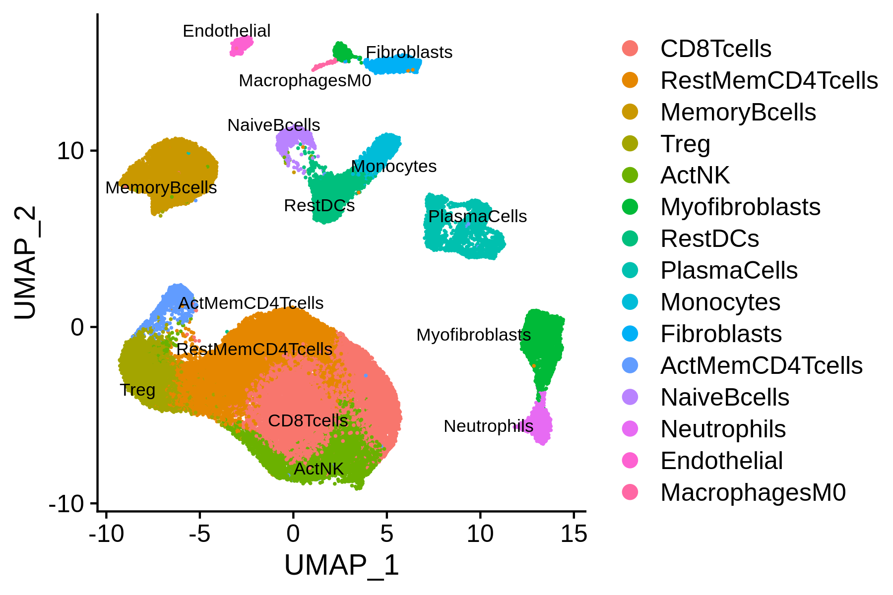
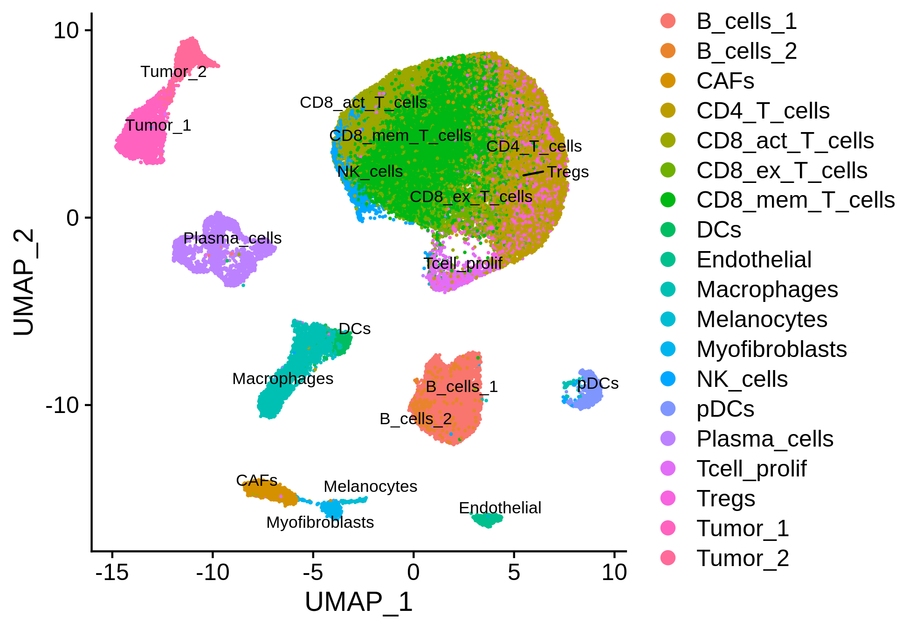
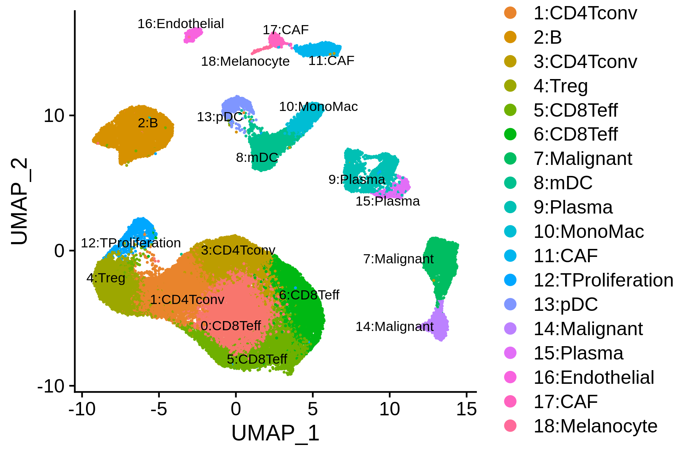
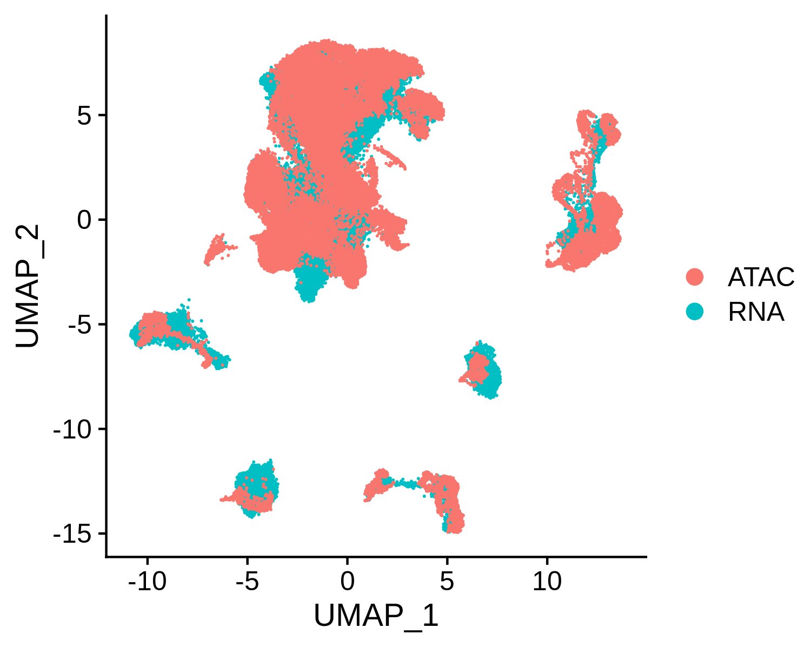
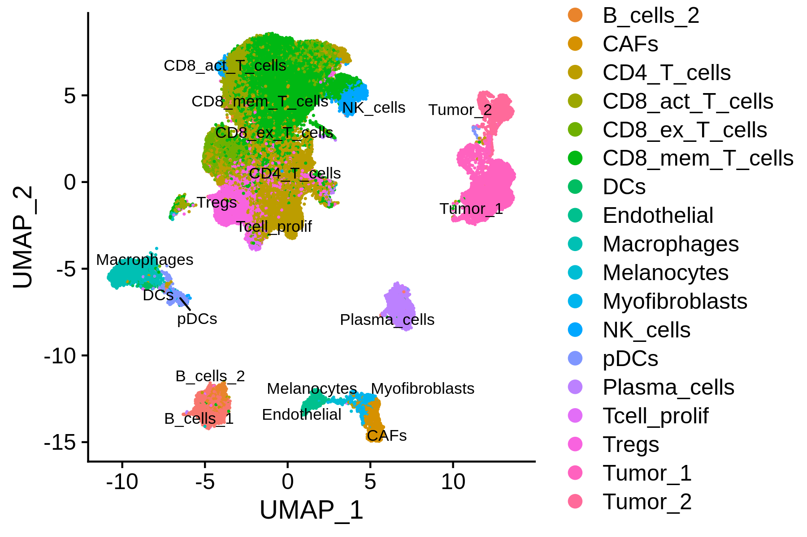
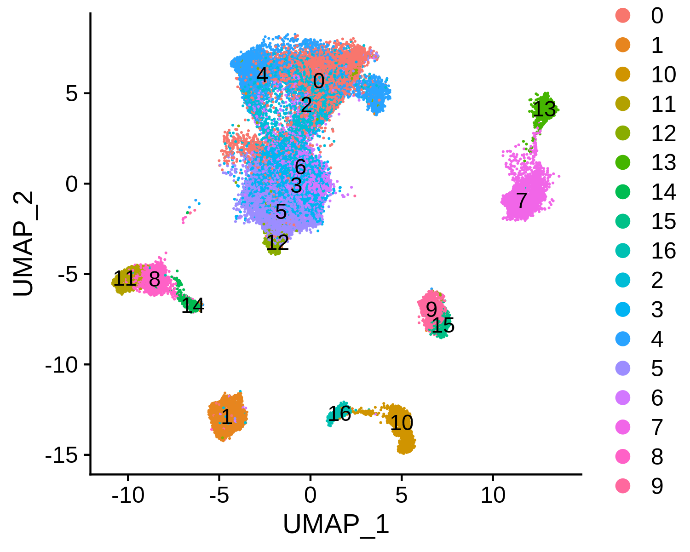
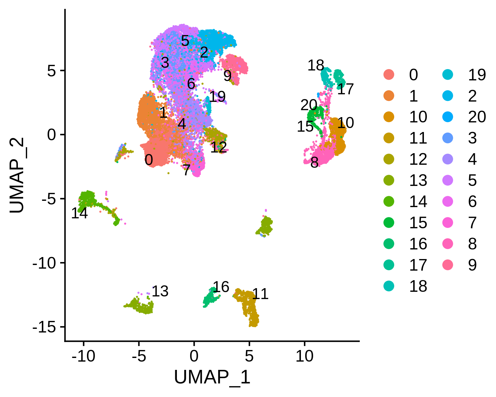

## Integrated analysis of BCC scATAC-seq dataset with 500K peaks

MAESTRO support processing huge dataset by using sparse matrix and HDF5 format to save the expression and peak count matrix, and we also support multiple processing using R to accelerate the clustering and DE analysis. In this example, we will demonstrate how to use MAESTRO to process the BCC scATAC-seq dataset with 0.5 million peaks and 38k cells, which is extremely large. And we will also demonstrate how to use the public scRNA-seq dataset to improve the annotation of scATAC-seq clusters.

### Step 0. Download the BCC scATAC-seq data
We will start from the processed dataset and demonstrate the step-by-step analysis using the MAESTRO R package. First, please download the data from the Cistrome website.

```bash
$ wget http://cistrome.org/~chenfei/MAESTRO/GSE129785_BCC_scATAC_peak_count.h5.gz
$ gunzip GSE129785_BCC_scATAC_peak_count.h5.gz
```

If users have their mtx formatted count matrix files from 10x genomics or plain text count files, they can convert them to HDF5 format using the functions provided in MAESTRO conda package.
```bash
$ conda activate MAESTRO
$ MAESTRO count-to-h5 --type Gene --count GSE123813_bcc_scRNA_counts.txt --directory . --outprefix GSE123813_BCC_scRNA
$ MAESTRO mtx-to-h5 --type Peak --matrix outs/filtered_feature_bc_matrix/matrix.mtx \
--feature outs/filtered_feature_bc_matrix/features.tsv --barcode outs/filtered_feature_bc_matrix/barcodes.tsv \
--directory . --outprefix GSE129785_BCC_scATAC
```
Then users will get GSE123813_BCC_scRNA_gene_count.h5 and GSE129785_BCC_scATAC_peak_count.h5. These HDF5 files can be used for the downstream analysis.

### Step 1. Read the data into R environment   
To use the MAESTRO R function, please install the R package following the instructions in MAESTRO [README](https://github.com/chenfeiwang/MAESTRO/blob/master/README.md) page. Then we need to load the peak count matrix into R. We should first filter the peaks with occurrence less than 50 to reduce the computing time and save some memory.
```R
> library(MAESTRO)
> library(Seurat)
> bcc.peak <- Read10X_h5('GSE129785_BCC_scATAC_peak_count.h5')
> dim(bcc.peak)
[1] 580480  37818
> bcc.peak <- bcc.peak[which(Matrix::rowSums(bcc.peak)>50),]
> dim(bcc.peak)
[1] 530771  37818
> bcc.gene <- ATACCalculateGenescore(bcc.peak)
```

The `ATACCalculateGenescore` function calls python from R, and utilizes matrix manipulation to calculate gene scores. However, we need to mention that for a large dataset, the gene score calculation usually consumes large memory. Users should make sure they have enough memory configuration on the computing server or cluster. Or users can choose to calculate gene score using `MAESTRO scatac-genescore`, which can reduce memory consumption to a certain extent.
```bash
MAESTRO scatac-genescore --format h5 --peakcount GSE129785_BCC_scATAC_peak_count.h5 \
--species GRCh38 --directory . --outprefix GSE129785_BCC_scATAC
```

### Step 2. Claim the process and memory usage in R
There are still about 0.5 million peaks after filtering. To accelerate the computing process, users can use the multiple processing functions in R and claim the process and memory usage using the following commands. 
```R
> library(future)
> plan("multiprocess", workers = 8)
> options(future.globals.maxSize = 10*1024^3)
```

### Step 3. Perform clustering analysis and differential peak calling for BCC scATAC-seq 
Similar to [previous demonstration](https://github.com/chenfeiwang/MAESTRO/blob/master/example/ATAC_infrastructure_10x/ATAC_infrastructure_10x.md), MAESTRO can cluster the cells from the scATAC-seq dataset and identify the differential peaks.
```R
> bcc.ATAC.res <- ATACRunSeurat(inputMat = bcc.peak, 
                                project = "GSE129785_BCC_scATAC", 
                                method = "LSI",
                                min.c = 50,
                                min.p = 500,
                                dims.use = 1:30,
                                cluster.res = 0.6,
                                peaks.test.use = "presto",
                                peaks.cutoff = 1e-05)
> head(bcc.ATAC.res$peaks)
  p_val avg_logFC pct.1 pct.2 p_val_adj cluster                      peak
1     0 0.3970384 0.345 0.037         0       0   chr17-55314606-55315106
2     0 0.3923740 0.371 0.052         0       0    chr7-36208966-36209466
3     0 0.3601251 0.364 0.091         0       0 chr13-110965223-110965723
4     0 0.3236424 0.368 0.100         0       0 chr10-126041663-126042163
5     0 0.3138130 0.453 0.204         0       0   chr19-50329070-50329570
6     0 0.3123080 0.294 0.048         0       0  chr2-159879020-159879520
```

 

### Step 4. Annotate cell types
We next try to annotate different clusters based on their marker genes. For scATAC, MAESTRO performs the cell type annotation using the gene regulatory potential to represent gene expression. So, we first need to use `ATACAttachGenescore()` to pass the gene regulatory potential matrix to the clustering result, and then perform differential gene analysis for each cluster on the gene RPscore matrix and identify the marker genes. We use public immune signatures like [CIBERSORT](https://www.nature.com/articles/nmeth.3337) to annotate the clusters. Users can also use their own signatures to annotate the clusters. Cell type information is stored in `Object@meta.data$assign.ident`.

```R
> bcc.ATAC.res$ATAC <- ATACAttachGenescore(ATAC = bcc.ATAC.res$ATAC, RPmatrix = bcc.gene)
> data(human.immune.CIBERSORT)
> bcc.ATAC.res$ATAC <- ATACAnnotateCelltype(ATAC = bcc.ATAC.res$ATAC, 
                                            signatures = human.immune.CIBERSORT, 
                                            min.score = 0.1, 
                                            genes.test.use = "presto",
                                            genes.cutoff = 1E-5)
> head(bcc.ATAC.res$ATAC@meta.data$assign.ident)
```

 

### Step 5. Download the scRNA-seq dataset
However, as we can see from the annotations, some of the clusters are annotated as "Others", indicating that the differential accessibility of marker genes can not robustly annotate these clusters. Usually, scRNA-seq has better discrimination on markers between different clusters. Next, we will perform integrated analysis of the BCC scATAC-seq dataset with the public BCC scRNA-seq dataset, and try to use the scRNA-seq cluster labels to annotate the scATAC-seq clusters.

First, users can download the scRNA-seq dataset from Cistrome website.
```bash
$ wget http://cistrome.org/~chenfei/MAESTRO/GSE123813_BCC_scRNA_counts.h5.gz
$ wget http://cistrome.org/~chenfei/MAESTRO/GSE123813_BCC_scRNA_metadata.txt.gz
$ gunzip GSE123813_BCC_scRNA_counts.h5.gz
$ gunzip GSE123813_BCC_scRNA_metadata.txt.gz
```

### Step 6. Perform clustering analysis and cell type annotation for BCC scRNA-seq
Then users can load the BCC scRNA-seq dataset into R, perform clustering analysis like the [previous demonstrations](../RNA_infrastructure_10x/RNA_infrastructure_10x.md).
```R
> bcc <- Read10X_h5('GSE123813_BCC_scRNA_counts.h5')
> bcc.expr <- RNACountToTPM(bcc, idType = "Symbol")
> bcc.expr <- log2(bcc.expr/10+1)
> bcc.RNA.res <- RNARunSeurat(inputMat = bcc.expr, 
                              project = "GSE123813_BCC_scRNA", 
                              min.c = 10,
                              min.g = 500,
                              dims.use = 1:15,
                              variable.genes = 2000, 
                              organism = "GRCh38",
                              cluster.res = 0.6,
                              genes.test.use = "presto",
                              genes.cutoff = 1e-05)
```

 

Then we can annotate the scRNA-seq clusters using public immune signatures from CIBERSORT.
```R
> data(human.immune.CIBERSORT)
> bcc.RNA.res$RNA <- RNAAnnotateCelltype(RNA = bcc.RNA.res$RNA, 
                                         gene = bcc.RNA.res$gene,
                                         signatures = human.immune.CIBERSORT, 
                                         min.score = 0.05)
```

 

This scRNA-seq dataset provides metadata. So, we can also annotate the scRNA-seq clusters using the original labels.
```R
> bcc.RNA.anno <- read.delim("GSE123813_BCC_scRNA_metadata.txt")
> bcc.RNA.res$RNA@meta.data <- cbind(bcc.RNA.res$RNA@meta.data, bcc.RNA.anno[match(colnames(bcc.RNA.res$RNA), bcc.RNA.anno[,1]),c(2,3,5)])
> p = DimPlot(object <- bcc.RNA.res$RNA, label = TRUE, pt.size = 0.2, group.by = "cluster", label.size = 3, repel = TRUE)
> ggsave(paste0(bcc.RNA.res$RNA@project.name, "_annotated_meta.png"), p, width=6.5, height=4.5)
```

 

We can combine the MAESTRO automatic annotation results and the original labels, and then finalize the clusters mannually. 
```R
> current.cluster.ids <- levels(bcc.RNA.res$RNA@meta.data$seurat_clusters)
> new.cluster.ids <- c("0:CD8Teff", "1:CD4Tconv", "2:B", "3:CD4Tconv", "4:Treg", 
                       "5:CD8Teff", "6:CD8Teff", "7:Malignant", "8:mDC", "9:Plasma", 
                       "10:MonoMac", "11:CAF", "12:TProliferation", "13:pDC", "14:Malignant", 
                       "15:Plasma", "16:Endothelial", "17:CAF", "18:Melanocyte")
> assign.ident.mannual <- plyr::mapvalues(x = bcc.RNA.res$RNA@meta.data$seurat_clusters, from = current.cluster.ids, to = new.cluster.ids)
> bcc.RNA.res$RNA@meta.data$assign.ident.CIBERSORT = bcc.RNA.res$RNA@meta.data$assign.ident
> bcc.RNA.res$RNA@meta.data$assign.ident = assign.ident.mannual
> p = DimPlot(object = bcc.RNA.res$RNA, label = TRUE, pt.size = 0.2, group.by = "assign.ident", label.size = 3, repel = T)
> ggsave(paste0(bcc.RNA.res$RNA@project.name, "_annotated_mannually.png"), p, width=6, height=4)
```

 

### Step 7. Integrated analysis of BCC scATAC-seq and scRNA-seq
Next, we can integrate the BCC scATAC-seq clusters with scRNA-seq clusters, co-embed the scRNA-seq and scATAC-seq cells in the same low dimensional space, and transfer the cell type labels from scRNA-seq to scATAC-seq. MAESTRO will automatically generate the scATAC and scRNA co-aligned visualization, cell-type annotated visualization using scRNA-seq labels, RNA-only visualization, and ATAC-only visualization.

```R
> bcc.coembedded.res <- Incorporate(RNA = bcc.RNA.res$RNA, ATAC = bcc.ATAC.res$ATAC, project = "BCC_integrated")
```
Co-embedding visualization:     
 

Co-embedding and annotated visualization:     
 

scRNA-only visualization:       
 

scATAC-only visualization:      
 

**Step 8. Save the project for future analysis**     
Finally, users can save the integrated R project for future analysis. Users can also explore the differential expressed genes, driver regulators in different clusters, and consistency between scRNA-seq and scATAC-seq in the later analysis.

```R
> saveRDS(bcc.coembedded.res, "BCC_integrated.rds")
```
