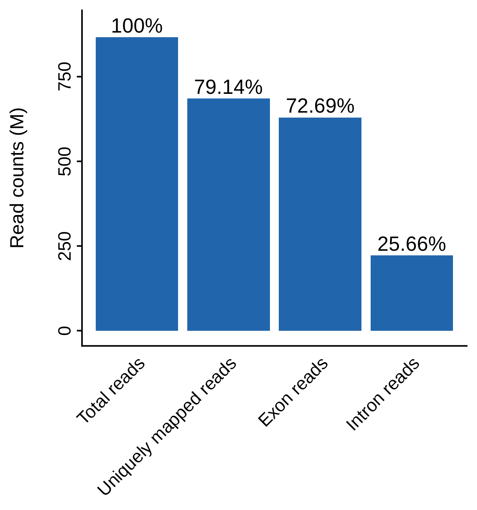
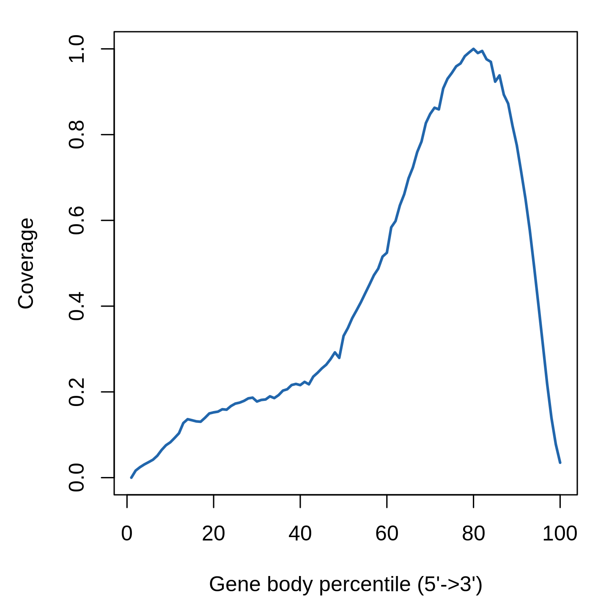
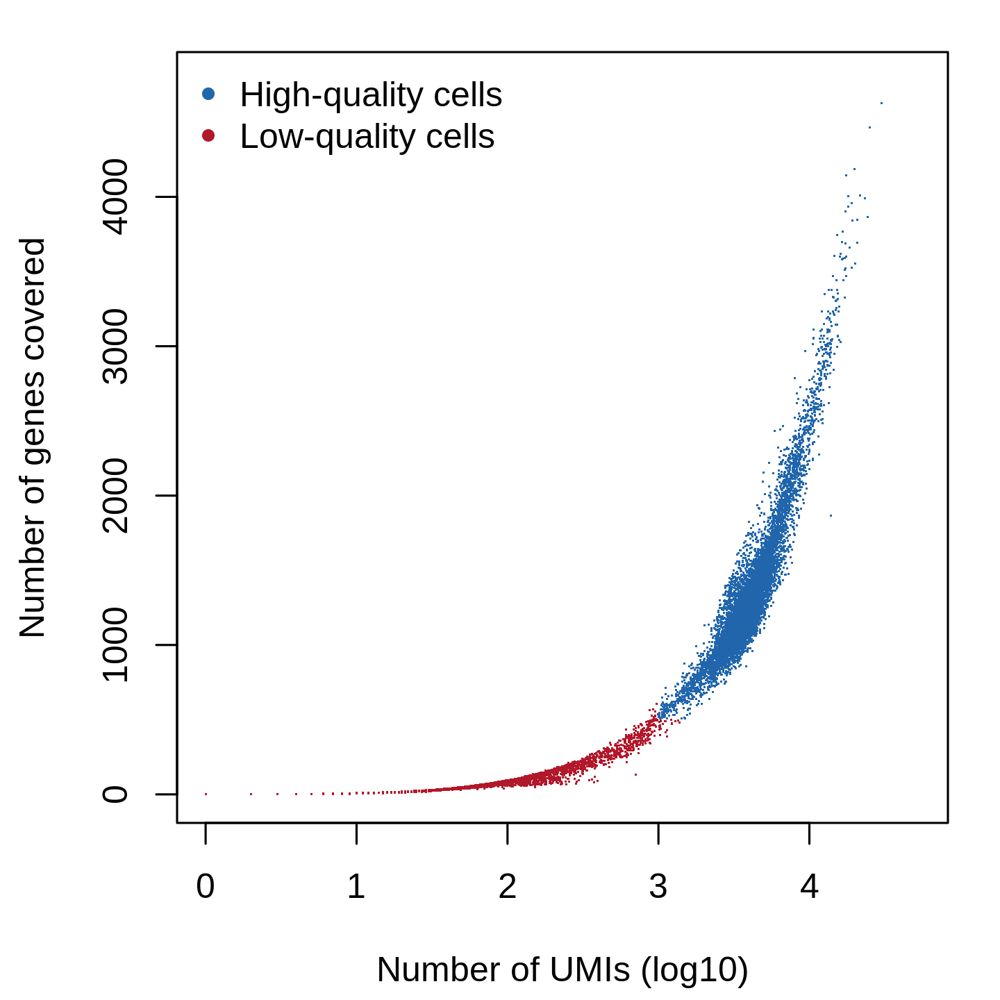
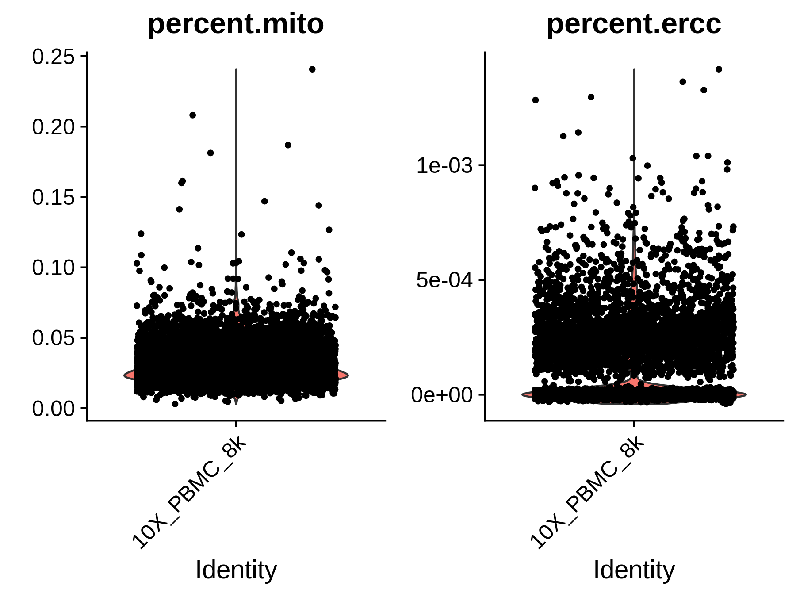
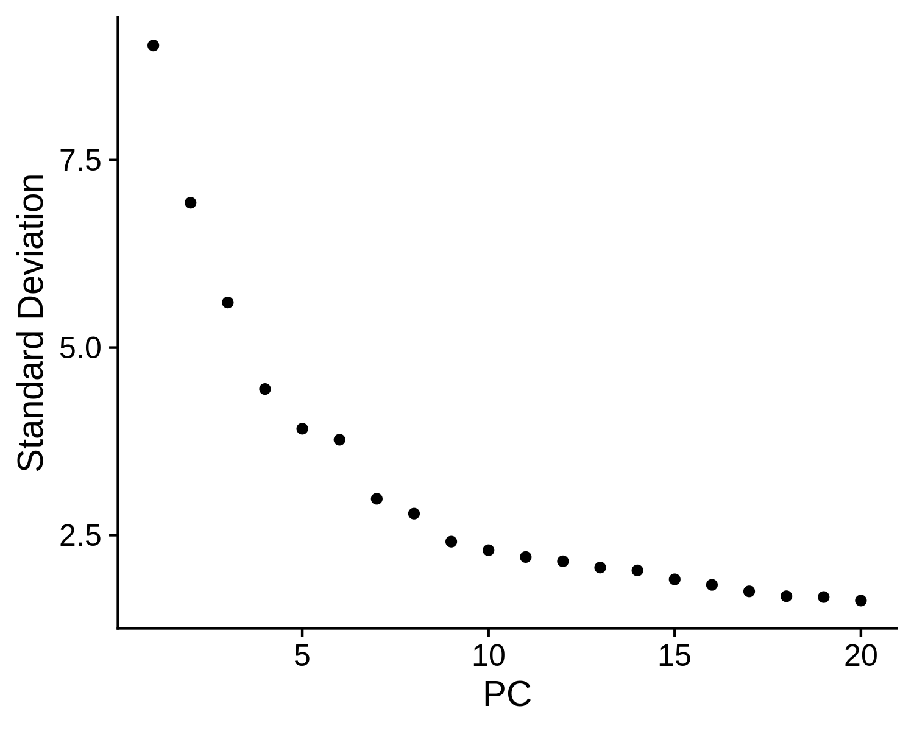
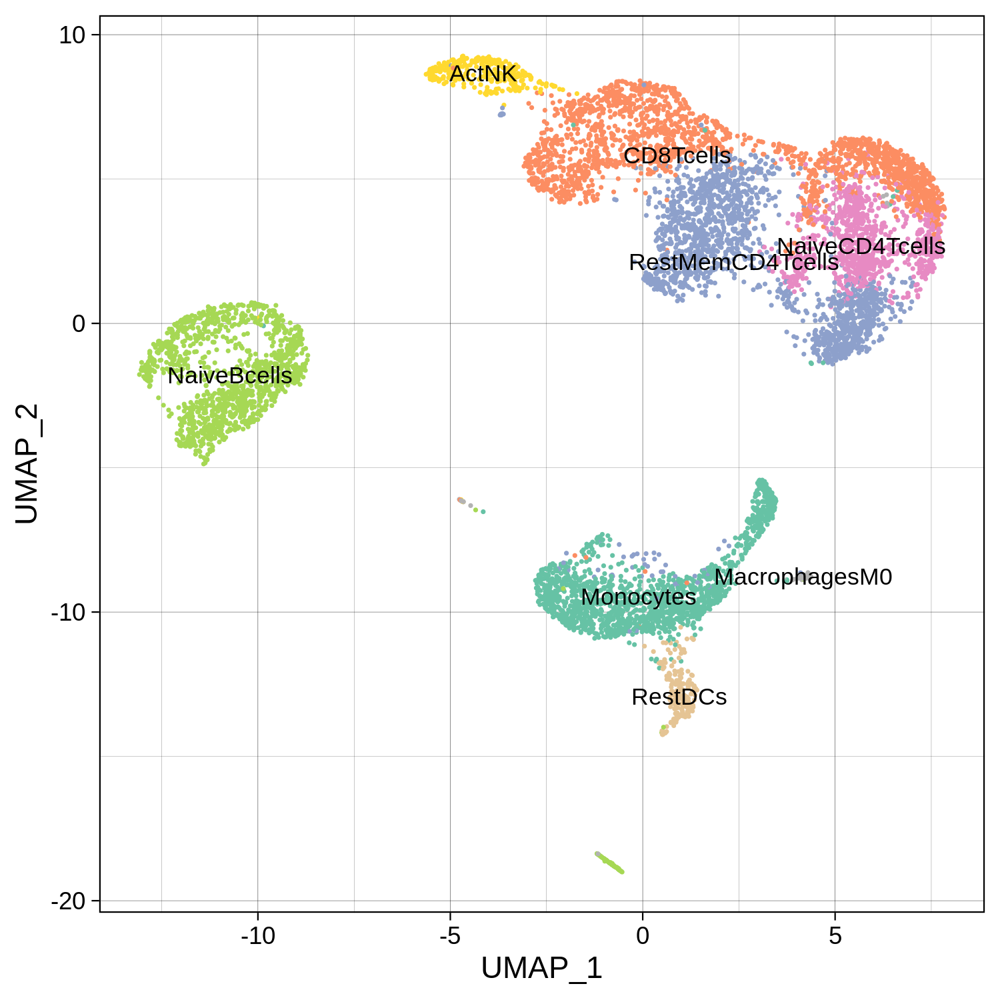
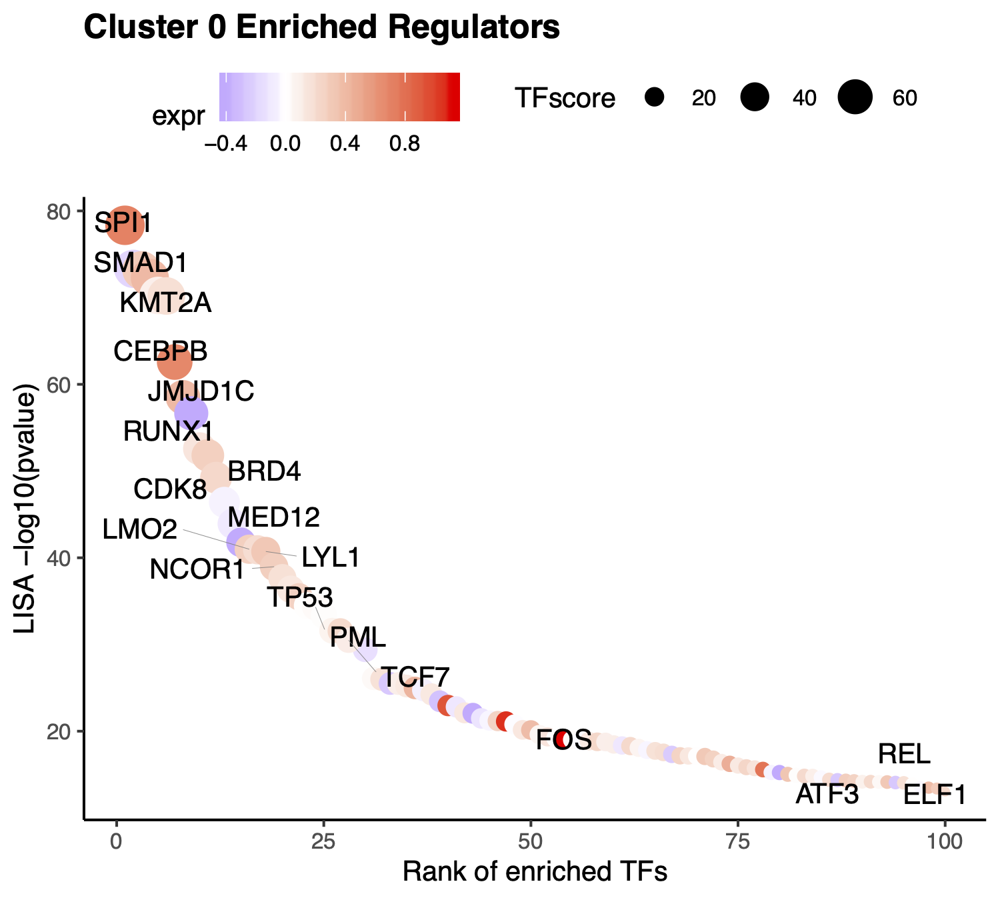
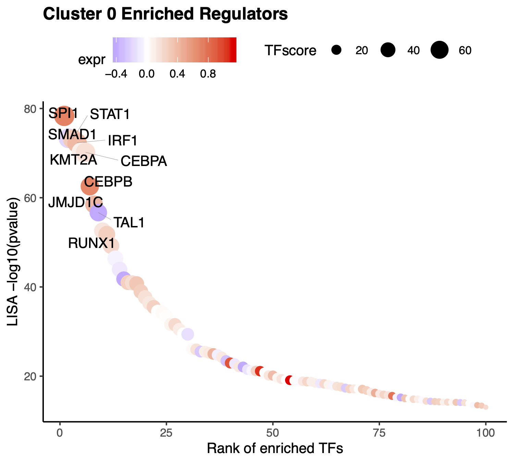
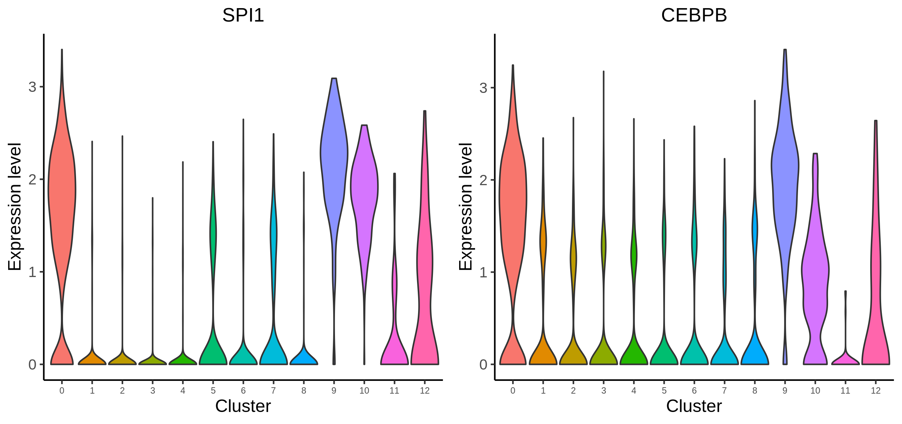
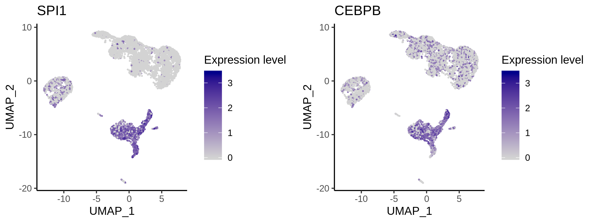

# 10X PBMC 8k scRNA-seq

In this example, we will be analyzing a scRNA-seq dataset of 8K human peripheral blood mononuclear cells (PBMCs) freely available from 10X Genomics. The raw dataset can be downloaded from the 10X Genomics website. We will show you how to [run through the whole MAESTRO pipeline](#run-maestro-pipeline) from the raw sequencing fastq files to the final results. We also provide guidance on how to [perform custom analysis](#perform-custom-analysis-from-the-pipeline-output) starting from the pipeline output such as the expression count matrix.

## Run MAESTRO pipeline

### Step 0. Download the data and prepare the environment
Please download the raw data from 10X genomics website.
```bash
$ wget http://s3-us-west-2.amazonaws.com/10x.files/samples/cell-exp/2.1.0/pbmc8k/pbmc8k_fastqs.tar
$ tar xvf pbmc8k_fastqs.tar
```

Before running MAESTRO, users need to activate the MAESTRO environment.
```bash
$ conda activate MAESTRO
```

### Step 1. Configure the MAESTRO workflow
Initialize the MAESTRO scRNA-seq workflow using `MAESTRO scrna-init` command. This will install a Snakefile and a config file in this directory.
```bash
$ MAESTRO scrna-init --platform 10x-genomics --species GRCh38 \
--fastq-dir Data/10X_PBMC_8k/fastqs --fastq-prefix pbmc8k \
--cores 8 --rseqc --directory Analysis/10X_PBMC_8k_MAESTRO_V110 --outprefix 10X_PBMC_8k \
--mapindex annotations/MAESTRO/Refdata_scRNA_MAESTRO_GRCh38_1.1.0/GRCh38_STAR_2.7.3a \
--whitelist Data/barcodes/737K-august-2016.txt \
--umi-length 10 --method LISA --lisamode local --lisaenv lisa --condadir /home1/user/miniconda3 --signature human.immune.CIBERSORT
```

To get a full description of command-line options, please use the command `MAESTRO scrna-init -h`.
```bash
usage: MAESTRO scrna-init [-h] [--platform {10x-genomics,Dropseq,Smartseq2}]
                          --fastq-dir FASTQ_DIR [--fastq-prefix FASTQ_PREFIX]
                          [--fastq-barcode FASTQ_BARCODE]
                          [--fastq-transcript FASTQ_TRANSCRIPT]
                          [--species {GRCh38,GRCm38}] [--cores CORES]
                          [--rseqc] [--directory DIRECTORY]
                          [--outprefix OUTPREFIX]
                          [--count-cutoff COUNT_CUTOFF]
                          [--gene-cutoff GENE_CUTOFF]
                          [--cell-cutoff CELL_CUTOFF] --mapindex MAPINDEX
                          [--rsem RSEM] [--whitelist WHITELIST]
                          [--barcode-start BARCODE_START]
                          [--barcode-length BARCODE_LENGTH]
                          [--umi-start UMI_START] [--umi-length UMI_LENGTH]
                          [--lisamode {local,web}] [--lisaenv LISAENV]
                          [--condadir CONDADIR] [--signature SIGNATURE]
```

Here we list all the arguments and their description.

**Input files arguments:**

Arguments  |  Description
---------  |  -----------
`--platform` | {10x-genomics,Dropseq,Smartseq2} Platform of single cell RNA-seq. DEFAULT: 10x-genomics.
`--fastq-dir` | Directory where fastq files are stored.
`--fastq-prefix` | Sample name of fastq file, only for the platform of '10x-genomics'. If there is a file named pbmc_1k_v2_S1_L001_I1_001.fastq.gz, the prefix is 'pbmc_1k_v2'.
`--fastq-barcode` | Specify the barcode fastq file, only for the platform of 'Dropseq'. If there are multiple pairs of fastq, please provide a comma-separated list of barcode fastq files. For example, `--fastq-barcode test1_1.fastq,test2_1.fastq`.
`--fastq-transcript` | Specify the transcript fastq file, only for the platform of 'Dropseq'.
`--species` | {GRCh38,GRCm38} Specify the genome assembly (GRCh38 for human and GRCm38 for mouse). DEFAULT: GRCh38.

**Running and output arguments:**

Arguments  |  Description
---------  |  -----------
`--cores` | The number of cores to use. DEFAULT: 8.
`--rseqc` | Whether or not to run RSeQC. If set, the pipeline will include the RSeQC part and then takes a longer time. By default (not set), the pipeline will skip the RSeQC part.
`--directory` | Path to the directory where the workflow shall be initialized and results shall be stored. DEFAULT: MAESTRO.
`--outprefix` | Prefix of output files. DEFAULT: MAESTRO.

**Quality control arguments:**

Arguments  |  Description
---------  |  -----------
`--count-cutoff` | Cutoff for the number of count in each cell. DEFAULT: 1000.
`--gene-cutoff` | Cutoff for the number of genes included in each cell. DEFAULT: 500.
`--cell-cutoff` | Cutoff for the number of cells covered by each gene. DEFAULT: 10.

**Reference genome arguments:**

Arguments  |  Description
---------  |  -----------
`--mapindex` | Genome index directory for STAR. Users can just download the index file for [human](http://cistrome.org/~chenfei/MAESTRO/Refdata_scRNA_MAESTRO_GRCh38_1.1.0.tar.gz) and [mouse](http://cistrome.org/~chenfei/MAESTRO/Refdata_scRNA_MAESTRO_GRCm38_1.1.0.tar.gz) from CistromeDB and decompress them. Then specify the index directory for STAR, for example, `--mapindex Refdata_scRNA_MAESTRO_GRCh38_1.1.0/GRCh38_STAR_2.7.3a`.
`--rsem` | The prefix of transcript references for RSEM used by rsem-prepare-reference (Only required when the platform is Smartseq2). Users can directly download the reference file for [human](http://cistrome.org/~chenfei/MAESTRO/Refdata_scRNA_MAESTRO_GRCh38_1.1.0.tar.gz) and [mouse](http://cistrome.org/~chenfei/MAESTRO/Refdata_scRNA_MAESTRO_GRCm38_1.1.0.tar.gz) from CistromeDB and decompress them. Then specify the prefix for RSEM, for example, `--rsem Refdata_scRNA_MAESTRO_GRCh38_1.1.0/GRCh38_RSEM_1.3.2/GRCh38`.

**Barcode arguments, for platform of 'Dropseq' or '10x-genomics':**

Arguments  |  Description
---------  |  -----------
`--whitelist` | If the platform is 'Dropseq' or '10x-genomics', please specify the barcode library (whitelist) so that STARsolo can do the error correction and demultiplex of cell barcodes. The 10X Chromium whitelist file can be found inside the CellRanger distribution. Please make sure that the whitelist is compatible with the specific version of the 10X chemistry: V2 or V3. For example, in CellRanger 3.1.0, the V2 whitelist is 'cellranger-3.1.0/cellranger-cs/3.1.0/lib/python/cellranger/barcodes/737K-august-2016.txt'. The V3 whitelist is 'cellranger-3.1.0/cellranger-cs/3.1.0/lib/python/cellranger/barcodes/3M-february-2018.txt'.
`--barcode-start` | The start site of each barcode. DEFAULT: 1.
`--barcode-length` | The length of cell barcode. For 10x-genomics, the length of barcode is 16. DEFAULT: 16.
`--umi-start` | The start site of UMI. DEFAULT: 17.
`--umi-length` | The length of UMI. For 10x-genomics, the length of V2 chemistry is 10. For 10X V3 chemistry, the length is 12. DEFAULT: 10.

**Regulator identification arguments:**

Arguments  |  Description
---------  |  -----------
`--lisamode` | Mode to Run LISA, 'local' or 'web'. If the mode is set as 'local', please install [LISA](https://github.com/qinqian/lisa) and download pre-computed datasets following the instructions. The 'web' mode is to run online version of LISA. In consideration of the connection issue and size of datasets, the 'local' mode is recommended to run the whole MAESTRO pipeline. If the mode is 'local', please provide the name of LISA environment through `--lisaenv` and specify the directory where miniconda or anaconda is installed through `--condadir`. DEFAULT: local.
`--lisaenv` | Name of LISA environment (required if method is set to lisa and lisamode is set to local). DEFAULT: lisa.
`--condadir` | Directory where miniconda or anaconda is installed (required if method is set to lisa and lisamode is set to local). For example, `--condadir /home/user/miniconda3`.

**Cell signature arguments:**

Arguments  |  Description
---------  |  -----------
`--signature` | Cell signature file used to annotate cell types. MAESTRO provides several sets of built-in cell signatures. Users can choose from ['human.immune.CIBERSORT', 'mouce.brain.ALLEN', 'mouse.all.facs.TabulaMuris', 'mouse.all.droplet.TabulaMuris']. Custom cell signatures are also supported. In this situation, users need to provide the file location of cell signatures, and the signature file is tab-seperated without header. The first column is cell type, and the second column is signature gene. DEFAULT: human.immune.CIBERSORT.


### Step 2. Run MAESTRO
Before running the workflow, please check the `config.yaml` and see if it is configured correctly. Once `config.yaml` is configured, users can use snakemake to run the workflow. 
```bash
$ cd 10X_PBMC_8k_MAESTRO_V110
$ snakemake -np
$ nohup snakemake --cores 10 > 10X_PBMC_8k.out &
```

### Step 3. Understand the final output files
The whole pipeline in this example takes about 5 hours with 10 cores. Here, we assume users have run MAESTRO successfully. An output directory is specified in the run call, and will contain several useful outputs as described below.
```bash
$ ls Result
10X_PBMC_8k_scRNA_report.html  Analysis  Benchmark  Log  QC  STAR
```

#### Output files 
* **STAR:**
The `STAR` directory contains all the mapping and analysis files generated by `STAR` normal (Smartseq2) or solo mode (10x-genomics or Dropseq). For solo mode, `Solo.out/Gene/` stores raw and filtered count matrix. In MAESTRO pipeline, raw count matrix is used for a further filter according to quality control arguments like `--count-cutoff` `--gene-cutoff` and `--cell-cutoff`.
* **QC:**
The `QC` directory contains quality control analysis results of scRNA-seq data, including the filtered count matrix `outprefix_filtered_gene_count.h5` and RSeQC results (if `--rseqc` is set).
* **Analysis:**
The `Analysis` directory contains a Seurat R object, as well as clustering result, cell type annotation result and driver transcription factor identification result, which we will introduce in the step-by-step analysis.
* **Benchmark:**
The `Benchmark` directory stores benchmark files for all rules in Snakefile, each of which contains a tab-separated table of run times and memory usage in MiB.
* **Log:**
The Log directory contains the log files generated in the pipeline analysis.
* **outprefix_scRNA_report.html:**
The `outprefix_scRNA_report.html` file summarizes all the results in an HTML based document. The summary HTML for the 10X_PBMC_8k example can be found [here](http://cistrome.org/~chenfei/MAESTRO/10X_PBMC_8k_scRNA_report.html).

MAESTRO performs quality control at both bulk and single-cell level. Here we list QC plots generated by MAESTRO.

**Mappability plot for scRNA-seq QC analysis (bulk level)**

MAESTRO checks the read mappability and distribution of reads in CDS and intronic regions. CDS read distribution checks proper RNA processing and library preparation which ensures accurate expression quantification. In general, for human or mouse, uniquely mapped reads should account for more than 60% of all reads, and more reads should be distributed in exon regions than intron reads. La Manno et al (2018) found that for scRNA-seq, 15–25% of reads contained unspliced intronic sequences. 

 

**Gene-body coverage plot for scRNA-seq QC analysis (bulk level)**

Gene-body coverage evaluates sample read bias over 3’ or 5’ of the transcripts. For 10x-genomics, reads are supposed to be biased to 3' of the transcripts. For Smartseq2, reads are supposed to be distributed evenly over the transcripts.

 

**Cell filtering plot for scRNA-seq QC analysis (single-cell level)**

Cells with less than 1000 UMIs and 500 genes covered are treated as low-quality cells and filtered out from the downstream analysis. If the sequencing depth is not enough or the number of cells is small, please lower the `--count-cutoff` and `--gene-cutoff`.

 


## Perform custom analysis from the pipeline output
Although MAESTRO will generate all the analysis results through the snakemake-based workflow, in most cases, users might focus on specific clusters or sub-clusters or want to tune some of the parameters to improve the results. Then users can utilize the stand-alone MAESTRO R package, which has been installed in the MAESTRO conda environment, to perform custom analysis from the processed dataset (gene by cell count matrix). We will show you how to run through the downstream analysis using the R package step by step.

### Step 0. Read data
First users need to read the gene expression count matrix generated by MAESTRO pipeline into the R environment. To support the processing of large datasets, in MAESTRO we use [HDF5 format](https://support.10xgenomics.com/single-cell-gene-expression/software/pipelines/latest/advanced/h5_matrices) for all the expression, atac-seq peak count and RP tables. 
```R
> library(MAESTRO)
> library(Seurat)
> pbmc.gene <- Read10X_h5('Result/QC/10X_PBMC_8k_filtered_gene_count.h5')
```

We also support the processed dataset from 10x Cell Ranger pipeline or STARsolo. Users can load the gene matrix into R through `Read10X` function in Seurat package.
```R
> pbmc.gene <- Read10X('Result/STAR/10X_PBMC_8kSolo.out/Gene/filtered')
```

### Step 1. Perform clustering and differential gene analysis
We next create a Seurat object using the gene expression matrix and perform the clustering analysis as well as differential gene analysis for different clusters. `RNARunSeurat()` function in MAESTRO integrates multiple functions of Seurat and perform the routine analysis as follows.

1. **Single-cell level quality control**
* **Cell and gene coverage:**
Cells with less than 200 genes expressed, and genes expressed in less than 10 cells will be removed from the analysis. 
* **Mitochondrial gene and ERCC:**
If `mito = TRUE` and `mito.cutoff = 0.05` is set, we will also filter the cells with more than 5% mitochondrial reads or more than 5% ERCC spike-ins. Mitochondrial genes are expressed in most cells and their expression level is specific to cell types. High expression level (i.e., high percentage) of mitochondrial genes could be detected from apoptotic or lysing cells, which should not be included in the analysis. ERCC spike-ins are used to estimate total mRNA content captured in cells. High level of ERCC is likely caused by cell death. Similarly, cells with a high percentage of ERCC need to be filtered.
2. **Normalization**
* **Removing unwanted confounding factors:**
Single cells may contain unwanted sources of variation, such as technical noise. These factors may have a disturbing effect on downstream analysis and should be removed out. Seurat provides a function to regress user-defined variables out.
* **Variance shrinkage and high-variance gene identification:**
Based on the assumption that the expression level of most genes in all cells is similar, variance adjustment is needed to preserve biological variation and minimize unknown experiment variation. After shrinking variance, really highly variable genes are identified and only the top 2000 variable genes are used in the downstream analysis.
3. **Analysis**
* **Dimension reduction and determining significant components:**
MAESTRO performed PCA on top variable features to reduce the dimension of the dataset. An elbow plot is generated to visualize the variance of each PC and identify the "elbow" point to determine the significant PCs. If not set, the top 15 PCs will be selected by default for downstream analysis. 
* **Clustering:**
MAESTRO employs the graph-based clustering method in Seurat for scRNA-seq clustering analysis. Please see [Seurat](https://www.cell.com/cell/pdf/S0092-8674(19)30559-8.pdf) for the details. Briefly, MAESTRO will build a K-nearest neighbor (KNN) graph using the reduced dimensions from the previous step, and then refine the edge weights between two cells based on the Jaccard similarity of their neighborhoods, which are completed by the `FindNeighbors` function in Seurat. To cluster the cells, MAESTRO uses the `FindClusters` function in Seurat, which applies the Louvain algorithm to cluster cells together iteratively. The default clustering resolution for scRNA-seq is set to 0.6, and users can also tune the parameter for different conditions. Besides, extra parameters for `FindNeighbors` and `FindClusters` can be passed via `findneighbors.args` and `findclusters.args`. For example, users can set `findneighbors.args = list(k.param = 25)` to define k = 25 for the k-nearest neighbor algorithm.
* **UMAP visualization:**
UMAP is used to visualize all the single cells. MAESTRO adopts [UMAP](https://arxiv.org/abs/1802.03426) to achieve a low dimension embedding, in which similar cells are placed together. To get a better result for visualization, users can tune the parameters of `RunUMAP` by adding the arguments in `RNARunSeurat` function, like `RNARunSeurat(inputMat = pbmc.gene, ..., n.neighbors = 20, min.dist = 0.2)`. 
* **Differential gene analysis:**
The default differential expression method is [presto](https://github.com/immunogenomics/presto), a fast version of Wilcoxon test. Users can also use other model-based methods like [DESeq2](https://bioconductor.org/packages/release/bioc/html/DESeq2.html) and [MAST](https://www.ncbi.nlm.nih.gov/pmc/articles/PMC4676162/). These methods have been integrated into `FindAllMarkers` function in Seurat. We provide `FindAllMarkersMAESTRO` function in MAESTRO, which is adapted from `FindAllMarkers`, to reduce the computational time and memory. Genes with logFC greater than 0.25, minimum presence faction in cells of 0.1, and p-value less than 1E-5 are identified as marker genes for each cluster.

```R
> pbmc.RNA.res <- RNARunSeurat(inputMat = pbmc.gene,
                               project = "10X_PBMC_8k",
                               orig.ident = NULL,
                               min.c = 10,
                               min.g = 200,
                               mito = TRUE,
                               mito.cutoff = 0.05,
                               variable.genes = 2000,
                               organism = "GRCh38",
                               dims.use = 1:15,
                               cluster.res = 0.6,
                               only.pos = FALSE,
                               genes.test.use = "presto",
                               genes.cutoff = 1e-05,
                               genes.pct = 0.1,
                               genes.logfc = 0.25)

> head(pbmc.RNA.res$genes)
  p_val avg_logFC pct.1 pct.2 p_val_adj cluster       gene
1     0  3.560335 0.992 0.390         0       0     S100A8
2     0  3.443707 0.993 0.463         0       0     S100A9
3     0  2.812824 0.994 0.460         0       0        LYZ
4     0  2.694738 0.914 0.080         0       0    S100A12
5     0  2.442931 0.967 0.115         0       0 AC020656.1
6     0  2.278404 0.976 0.143         0       0       FCN1
```

`RNARunSeurat()` returns a list of a Seurat object `RNA` and dataframe `genes`. Please see [Seurat Github wiki](https://github.com/satijalab/seurat/wiki) for more details of the Seurat object structure. Users can use the `str()` command to get an intuitive understanding of the object.
```R
> str(pbmc.RNA.res$RNA)
```

 
 
 

### Step 2. Annotate cell types
We next try to annotate different clusters based on their marker genes. We use public immune signatures like [CIBERSORT](https://www.nature.com/articles/nmeth.3337) to annotate the clusters. Users can also use their signatures to annotate the clusters. Cell type information is stored in `Object@meta.data$assign.ident`.

```R
> data(human.immune.CIBERSORT)
> pbmc.RNA.res$RNA <- RNAAnnotateCelltype(RNA = pbmc.RNA.res$RNA, 
                                          gene = pbmc.RNA.res$gene,
                                          signatures = human.immune.CIBERSORT, 
                                          min.score = 0.05)
> head(pbmc.RNA.res$RNA@meta.data)
                  orig.ident nCount_RNA nFeature_RNA percent.mito percent.ercc
AAACCTGAGCATCATC 10X_PBMC_8k       2312          832   0.03892734 0.0004325260
AAACCTGAGCTAGTGG 10X_PBMC_8k       4337         1258   0.01982938 0.0002305741
AAACCTGCACATTAGC 10X_PBMC_8k       2659          841   0.01466717 0.0000000000
AAACCTGCACTGTTAG 10X_PBMC_8k       4479         1462   0.03683858 0.0000000000
AAACCTGCATAGTAAG 10X_PBMC_8k       4224         1432   0.03882576 0.0000000000
AAACCTGCATGAACCT 10X_PBMC_8k       3068         1202   0.03846154 0.0000000000
                 RNA_snn_res.0.6 seurat_clusters     assign.ident
AAACCTGAGCATCATC               7               7      NaiveBcells
AAACCTGAGCTAGTGG               2               2 RestMemCD4Tcells
AAACCTGCACATTAGC               6               6 RestMemCD4Tcells
AAACCTGCACTGTTAG               0               0        Monocytes
AAACCTGCATAGTAAG               0               0        Monocytes
AAACCTGCATGAACCT               1               1        CD8Tcells
```


All the reduction results are stored in `Object@reductions`. For example, users can use `Object@reductions$umap@cell.embeddings` to extract the cell embedding result of UMAP for custom plotting. Or users can directly use `DimPlot()` from Seurat and other functions like `theme()` from ggplot2 to generate a prettier plot.

```R
> library(ggplot2)
> library(RColorBrewer)
> p <- DimPlot(object = pbmc.RNA.res$RNA, label = TRUE, pt.size = 0.15, 
             group.by = "assign.ident", label.size = 3, 
             cols = brewer.pal(8,"Set2")) + 
       theme_linedraw() + NoLegend()
> ggsave(file.path(paste0(pbmc.RNA.res$RNA@project.name, "_annotated_nolegend.png")), p, width=5, height=5)
```


### Step 3. Identify driver transcription regulators
To identify enriched transcription regulators is crucial to understanding gene regulation in the heterogeneous single-cell populations. MAESTRO utilizes LISA to predict the potential transcription factors based on the marker genes in each cluster, which rely on the transcriptional regulator binding profiles from CistromeDB to identify the potential regulators shaping the expression pattern of each cluster. MAESTRO provides two options for running LISA, "local" and "web". The web mode does not need to install LISA and download the annotations. If users select the local mode, which is much faster and more stable than the web version, users need to install LISA locally, build the annotation files according to the [LISA document](https://github.com/qinqian/lisa), and provide the environment name of LISA when using the `RNAAnnotateTranscriptionFactor` function. If users have multiple clusters of differential genes, the "local" mode is recommended.

```R
> pbmc.RNA.tfs <- RNAAnnotateTranscriptionFactor(RNA = pbmc.RNA.res$RNA,
                                                 genes = pbmc.RNA.res$genes,
                                                 project = pbmc.RNA.res$RNA@project.name,
                                                 method = "LISA",
                                                 lisa.mode = "local",
                                                 conda.dir = "/home1/user/miniconda3",
                                                 lisa.envname = "lisa",
                                                 organism = "GRCh38",
                                                 top.tf = 10)
> pbmc.RNA.tfs[["0"]]
 [1] "SPI1 | IRF1 | STAT1 | IRF8 | STAT3 | STAT2 | IRF2 | BCL6 | IRF3 | BCL11A | STAT5A | STAT5B | PRDM1 | IRF4 | SPIB | STAT4"
 [2] "SMAD1"
 [3] "KMT2A"
 [4] "CEBPB | CEBPD | ATF4 | CEBPG | CEBPA | NFIL3 | DDIT3 | BATF | DBP | BATF3 | CEBPE | HLF"
 [5] "BRD4"
 [6] "JMJD1C"
 [7] "RUNX1 | CBFB | RUNX3 | RUNX2"
 [8] "CDK8"
 [9] "ELF1 | FLI1 | ETV6 | ELF2 | ETS2 | ELK3 | ELK4 | NFAT5 | GABPA | ETS1 | ELK1 | ETV5 | ETV2 | ETV7 | ELF3"
[10] "NCOR1"
```

Besides identifying TFs for all the clusters, we also support the differential gene list from a single comparison. In this situation, users can choose the "web" mode.
```R
> de.geneset <- FindMarkersMAESTRO(pbmc.RNA.res$RNA, ident.1 = c(0))
> pbmc.RNA.monocyte.tfs <- RNAAnnotateTranscriptionFactor(RNA = pbmc.RNA.res$RNA, 
                                                          genes = de.geneset,
                                                          cluster = c(0),
                                                          project = "10X_PBMC_8k_Monocyte", 
                                                          method = "LISA",
                                                          lisa.mode = "web",
                                                          organism = "GRCh38",
                                                          top.tf = 20)
```

### Step 4. Visualize driver transcription factors for each cluster  
According to the annotation of the clusters, we know that cluster 0 is Monocyte. Next, we want to visualize the enriched regulators in Monocyte from Step 5.

The output TFs returned from `RNAAnnotateTranscriptionFactor` have already been pre-filtered based on TF expression level. 
```R
> tfs <- sapply(pbmc.RNA.monocyte.tfs[[1]], function(x){
                return(unlist(strsplit(x, split = " | ", fixed = TRUE))[1])})
> p <- VisualizeTFenrichment(TFs = tfs, 
                             cluster.1 = 0, 
                             type = "RNA", 
                             SeuratObj = pbmc.RNA.res$RNA, 
                             LISA.table = "10X_PBMC_8k_Monocyte_lisa.txt",
                             visual.totalnumber = 100, 
                             name = "10X_PBMC_8k_Monocyte_filtered")
```
 

If users want to visualize the top factors without filtering. Please leave the TFs to NULL, then the top 10 regulators will be visualized.
```R
> p <- VisualizeTFenrichment(cluster.1 = 0, 
                             type = "RNA", 
                             SeuratObj = pbmc.RNA.res$RNA, 
                             LISA.table = "10X_PBMC_8k_Monocyte_lisa.txt",
                             visual.topnumber = 10,
                             visual.totalnumber = 100, 
                             name = "10X_PBMC_8k_Monocyte_top")
```
 

To further filter the regulators, users may want to visualize the expression level of the predicted transcription factors. We provide the function for visualize TF/genes expression level using Vlnplot and Umap.
```R
> p <- VisualizeVlnplot(genes = c("SPI1","CEBPB"), 
                        type = "RNA", 
                        SeuratObj = pbmc.RNA.res$RNA, 
                        ncol = 2, 
                        width = 8.5, 
                        height = 4, 
                        name = "10X_PBMC_8k_Monocyte")
```
   

```R
> p <- VisualizeUmap(genes = c("SPI1","CEBPB"), 
                     type = "RNA", 
                     SeuratObj = pbmc.RNA.res$RNA, 
                     ncol = 2, 
                     width = 8, 
                     height = 3, 
                     name = "10X_PBMC_8k_Monocyte")
```
 

### Step 5. Save the object for future analysis
Finally, users can save the R object, including the raw data, normalized data, clustering result, and meta information for future analysis.

```R
> saveRDS(pbmc.RNA.res, "10X_PBMC_8k_res.rds")
```

The differential genes, predicted TFs for each cluster and all the figures have already been saved in the current directory by MAESTRO.

```R
> list.files()
 [1] "10X_PBMC_8k_annotated_nolegend.png"
 [2] "10X_PBMC_8k_annotated.png"
 [3] "10X_PBMC_8k_cluster.png"
 [4] "10X_PBMC_8k_DiffGenes.tsv"
 [5] "10X_PBMC_8k_lisa.txt"
 [6] "10X_PBMC_8k_Monocyte_filtered.pdf"
 [7] "10X_PBMC_8k_Monocyte_lisa.txt"
 [8] "10X_PBMC_8k_Monocyte_top.pdf"
 [9] "10X_PBMC_8k_Monocyte_umapplot.png"
[10] "10X_PBMC_8k_Monocyte_vlnplot.png"
[11] "10X_PBMC_8k_Monocyte.lisa"
[12] "10X_PBMC_8k_Monocyte.PredictedTFTop20.txt"
[13] "10X_PBMC_8k_PCElbowPlot.png"
[14] "10X_PBMC_8k_res.rds"
[15] "10X_PBMC_8k.lisa"
[16] "10X_PBMC_8k.PredictedTFTop10.txt"
[17] "10X_PBMC_8k.spikein.png"
```


