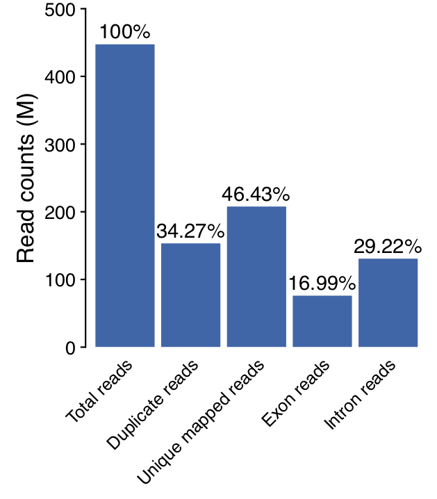
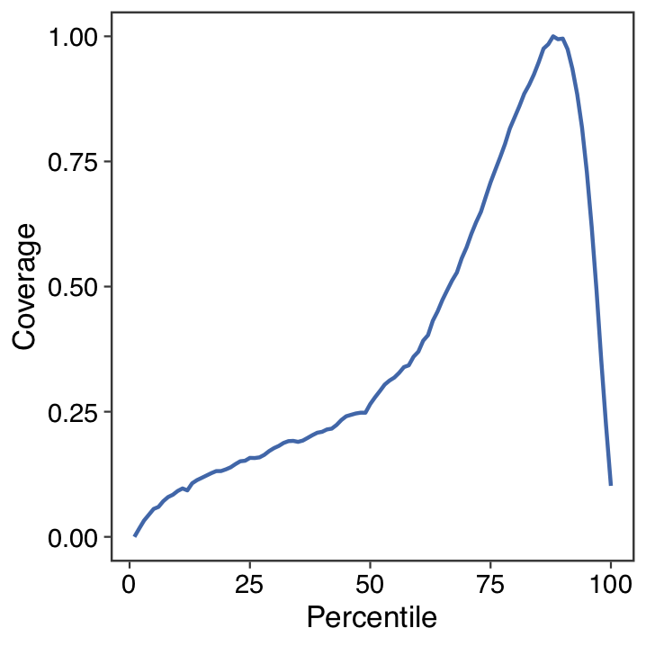
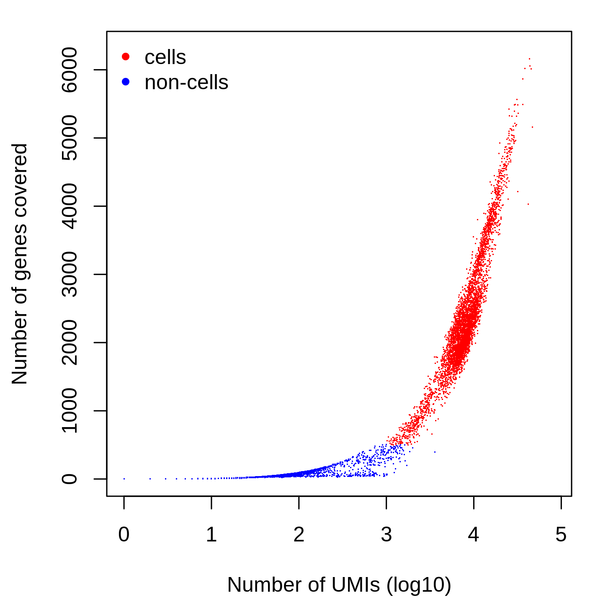
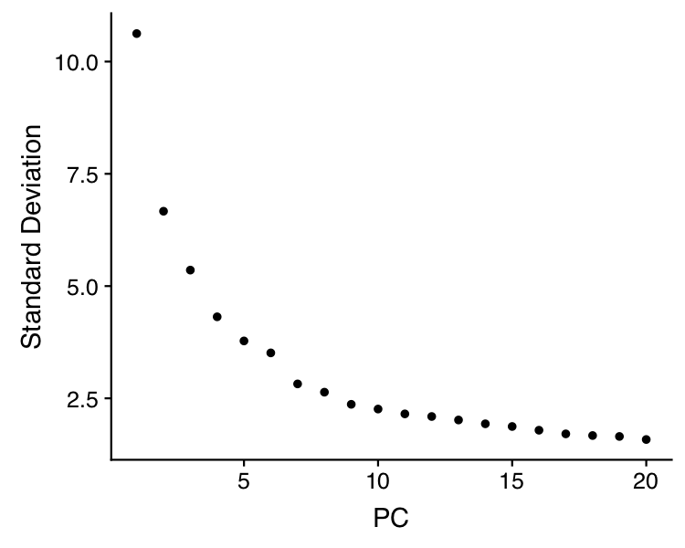
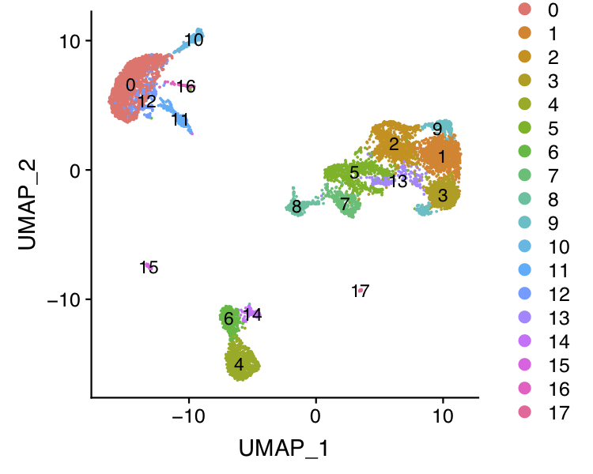
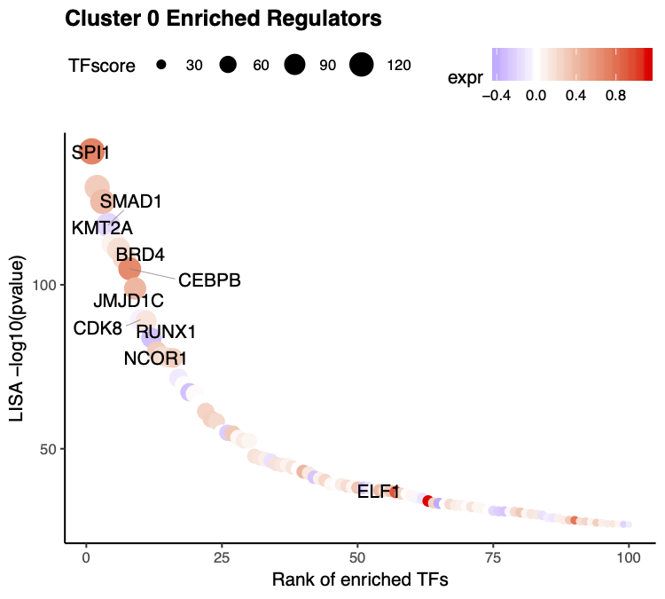
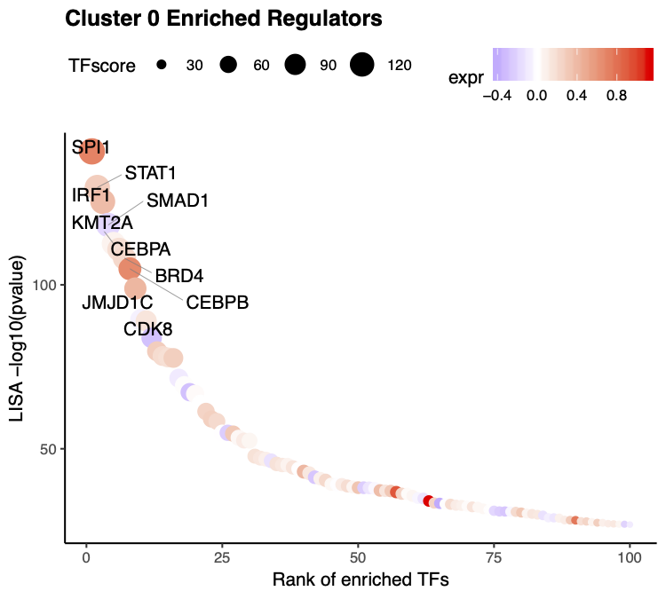
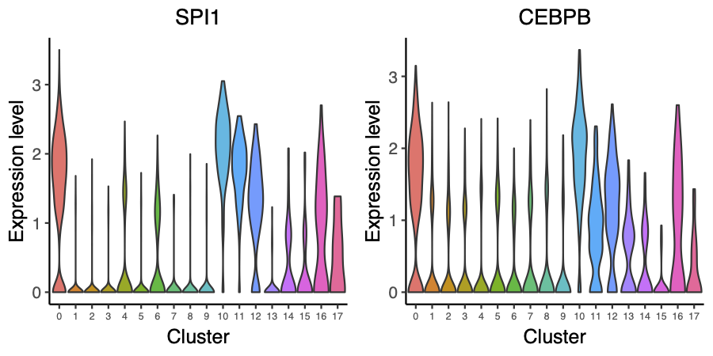
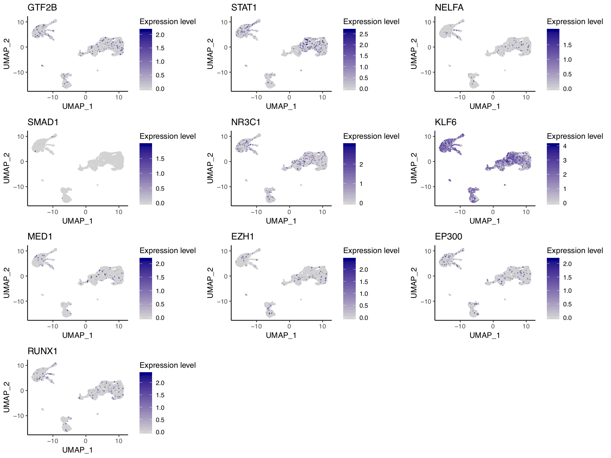

## 10x PBMC 8k scRNA-seq

In this example, we will be analyzing a scRNA-seq dataset of 8K human peripheral blood mononuclear cells (PBMCs) freely available from 10X Genomics. The raw dataset can be downloaded from the 10X Genomics website. We will show you how to run through the whole MAESTRO pipeline from the raw sequencing fastq files to the final results. 

**Step 0. Download the data and prepare your working directory**      
Before you run MAESTRO, you need to activate the MAESTRO environment and prepare your working directory.
```bash
source activate MAESTRO
MAESTRO init --help
MAESTRO init -d 10X_PBMC_8K -m scRNA
```      

The raw data can be downloaded from 10X genomics website.
```bash
$ cd 10X_PBMC_8K
$ wget http://s3-us-west-2.amazonaws.com/10x.files/samples/cell-exp/2.1.0/pbmc8k/pbmc8k_fastqs.tar
$ tar xvf pbmc8k_fastqs.tar
```               

**Step 1. Configure the MAESTRO workflow**                              
Open the `config.yaml` file in the working directory, add the sample information and software annotations. Currently, for scRNA-seq analysis, MAESTRO support Smart-seq2, 10X Genomics and Drop-seq protocols, here is an example config file for 10X Genomics scRNA-seq. 
```bash
$ vi config.yaml
# Directory where fastq files are stored
fastqdir: /home/cw254/projects/MAESTRO/snakemake/RNA/10X
# Sample name of fastq file (only for platform of "10X Genomics", for example, 
# if there is a file named pbmc_1k_v2_S1_L001_I1_001.fastq.gz, the sample name is "pbmc_1k_v2". )
fastqprefix: pbmc8k
# Species to use [GRCh38, GRCm38] (GRCh38 for human and GRCm38 for mouse)
species: GRCh38
# Platform of single cell RNA-seq [Smartseq2, 10X Genomics, Dropseq]
platform: 10X Genomics
# The prefix of output files
outprefix: 10X_PBMC_8K
# Number of cores to use
cores: 8
# annotation to run rabit
rabitlib: /home/cw254/annotations/rabit

# Reference genome 
genome:
  # Genome index directory for STAR
  mapindex: /home/cw254/annotations/refdata-cellranger-hg38-3.0.0/star
  # .gtf format genome annotation file
  gtf: /home/cw254/annotations/refdata-cellranger-hg38-3.0.0/genes/genes.gtf
  # genome annotation file from 10X Genomics required for Cell Ranger
  cellranger: /home/cw254/annotations/refdata-cellranger-hg38-3.0.0

# Information about barcode (only for platform of "Dropseq")
barcode:
  # The start site of each barcode (deinterleave linkers and connect barcodes and UMI)
  # If there's no need to remove linkers, set "start" as NULL.
  start: 
  # The end site of each barcode (deinterleave linkers and connect barcodes and UMI)
  end: 
  # The range of umi (after linker removal)
  umilength: 
  # The range of cell barcode (after linker removal)
  barcodelength: 

# Specify the barcode fastq file and reads fastq file (only for platform of "Dropseq")
fastq:
  # barcode fastq file
  barcode: 
  # transcript fastq file
  transcript: 
```

**Step 2. Run MAESTRO**      
Once configured, users can use snakemake to run the workflow. 
```bash
snakemake -np
nohup snakemake --cores 8 --use-conda > 10X_PBMC_8K.out &
```

**Step 3. Understanding the final output files**         
Here, we assume users have run MAESTRO successfully. An output directory is specified in the run call, and will contain several useful outputs as described below.
```bash
$ ls 10X_PBMC_8K/Result
$ Analysis CellRanger Log QC Summary
```

Output files: 1)The CellRanger directory contains all the mapping and analysis files from the CellRanger pipeline. 2) The QC directory contains quality control analysis of scRNA-seq data, including the barcodes filtering table. 3) The Analysis directory contains the gene count table, clustering result, annotated result, driver transcription factor identification result, for which we will introduce in the step-by-step analysis. 4) The Log directory contains the log files generated in the pipeline analysis. 5) The Summary directory contains the 10X_PBMC_8K_report.html, which summarized all the results in an HTML based document. The summary HTML for the 10X_PBMC_8K example can be found [here](http://cistrome.org/~chenfei/MAESTRO/10X_PBMC_12k_MAESTRO_scRNA_report.html).

Mappability plot for scRNA-seq QC analysis:     
 

Gene-body coverage plot for scRNA-seq QC analysis:      
 

Cell filtering plot for scRNA-seq QC analysis, cells with less than 500 UMIs and 200 genes covered are treated as non-cells and filtered out from the downstream analysis:      
 

**Step 4. Custom analysis starting from the processed dataset**      
Although MAESTRO will generate all the analysis result through the snakemake based workflow, in most cases, users might want to analysis the result from the processed dataset(count or TPM matrix of a cell by gene table), tune the parameters, focused on specific clusters or sub-clusters, and learn the gene set enrichment as well as transcription regulation in those clusters. Considering this, we build a stand-alone MAESTRO R package for downstream analysis. We will show you how to run through the MAESTRO analysis using the R package step by step.

First users need to read the gene expression count matrix generated by MAESTRO into the R enviroment. To support the processing of large dataset, in MAESTRO we use [HDF5 format](https://support.10xgenomics.com/single-cell-gene-expression/software/pipelines/latest/advanced/h5_matrices) for all the expression, atac-seq peak count and RP tables. 
```R
> library(MAESTRO)
> library(Seurat)
> pbmc.gene <- Read10X_h5('Result/QC/10X_PBMC_8K_filtered_feature_bc_matrix.h5')
```

We also support the processed dataset from 10x Cell Ranger pipelines, you can load the gene matrix into R through Seurat package.
```R
> pbmc.gene <- Read10X('Result/Cellranger/10X_PBMC_8K/outs/filtered_gene_bc_matrices/GRCh38/')
```

**Step 5. Clustering and differential gene expression analysis**      
We next create a Seurat object using the gene expression matrix and perform the clustering analysis as well as differential gene expression analysis for different clusters. 1) Cells with less than 200 genes expressed, and genes expressed in less than 10 cells will be removed from the analysis. Besides, we also filter the cells with more than 5% mitochondria reads. 2) The gene expression matrix will be normalized, and only the top 2000 variable genes are used in the clustering analysis. We performed PCA for dimension reduction, select the top 15 significant PCs, construct the KNN graphs, and use a graph-based clustering approach to identify the clusters. Please see [Seurat](https://www.cell.com/cell/pdf/S0092-8674(19)30559-8.pdf) for the details. 3) The default differential expression method is [wilcox-test](https://www.tandfonline.com/doi/abs/10.1080/01621459.1972.10481279). Users can also use other model-based methods like [DESeq2](https://bioconductor.org/packages/release/bioc/html/DESeq2.html) and [MAST](https://www.ncbi.nlm.nih.gov/pmc/articles/PMC4676162/).

```R
> pbmc.RNA.res <- RNARunSeurat(inputMat = pbmc.gene, 
>                              project = "10X_PBMC_8K", 
>                              min.c = 10,
>                              min.g = 200,
>                              dims.use = 1:15,
>                              variable.genes = 2000, 
>                              organism = "GRCh38",
>                              cluster.res = 0.6,
>                              genes.test.use = "wilcox",
>                              genes.cutoff = 1e-05
>                              )
> head(pbmc.RNA.res$genes)
              p_val avg_logFC pct.1 pct.2 p_val_adj cluster          gene
S100A8            0  3.173302 0.999 0.564         0       0        S100A8
S100A9            0  3.069642 1.000 0.660         0       0        S100A9
LYZ               0  2.657702 1.000 0.620         0       0           LYZ
S100A12           0  2.555861 0.919 0.125         0       0       S100A12
RP11-1143G9.4     0  2.382604 0.978 0.147         0       0 RP11-1143G9.4
FCN1              0  2.171051 0.988 0.210         0       0          FCN1
```
 
 
 

**Step 6. Annotate cell types**     
We next try to annotate different clusters based on their marker genes. We use public immune signatures like [CIBERSORT](https://www.nature.com/articles/nmeth.3337) to annotate the clusters. Users can also use their signatures to annotate the clusters.

```R
> data(human.immune.CIBERSORT)
> pbmc.RNA.res$RNA <- RNAAnnotateCelltype(RNA = pbmc.RNA.res$RNA, 
>                                         gene = pbmc.RNA.res$gene,
>                                         signatures = human.immune.CIBERSORT, 
>                                         min.score = 0.1)
```
 

**Step 7. Identify driver transcription factors**     
Identify enriched transcription regulators is crucial to understanding gene regulation in the heterogeneous single-cell populations. MAESTRO utilizes RABIT to predict the potential upstream transcription factors based on the marker genes in each cluster. For our analysis, we used the TF ChIP-seq peaks from CistromeDB to identify potential TFs that could shape the gene expression patterns. To run this function, users need first to install [RABIT](http://rabit.dfci.harvard.edu/), download the rabit index from [Cistrome website](http://cistrome.org/~chenfei/MAESTRO/rabit.tar.gz), and provide the file location of the index to MAESTRO.

```R
> pbmc.RNA.tfs <- RNAAnnotateTranscriptionFactor(RNA = pbmc.RNA.res$RNA, 
>                                                genes = pbmc.RNA.res$genes, 
>                                                project = "10X_PBMC_8K_TF", 
>                                                rabit.path = "/homes/cwang/annotations/rabit")
Start to run Rabit.
100%
Rabit in cluster 0 is done!
100%
Rabit in cluster 1 is done!
100%
Rabit in cluster 2 is done!
100%
Rabit in cluster 3 is done!
100%
Rabit in cluster 4 is done!
100%
Rabit in cluster 5 is done!
100%
Rabit in cluster 6 is done!
100%
Rabit in cluster 7 is done!
100%
Rabit in cluster 8 is done!
100%
Rabit in cluster 9 is done!
100%
Rabit in cluster 10 is done!
100%
Rabit in cluster 11 is done!
100%
Rabit in cluster 12 is done!
100%
Rabit in cluster 13 is done!
100%
Rabit in cluster 14 is done!
100%
Rabit in cluster 15 is done!
100%
Rabit in cluster 16 is done!
100%
Rabit in cluster 17 is done!
Rabit is done.
There are no significant TFs identified in Cluster 1, 13, 16, 2, 4, 5, 7, 9.
> head(pbmc.RNA.tfs)
$`0`
 [1] "EZH1"
 [2] "EP300"
 [3] "NR3C1 | ZNF341"
 [4] "GTF2B"
 [5] "MED1"
 [6] "SMAD1"
 [7] "STAT1 | STAT3 | BCL6 | STAT5A | STAT5B | STAT4"
 [8] "RUNX1 | CBFB | RUNX3 | RUNX2"
 [9] "NELFA"
[10] "KLF6 | KLF4 | KLF13 | KLF3 | SP3 | ZNF148 | ZNF281 | EGR1 | SP1 | KLF9 | SP2 | EGR2 | ZBTB17 | KLF12 | SP4 | KLF5 | KLF1"
```

Alternatively, users can also use LISA to identify the driver regulators, using the following commands. 
```R
> pbmc.RNA.tfs <- RNAAnnotateTranscriptionFactor(RNA = pbmc.RNA.res$RNA, 
>                                                genes = pbmc.RNA.res$genes, 
>                                                project = "10X_PBMC_8K_TF", 
>                                                method = "LISA")
```

Beside indentify TFs for all the clusters, we also support the differential gene list from a single comparison.
```R
> de.geneset <- FindMarkersMAESTRO(pbmc.RNA.res$RNA, ident.1 = c(0,10))
   |++++++++++++++++++++++++++++++++++++++++++++++++++| 100% elapsed = 02m 24s
> pbmc.RNA.monocyte.tfs <- RNAAnnotateTranscriptionFactor(RNA = pbmc.RNA.res$RNA, 
>                                                         genes = de.geneset,
>                                                         cluster = c(0,10),
>                                                         project = "10X_PBMC_8K_Monocyte_TF", 
>                                                         method = "LISA")
```

**Step 8. Visualize driver transcription factors for each cluster**     
According to the annotation of the clusters, we know that cluster 0 is Monocyte. Next, we want to visualize the enriched regulators in Monocyte from Step 7. To further filter the regulators, we will also visualize the expression level of the predicted transcription factors. Currently, for scRNA-seq, the VisualizeTFenrichment function only supports LISA results. 

The output TFs from MAESTRO have already been pre-filtered using TF expression level. 
```R
> tfs = sapply(pbmc.ATAC.tfs[[0]], function(x) {return(unlist(strsplit(x, split = " | ", fixed = TRUE))[1])})
> VisualizeTFenrichment(TFs = tfs, 
>                       cluster.1 = 0, 
>                       type = "RNA", 
>                       SeuratObj = pbmc.RNA.res$RNA, 
>                       LISA.table = "10X_PBMC_8K_TF_lisa.txt",
>                       visual.totalnumber = 100, 
>                       name = "10X_PBMC_8K_TF_Monocyte_filtered")    
```

 

If users want to visualize the top factors without filtering using expression level. Please leave the TFs to blank, then the top 10 regulators will be visualized.
```R
> VisualizeTFenrichment(cluster.1 = 0, 
>                       type = "RNA", 
>                       SeuratObj = pbmc.RNA.res$RNA, 
>                       LISA.table = "10X_PBMC_8K_TF_lisa.txt",
>                       visual.topnumber = 10,
>                       visual.totalnumber = 100, 
>                       name = "10X_PBMC_8K_TF_Monocyte_top")  
```

 

And we also provide the function for visualize TF/genes expression level using Vlnplot and Umap.
```R
> VisualizeVlnplot(genes = c("SPI1","CEBPB"), 
>                  type = "RNA", 
>                  SeuratObj = pbmc.RNA.res$RNA, 
>                  ncol = 2, 
>                  width = 6, 
>                  height = 3, 
>                  name = "10X_PBMC_8K_TF_Monocyte_vlnplot")
```
   

```R
> VisualizeUmap(genes = c("SPI1","CEBPB"), 
>               type = "RNA", 
>               SeuratObj = pbmc.RNA.res$RNA, 
>               ncol = 2, 
>               width = 8, 
>               height = 3, 
>               name = "10X_PBMC_8K_TF_Monocyte_umap")
```
 

**Step 9. Save the project for future analysis**     
Finally, users can save the R project, including the raw data, normalized data, clustering result, and meta information for future analysis.

```R
> saveRDS(pbmc.RNA.res, "pbmc.RNA.res.rds")
```

The differential genes, predicted TFs for each cluster have already been saved in the current directory by MAESTRO.

```bash
$ ls 10X_PBMC_8K.DiffGenes.tsv 10X_PBMC_8K_TF.RABIT
```


