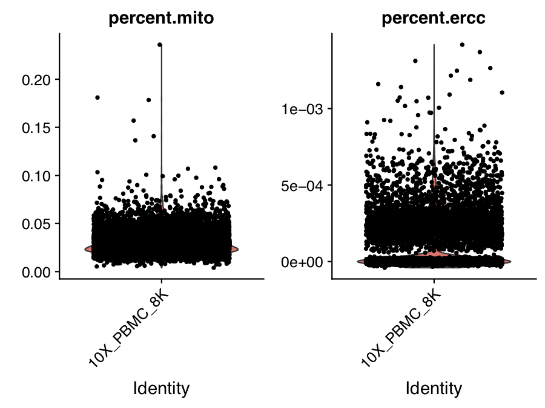
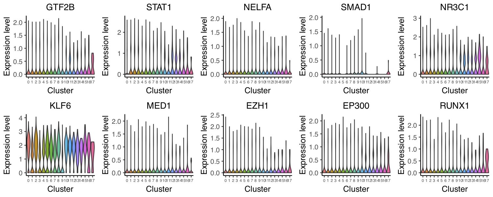

## 10x-genomics based scRNA-seq from human PBMC samples

In this example, we will be analyzing a scRNA-seq dataset of 8K human peripheral blood mononuclear cells (PBMCs) freely available from 10X-genomics. The raw dataset can be downloaded from 10x-genomics website. We will show you how to run through the whole MAESTRO pipeline from the raw sequencing fastq files to the final results. 

**Step 0. Download the data and prepare your working directory**     
Prepare your working directory.
```bash
```      

The raw data can be downloaded from 10X genomics:
```bash
$ cd 10x.pbmc8k.RNA
$ mkdir data
$ cd data
$ wget http://s3-us-west-2.amazonaws.com/10x.files/samples/cell-exp/2.1.0/pbmc8k/pbmc8k_fastqs.tar
$ tar xvf pbmc8k_fastqs.tar
```               

**Step 1. Configure the MAESTRO workflow**                              
Open the `config.yaml` file and edit it to your needs. Especially, define your single-cell platform for use. 
```bash
$ cd /root/MAESTRO/Snakemake
$ vi config.yaml
```

Here is an example for `config.yaml` file used for the PBMC 8K data analysis.
```bash
``` 
Once configured, the workflow can be executed with Snakemake.                

**Step 2. Run MAESTRO**     
To start, we must activate the MAESTRO CONDA ENVIRONMENT.If successful, you will see "(MAESTRO)" prepended to your command prompt.

Next we will perform a DRY-RUN to make sure that we setup the MAESTRO PROJECT directory correctly. In your PROJECT folder run the following command:
```bash
nohup snakemake --cores 8 --use-conda > 10x.pbmc.1k.out &
```
**Step 3. Understanding the final output files**     

Here, we assume you've run MAESTRO successfully. An output directory is specified in the run call, and will contain several useful outputs as described below.            

**Step 4. Custom analysis starting from the processed dataset**     
Although MAESTRO will generate all the analysis result through the snakemake based workflow, in most cases, you might want to analysis the result from the processed dataset(count or TPM matrix of a cell by gene table), tune the parameters, focused on specific clusters or sub-clusters, and learn the gene set enrichment as well as transcription regulation in those clusters. Considering this, we build a stand alone MAESTRO R package for downstream analysis. We will show you how to run though the MAESTRO analysis using the R package step by step.

First you need to read the gene expression count matrix generated by MAESTRO into the R enviroment.
```R
> library(MAESTRO)
> pbmc.gene <- read.table('10X_PBMC_8K_gene.txt')
```

We also support the processed dataset from 10x Cell Ranger pipelines, you can load the gene matrix into R through Seurat package.
```R
> library(Seurat)
> pbmc.gene <- Read10X('./outs/filtered_gene_bc_matrices/GRCh38/')
```

**Step 5. Clustering and differential gene expression analysis**      
We next create an Seurat object using the gene expression matrix, and perform the clustering analysis as well as differential gene expression analysis for different clusters. 1) Cells with less than 200 genes expressed and genes expressed in less than 10 cells will be removed from the analysis. Besides, we also filter the cells with more than 5% mitochondria reads. 2) The gene expression matrix will be normalized, and only top 2000 variable genes are used in the clustering analysis. We performed PCA for dimension reduction, select the top 15 significant PCs, construct the KNN graphs and use a graphical based clustering approach to identify the clusters. Please see [Seurat](https://www.cell.com/cell/pdf/S0092-8674(19)30559-8.pdf) for the details. 3) The default differential expression method is [wilcox-test](https://www.tandfonline.com/doi/abs/10.1080/01621459.1972.10481279). You can also use other model-based method like [DESeq2](https://bioconductor.org/packages/release/bioc/html/DESeq2.html) and [MAST](https://www.ncbi.nlm.nih.gov/pmc/articles/PMC4676162/).

```R
> pbmc.RNA.res <- RNARunSeurat(inputMat = pbmc.gene, 
>                               project = "10X_PBMC_8K", 
>                               min.c = 10,
>                               min.g = 200,
>                               dims.use = 1:15,
>                               variable.genes = 2000, 
>                               organism = "GRCh38",
>                               cluster.res = 0.6,
>                               genes.test.use = "wilcox",
>                               genes.cutoff = 1e-05
>                               )
> head(pbmc.RNA.res$genes)
              p_val avg_logFC pct.1 pct.2 p_val_adj cluster          gene
S100A8            0  3.173302 0.999 0.564         0       0        S100A8
S100A9            0  3.069642 1.000 0.660         0       0        S100A9
LYZ               0  2.657702 1.000 0.620         0       0           LYZ
S100A12           0  2.555861 0.919 0.125         0       0       S100A12
RP11-1143G9.4     0  2.382604 0.978 0.147         0       0 RP11-1143G9.4
FCN1              0  2.171051 0.988 0.210         0       0          FCN1
```
 
 
 

**Step 6. Annotate celltypes**     
We next try to annotate different clusters based on their marker genes. We use public immune signatures like [CIBERSORT](https://www.nature.com/articles/nmeth.3337) to annotate the clusters. You can also use your own signatures to annotate the clusters.

```R
> data(human.immune.CIBERSORT)
> pbmc.RNA.res$RNA <- RNAAnnotateCelltype(RNA = pbmc.RNA.res$RNA, 
>                                         gene = pbmc.RNA.res$gene,
>                                         signatures = human.immune.CIBERSORT, 
>                                         min.score = 0.1)
```
 

**Step 7. Identify driver transcription factors**     
Identify enriched transcription regulators is crucial to understanding gene regulation in the heterogeneous single-cell populations. MAESTRO utilize rabit to predict the potential upstream transcription factors based on the marker genes in each cluster. For our analysis, we used the TF ChIP-seq peaks from CistromeDB to identify potential TFs that could shaping the gene expression patterns. To run this function, you need to first install [rabit](http://rabit.dfci.harvard.edu/), download the rabit index from [Cistrome website](http://cistrome.org/~chenfei/MAESTRO/rabit.tar.gz), and provide the file location of the index to MAESTRO.

```R
> pbmc.RNA.tfs <- RNAAnnotateTranscriptionFactor(RNA = pbmc.RNA.res$RNA, 
>                                                genes = pbmc.RNA.res$genes, 
>                                                project = "10X_PBMC_8K_TF", 
>                                                rabit.path = "/homes/cwang/annotations/rabit")
Start to run Rabit.
100%
Rabit in cluster 0 is done!
100%
Rabit in cluster 1 is done!
100%
Rabit in cluster 2 is done!
100%
Rabit in cluster 3 is done!
100%
Rabit in cluster 4 is done!
100%
Rabit in cluster 5 is done!
100%
Rabit in cluster 6 is done!
100%
Rabit in cluster 7 is done!
100%
Rabit in cluster 8 is done!
100%
Rabit in cluster 9 is done!
100%
Rabit in cluster 10 is done!
100%
Rabit in cluster 11 is done!
100%
Rabit in cluster 12 is done!
100%
Rabit in cluster 13 is done!
100%
Rabit in cluster 14 is done!
100%
Rabit in cluster 15 is done!
100%
Rabit in cluster 16 is done!
100%
Rabit in cluster 17 is done!
Rabit is done.
There are no significant TFs identified in Cluster 1, 13, 16, 2, 4, 5, 7, 9.
> head(pbmc.RNA.tfs)
$`0`
 [1] "EZH1"
 [2] "EP300"
 [3] "NR3C1 | ZNF341"
 [4] "GTF2B"
 [5] "MED1"
 [6] "SMAD1"
 [7] "STAT1 | STAT3 | BCL6 | STAT5A | STAT5B | STAT4"
 [8] "RUNX1 | CBFB | RUNX3 | RUNX2"
 [9] "NELFA"
[10] "KLF6 | KLF4 | KLF13 | KLF3 | SP3 | ZNF148 | ZNF281 | EGR1 | SP1 | KLF9 | SP2 | EGR2 | ZBTB17 | KLF12 | SP4 | KLF5 | KLF1"
```

**Step 8. Visualize driver transcription factors for each cluster**     
According to the annotation of the clusters, we know that cluster 0 is Monocyte cells. Next we want to visualize the expression level of the enriched TFs, we only want to focused on the TFs that are expressed in the Monocyte cluster as its potential driver transcriptional regulators.

```R
> VisualizeVlnplot(genes = pbmc.RNA.tfs, 
>                  cluster = "0", 
>                  type = "RNA", 
>                  SeuratObj = pbmc.RNA.res$RNA, 
>                  ncol = 5, 
>                  width = 10, 
>                  height = 4, 
>                  name = "10X_PBMC_8K_TF_Monocyte")
```
   

```R
> VisualizeUmap(genes = pbmc.RNA.tfs, 
>               cluster = "0", 
>               type = "RNA", 
>               SeuratObj = pbmc.RNA.res$RNA, 
>               ncol = 3, 
>               width = 12, 
>               height = 7.5, 
>               name = "10X_PBMC_8K_TF_Monocyte")
```
 

**Step 9. Save the project for future analysis**     
Finally, you can save the R project including the raw data, normalized data, clustering result and meta informations for future analysis.

```R
> saveRDS(pbmc.RNA.res, "pbmc.RNA.res.rds")
```

The differential genes, predicted TFs for each cluster have already been saved in the current directory by MAESTRO.

```bash
$ ls 10X_PBMC_8K.DiffGenes.tsv 10X_PBMC_8K_TF.RABIT```
```


