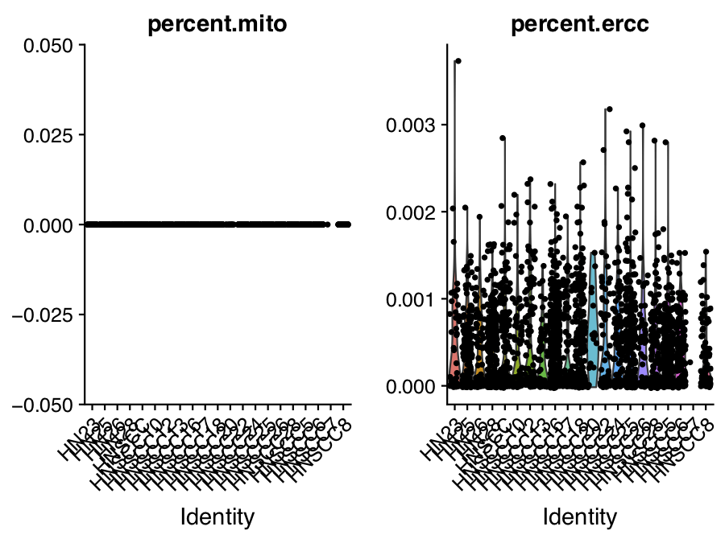
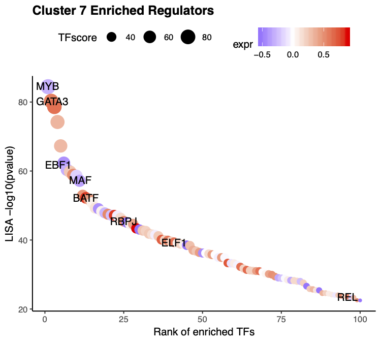
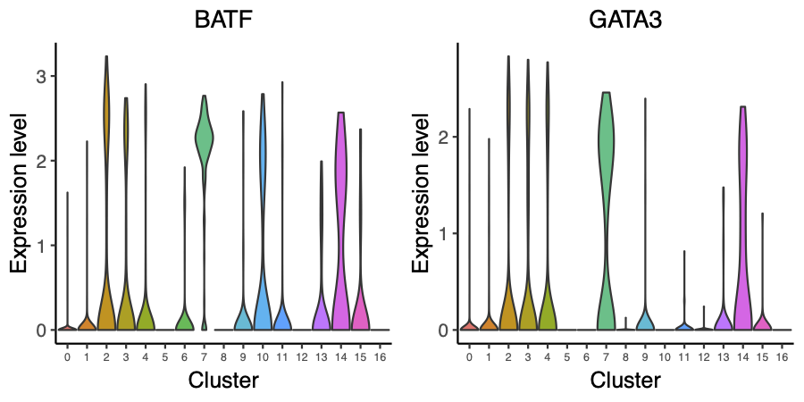
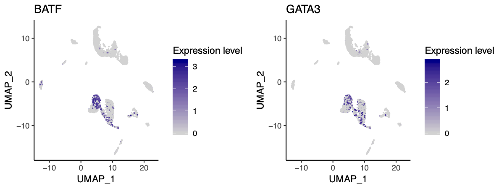

## Smart-seq2 HNSCC scRNA-seq

In this example, we will be analyzing datasets from head and neck cancers (HNSCC); the dataset is generated using Smart-seq2 based protocol.  The raw data can be downloaded from the GEO [GSE103322](https://www.ncbi.nlm.nih.gov/geo/query/acc.cgi?acc=GSE103322). Here we will start from the processed data, which is the gene-based logTPM matrix.

**Step 0. Download the data**     
We will start from the processed dataset and demonstrate the step-by-step analysis using the MAESTRO R package. First, users can download the data from the Cistrome website.

```bash
$ wget http://cistrome.org/~chenfei/MAESTRO/GSE103322_HNSCC_logTPM.h5.gz
$ wget http://cistrome.org/~chenfei/MAESTRO/GSE103322_HNSCC_Infor.txt.gz
$ gunzip GSE103322_HNSCC_logTPM.h5.gz
$ gunzip GSE103322_HNSCC_Infor.txt.gz
```

**Step 1. Read the data into R environment**     
To use the MAESTRO R function, following the instructions in MAESTRO [README](https://github.com/chenfeiwang/MAESTRO/blob/master/README.md) page and install the R package. Then read the gene expression matrix as well as the sample information into R. The HNSCC dataset contains single-cells both from cancer and normal cells; in this analysis, we will only focused on the normal cells.

```R
> library(MAESTRO)
> library(Seurat)
> HNSCC.gene <- Read10X_h5('GSE103322_HNSCC_logTPM.h5')
> HNSCC.Infor <- read.delim('GSE103322_HNSCC_Infor.txt')
> HNSCC.normal <- HNSCC.gene[,colnames(HNSCC.Infor[,which(HNSCC.Infor[4,]==1)])]
```

**Step 2. Clustering and differential gene expression analysis**      
We next create a Seurat object using the gene expression matrix and perform the clustering analysis as well as differential gene expression analysis for different clusters. 1) Cells with less than 200 genes expressed, and genes expressed in less than 10 cells will be removed from the analysis. Besides, we also filter the cells with more than 5% mitochondria reads. 2) The gene expression matrix will be normalized, and only the top 2000 variable genes are used in the clustering analysis. We performed PCA for dimension reduction, select the top 15 significant PCs, construct the KNN graphs, and use a graph-based clustering approach to identify the clusters. Please see [Seurat](https://www.cell.com/cell/pdf/S0092-8674(19)30559-8.pdf) for the details. 3) The default differential expression method is [wilcox-test](https://www.tandfonline.com/doi/abs/10.1080/01621459.1972.10481279). Users can also use other model-based methods like [DESeq2](https://bioconductor.org/packages/release/bioc/html/DESeq2.html) and [MAST](https://www.ncbi.nlm.nih.gov/pmc/articles/PMC4676162/).

```R
> HNSCC.RNA.res <- RNARunSeurat(inputMat = HNSCC.normal, 
>                               project = "HNSCC.scRNA", 
>                               min.c = 10,
>                               min.g = 200,
>                               mito = TRUE,
>                               dims.use = 1:15,
>                               variable.genes = 2000, 
>                               organism = "GRCh38",
>                               cluster.res = 0.6,
>                               genes.test.use = "wilcox",
>                               genes.cutoff = 1e-05
>                               )
> head(HNSCC.RNA.res$genes)
              p_val avg_logFC pct.1 pct.2     p_val_adj cluster  gene
ACTA2  0.000000e+00  1.773778 0.920 0.190  0.000000e+00       0 ACTA2
TAGLN  0.000000e+00  1.699723 0.956 0.208  0.000000e+00       0 TAGLN
MYH11  0.000000e+00  1.694768 0.865 0.156  0.000000e+00       0 MYH11
ADIRF  0.000000e+00  1.452912 0.936 0.239  0.000000e+00       0 ADIRF
MYL9   0.000000e+00  1.418340 0.970 0.260  0.000000e+00       0  MYL9
LMOD1 6.154863e-281  1.312901 0.674 0.070 1.113415e-276       0 LMOD1
```

 
 
 

**Step 3. Annotate cell types**     
We next try to annotate different clusters based on their marker genes. We use public immune signatures like [CIBERSORT](https://www.nature.com/articles/nmeth.3337) to annotate the clusters. However, the CIBERSORT signatures do not contain some of the stromal populations; we further add the signatures for the stromal populations. Users can also use their signatures to annotate the clusters.

```R
> data(human.immune.CIBERSORT)
> human.immune.CIBERSORT <- rbind(human.immune.CIBERSORT,
>                           cbind("Fibroblasts", c("FAP", "PDPN", "MMP2", "PDGFRA", "THY1", "MMP11","PDGFRL", "TGFB3", "COL1A2", "DCN", "COL3A1", "COL6A1")),
>                           cbind("Myofibroblasts", c("ACTA2", "MCAM", "MYLK", "MYL9", "IL6", "PDGFA")),
>                           cbind("Endothelial", c("PECAM1", "VWF", "ENG")))
> HNSCC.RNA.res$RNA <- RNAAnnotateCelltype(RNA = HNSCC.RNA.res$RNA, 
>                                          gene = HNSCC.RNA.res$gene,
>                                          signatures = human.immune.CIBERSORT, 
>                                          min.score = 0.1)
```

 

**Step 4. Identify driver transcription factors**     
Identify enriched transcription regulators is crucial to understanding gene regulation in the heterogeneous single-cell populations. MAESTRO utilizes RABIT to predict the potential upstream transcription factors based on the marker genes in each cluster. For our analysis, we used the TF ChIP-seq peaks from CistromeDB to identify potential TFs that could shape the gene expression patterns. To run this function, users need first to install [rabit](http://rabit.dfci.harvard.edu/), download the rabit index from [Cistrome website](http://cistrome.org/~chenfei/MAESTRO/rabit.tar.gz), and provide the file location of the index to MAESTRO.

```R
> HNSCC.RNA.tfs <- RNAAnnotateTranscriptionFactor(RNA = HNSCC.RNA.res$RNA, 
>                                                 genes = HNSCC.RNA.res$genes, 
>                                                 project = "HNSCC.scRNA.TF", 
>                                                 rabit.path = "/homes/cwang/annotations/rabit")
Start to run Rabit.
100%
Rabit in cluster 0 is done!
100%
Rabit in cluster 1 is done!
100%
Rabit in cluster 2 is done!
100%
Rabit in cluster 3 is done!
100%
Rabit in cluster 4 is done!
100%
Rabit in cluster 5 is done!
100%
Rabit in cluster 6 is done!
100%
Rabit in cluster 7 is done!
100%
Rabit in cluster 8 is done!
100%
Rabit in cluster 9 is done!
100%
Rabit in cluster 10 is done!
100%
Rabit in cluster 11 is done!
100%
Rabit in cluster 12 is done!
100%
Rabit in cluster 13 is done!
100%
Rabit in cluster 14 is done!
100%
Rabit in cluster 15 is done!
100%
Rabit in cluster 16 is done!
Rabit is done.
There are no significant TFs identified in Cluster 10, 11, 12, 15, 16.
> head(HNSCC.RNA.tfs)
$`0`
 [1] "RAD21"                    "STAG1"
 [3] "CTCF | CTCFL"             "BRD4"
 [5] "HCFC1"                    "NOTCH1"
 [7] "YY2 | TAF1 | ZFP42 | YY1" "CDK8"
 [9] "KDM5B"                    "TP53 | TP73 | TP63"
```

Alternatively, users can also use LISA to identify the driver regulators, using the following commands. 
```R
> HNSCC.RNA.tfs <- RNAAnnotateTranscriptionFactor(RNA = HNSCC.RNA.res$RNA, 
>                                                 genes = HNSCC.RNA.res$genes, 
>                                                 project = "HNSCC_scRNA_TF", 
>                                                 method = "LISA")
```

Beside indentify TFs for all the clusters, we also support the differential gene list from a single comparison.
```R
> de.geneset <- FindMarkersMAESTRO(HNSCC.RNA.res$RNA, ident.1 = c(0,8))
   |++++++++++++++++++++++++++++++++++++++++++++++++++| 100% elapsed = 01m 14s
> pbmc.RNA.tfs <- RNAAnnotateTranscriptionFactor(RNA = HNSCC.RNA.res$RNA, 
>                                                genes = de.geneset,
>                                                cluster = c(0,8),
>                                                project = "HNSCC_scRNA_Myofibroblasts_TF", 
>                                                method = "LISA")
```

**Step 5. Visualize driver transcription factors for each cluster**     
According to the annotation of the clusters, we know that cluster 7 is Treg. Next, we want to visualize the enriched regulators in Treg from Step 7. To further filter the regulators, we will also visualize the expression level of the predicted transcription factors. Currently, for scRNA-seq, the VisualizeTFenrichment function only supports LISA results. 

The output TFs from MAESTRO have already been pre-filtered using TF expression level. 
```R
> tfs = sapply(HNSCC.RNA.tfs[[8]], function(x) {return(unlist(strsplit(x, split = " | ", fixed = TRUE))[1])})
> VisualizeTFenrichment(TFs = tfs, 
>                       cluster.1 = 7, 
>                       type = "RNA", 
>                       SeuratObj = HNSCC.RNA.res$RNA, 
>                       LISA.table = "HNSCC_scRNA_TF_lisa.txt",
>                       visual.totalnumber = 100, 
>                       name = "HNSCC_scRNA_TF_Treg") 
```

 

And we also provide the function for visualize TF/genes expression level using Vlnplot and Umap.
```R
> VisualizeVlnplot(genes = c("GATA3","BATF"), 
>                  type = "RNA", 
>                  SeuratObj = HNSCC.RNA.res$RNA, 
>                  ncol = 2, 
>                  width = 6, 
>                  height = 3, 
>                  name = "HNSCC_scRNA_TF_Treg_vlnplot")
```
   

```R
> VisualizeUmap(genes = c("GATA3","BATF"), 
>               type = "RNA", 
>               SeuratObj = HNSCC.RNA.res$RNA, 
>               ncol = 2, 
>               width = 8, 
>               height = 3, 
>               name = "HNSCC_scRNA_TF_Treg_umap")
```
 

**Step 6. Save the project for future analysis**     
Finally, users can save the R project, including the raw data, normalized data, clustering result, and meta information for future analysis.

```R
saveRDS(HNSCC.RNA.res, "HNSCC.RNA.res.rds")
```

The differential genes, predicted TFs for each cluster have already been saved in the current directory by MAESTRO.

```bash
$ ls HNSCC.scRNA.DiffGenes.tsv HNSCC.scRNA.TF 
```

